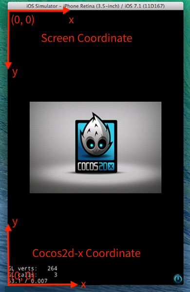
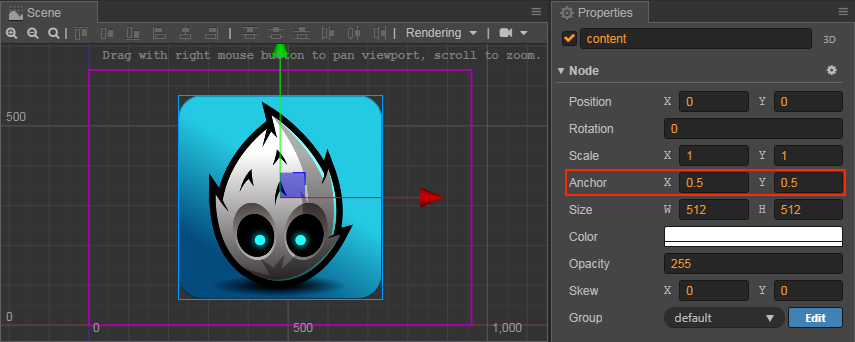
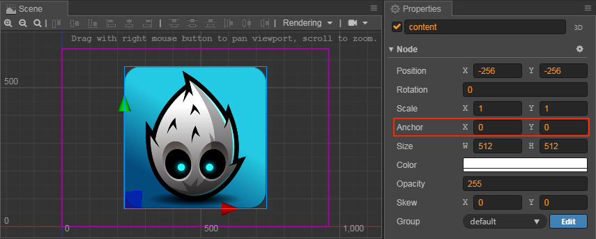
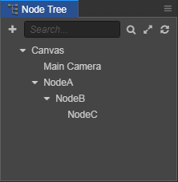
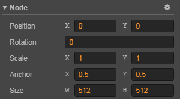

# 坐标系和节点变换属性

在 [场景编辑器](../getting-started/basics/editor-panels/scene.md) 和 [节点和组件](node-component.md) 文档中，我们介绍了可以通过 **变换工具** 和编辑 **属性检查器** 中节点的属性来变更节点的显示行为。这一节我们将会深入了解节点所在场景空间的坐标系，以及节点位置（Position）、旋转（Rotation）、缩放（Scale）、尺寸（Size）四大变换属性的工作原理。

## Cocos Creator 坐标系

我们已经知道可以为节点设置位置属性，那么一个有着特定位置属性的节点在游戏运行时将会呈现在屏幕上的什么位置呢？就好像日常生活的地图上有了经度和纬度才能进行卫星定位，我们也要先了解 Cocos Creator 的坐标系，才能理解节点位置的意义。

### 笛卡尔坐标系

Cocos Creator 的坐标系和 cocos2d-x 引擎坐标系完全一致，而 cocos2d-x 和 OpenGL 坐标系相同，都是起源于笛卡尔坐标系。笛卡尔坐标系中定义右手系原点在左下角，x 向右，y 向上，z 向外，我们使用的坐标系就是笛卡尔右手系。

### 屏幕坐标系和 cocos2d-x 坐标系

标准屏幕坐标系使用和 OpenGL 不同的坐标系，和 cocos2d-x 坐标系有很大区别。

在 iOS, Android 等平台用原生 SDK 开发应用时使用的是标准屏幕坐标系，原点为屏幕左上角，x 向右，y 向下。

Cocos2d-x 坐标系和 OpenGL 坐标系一样，原点为屏幕左下角，x 向右，y 向上。

### 世界坐标系（World Coordinate）和本地坐标系（Local Coordinate）

世界坐标系也叫做绝对坐标系，在 Cocos Creator 游戏开发中表示场景空间内的统一坐标体系，「世界」就用来表示我们的游戏场景。

本地坐标系也叫相对坐标系，是和节点相关联的坐标系。每个节点都有独立的坐标系，当节点移动或改变方向时，和该节点关联的坐标系将随之移动或改变方向。

Cocos Creator 中的 **节点（Node）** 之间可以有父子关系的层级结构，我们修改节点的 **位置（Position）** 属性设定的节点位置是该节点相对于父节点的 **本地坐标系** 而非世界坐标系。最后在绘制整个场景时 Cocos Creator 会把这些节点的本地坐标映射成世界坐标系坐标。

要确定每个节点坐标系的作用方式，我们还需要了解 **锚点** 的概念。

### 锚点（Anchor）

**锚点（Anchor）** 是节点的另一个重要属性，它决定了节点以自身约束框中的哪一个点作为整个节点的位置。我们选中节点后看到变换工具出现的位置就是节点的锚点位置。

锚点由 `anchorX` 和 `anchorY` 两个值表示，他们是通过节点尺寸计算锚点位置的乘数因子，范围都是 `0 ~ 1` 之间。`(0.5, 0.5)` 表示锚点位于节点长度乘 0.5 和宽度乘 0.5 的地方，即节点的中心。

锚点属性设为 `(0, 0)` 时，锚点位于节点本地坐标系的初始原点位置，也就是节点约束框的左下角。

### 子节点的本地坐标系

锚点位置确定后，所有子节点就会以 **锚点所在位置** 作为坐标系原点，注意这个行为和 cocos2d-x 引擎中的默认行为不同，是 Cocos Creator 坐标系的特色！

假设场景中节点的结构如下图所示：

当我们的场景中包含不同层级的节点时，我们按照以下的流程确定每个节点在世界坐标系下的位置：

1. 从场景根级别开始处理每个节点，上图中 `NodeA` 就是一个根级别节点。首先根据 NodeA 的 **位置（Position）** 属性和 **锚点（Anchor）** 属性，在世界坐标系中确定 NodeA 的显示位置和坐标系原点位置（和锚点位置一致）。
2. 接下来处理 NodeA 的所有直接子节点，也就是上图中 `NodeB` 以及和 NodeB 平级的节点。根据 NodeB 的位置和锚点属性，在 NodeA 的本地坐标系中确定 NodeB 在场景空间中的位置和坐标系原点位置。
3. 之后不管有多少级节点，都继续按照层级高低依次处理，每个节点都使用父节点的坐标系和自身位置锚点属性来确定在场景空间中的位置。

## 变换属性

除了上面介绍过的 **锚点（Anchor）** 之外，节点还包括四个主要的变换属性，下面我们依次介绍。

### 位置（Position）

**位置（Position）** 由 `x` 和 `y` 两个属性组成，分别规定了节点在当前坐标系 x 轴和 y 轴上的坐标。

上图中节点 `NodeA` 位于场景根级别，他的位置是 `(507, 354)`（可以参考 **场景编辑器** 背景的刻度显示），其子节点 `NodeC` 的位置是 `(345, 0)`，可以看到子节点的位置是以父节点锚点为基准来偏移的。

位置属性的默认值是 `(0, 0)`，也就是说，新添加节点时，节点总会出现在父节点的坐标系原点位置。Cocos Creator 中节点的默认位置为 `(0, 0)`，默认锚点设为 `(0.5, 0.5)`。这样子节点会默认出现在父节点的中心位置，在制作 UI 或组合玩家角色时都能够对所有内容一览无余。

在场景编辑器中，可以随时使用 [移动变换工具](../getting-started/basics/editor-panels/scene.md#--9) 来修改节点位置。

### 旋转（Rotation）

**旋转（Rotation）** 是另外一个会对节点本地坐标系产生影响的重要属性，旋转属性只有一个值，表示节点当前的旋转角度。角度值为正时，节点顺时针旋转，角度值为负时，节点逆时针旋转。

上图所示的节点层级关系和前一张图相同，只是节点 `NodeA` 的 **旋转（Rotation）** 属性设为了 `30` 度，可以看到除了 `NodeA` 本身顺时针旋转了 30 度之外，其子节点 `NodeC` 也以 `NodeA` 的锚点为中心，顺时针旋转了 30 度。

在场景编辑器中，可以随时使用 [旋转变换工具](../getting-started/basics/editor-panels/scene.md#--10) 来修改节点旋转。

### 缩放（Scale）

**缩放（Scale）** 属性也是一组乘数因子，由 `scaleX` 和 `scaleY` 两个值组成，分别表示节点在 x 轴和 y 轴的缩放倍率。

上图中节点 `NodeA` 的缩放属性设为 `(0.5, 1.0)`，也就是将该节点在 x 轴方向缩小到原来的 0.5 倍，y 轴保持不变。可以看到子节点 `NodeC` 图像也在 x 轴方向上进行了压缩，所以缩放属性会影响所有子节点。

子节点上设置的缩放属性会和父节点叠加作用，子节点的子节点会将每一层级的缩放属性全部相乘来获得在世界坐标系下显示的缩放倍率，这一点和位置、旋转其实是一致的，只不过位置和旋转属性是相加作用，只有缩放属性是相乘，作用表现的更明显。

缩放属性是叠加在位置、尺寸等属性上作用的，修改缩放属性时，节点的位置和尺寸不会变化，但显示节点图像时会先将位置和尺寸等属性和缩放相乘，得出的数值才是节点显示的真实位置和大小。

在场景编辑器中，可以随时使用 [缩放变换工具](../getting-started/basics/editor-panels/scene.md#--11) 来修改节点缩放。

### 尺寸（Size）

**尺寸（Size）** 属性由 `Width`（宽度）和 `Height` （高度）两个值组成，用来规定节点的约束框大小。对于 Sprite 节点来说，约束框的大小也就相当于显示图像的大小。

因此尺寸属性很容易和缩放属性混淆，两者都会影响 Sprite 图像的大小，但他们是通过不同的方式来影响图像实际显示大小的。尺寸属性和位置、锚点一起，规定了节点四个顶点所在位置，并由此决定由四个顶点约束的图像显示的范围。尺寸属性在渲染 [九宫格图像（Sliced Sprite）](../ui/sliced-sprite.md) 时有至关重要的作用。

而缩放属性是在尺寸数值的基础上进行相乘，得到节点经过缩放后的宽度和高度。可以说在决定图像大小时，尺寸是基础，缩放是变量。另外尺寸属性不会直接影响子节点的尺寸（但可以通过 [对齐挂件（Widget）](../ui/widget-align.md)间接影响），这一点和缩放属性有很大区别。

在场景编辑器中，可以随时使用 [矩形变换工具](../getting-started/basics/editor-panels/scene.md#--11) 来修改节点尺寸。