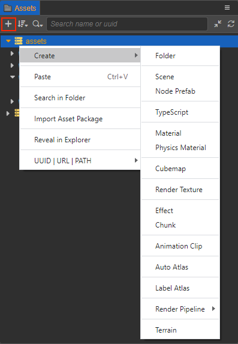
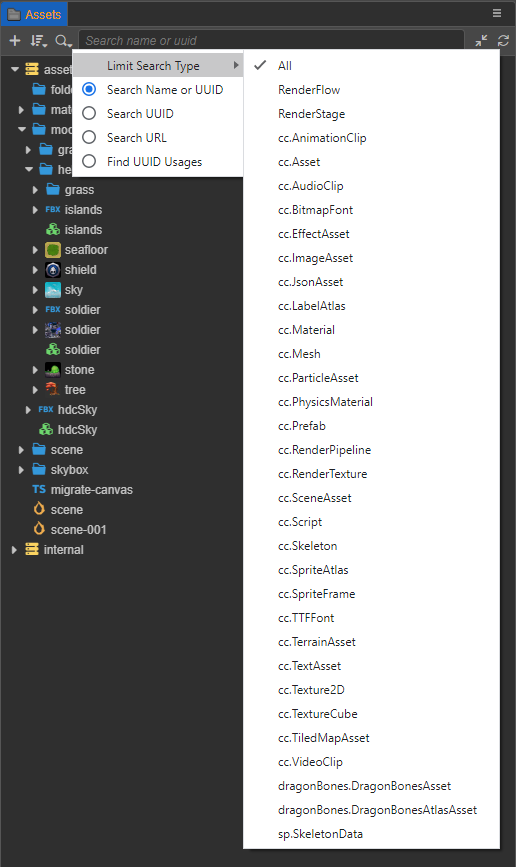
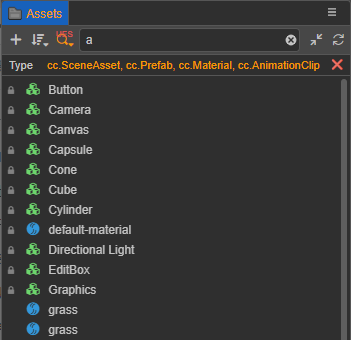
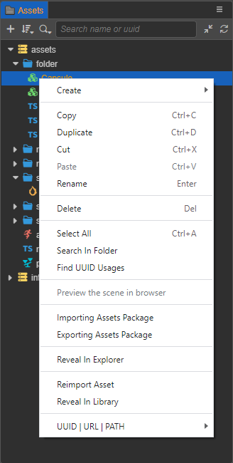
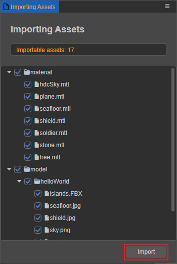

# 资源管理器

**资源管理器** 面板是用于访问和管理项目资源的重要工作区域。在开始制作游戏时，**导入资源** 通常是必须的步骤。在新建项目时可以使用  **HelloWorld** 模板项目，就可以看到 **资源管理器** 中已经包含了一些基本资源类型。

## 面板介绍

**资源管理器** 面板主要可以分为 **工具栏** 和 **资源列表** 两部分内容：

- **工具栏** 中的功能包括 **新建资源**、**排序方式**、**搜索过滤**、**搜索框**、**全部折叠/展开** 和 **刷新列表**。详情可参考下文介绍。

- **资源列表** 将项目资源文件夹中的内容以树状结构展示出来，默认包括 **assets** 和 **internal** 两个基本资源库（简称 DB）：

    - **assets** 类似操作系统中的文件管理器，只有放在项目文件夹的 `assets` 目录下的资源才会显示在这里。关于项目文件夹结构说明请参考 [项目结构](../../getting-started/project-structure/index.md)。
    - **internal** 中的是默认的内置资源（只读），内置资源可以复制，但不能进行增删改操作。可以作为资源模板拖拽到 **assets** 中，即新建了一个项目资源。

**资源管理器** 面板支持使用快捷方式来操作资源，详情请参考[快捷键使用方式](../shortcuts/index.md)。

### 生成资源

资源的创建有两种方式，一种是通过编辑器，另一种是通过导入外部资源。

通过编辑器创建资源包括以下两种方式：
1. 点击 **资源管理器** 左上方的 **+** 按钮。
2. 在 **资源管理器** 面板中点击鼠标右键，然后选择 **创建**。

> **注意**：创建资源时会先出现一个 **输入框** 要求填入新资源的名称，名称不能为空。

创建资源时，可以在树形资源列表中选中要放置资源的文件夹，则新建的资源会创建到当前选中的文件夹目录下。若没有选中任何文件夹，则新建资源会默认创建到当前根目录下（`assets`）。

通过导入外部资源的方式创建资源包括以下两种方式：
1. 在文件夹中选中需要导入的资源，拖拽到编辑器 **资源管理器** 面板的 `assets` 目录中，若面板右下角依次显示资源名称且资源显示在面板列表中，则代表资源已经导入完成。
2. 在 **资源管理器** 面板中右键点击 `assets` 目录，选择 **在资源管理器中显示**，打开 `assets` 目录所在的文件夹，将需要导入的资源拷贝到 `assets` 文件夹下。回到编辑器界面，观察资源是否存在转圈现象，有的话，待转圈结束即表示资源导入完成。若导入的资源较小没有出现转圈现象，则面板右下角依次显示资源名称且资源显示在面板列表中，即代表资源已经导入完成。

### 选择资源

在资源列表中可以使用以下的资源选择操作：

- 单击以选中单个资源。选中的资源会呈现 **蓝底黄字** 的高亮状态
- 双击以打开某个资源，比如 scene、script、image。双击文件夹则折叠/展开文件夹
- 按住 Ctrl/Cmd，然后选择资源，可以同时选中多个资源
- 按住 Shift，然后选择资源，可以连续选中多个资源

对于选中的资源，可以执行移动、删除等操作。

### 移动资源

选中资源后（可多选），按住鼠标拖拽可以将资源移动到其他位置。将要移动的资源拖拽到目标文件夹上时，会看到鼠标悬停的文件夹呈现黄字的高亮状态，并且在其周围有一个蓝色的方框。这时松开鼠标，就会将资源移动到高亮显示的文件夹目录下。

资源的移动还包括以下操作：

- 将 **资源管理器** 中的资源拖拽到 **场景编辑器** 或 **层级管理器** 面板可生成节点，目前支持拖拽 `cc.Prefab`、`cc.Mesh`、`cc.SpriteFrame` 资源。
- 从 **系统的文件管理器** 拖拽文件到 **资源管理器** 列表中，即可导入资源。
- 从 **层级管理器** 面板拖拽节点到 **资源管理器** 面板的某个文件夹中，可将节点保存为一个 `cc.Prefab` 资源，详见 [预制资源（Prefab）](../../asset/prefab.md)。

### 排序资源

工具栏中的 **排序方式**包括 **按名称排序** 和 **按类型排序**。当前的排序方式会被记录，下次打开编辑器时会保持当前的排序方式。

### 折叠资源

折叠分为单一折叠或含子集的全部折叠：

- **工具栏** 中的 **全部折叠/展开** 按钮作用于全局
- 单击一个父级资源（例如文件夹）的三角图标，可以展开或折叠它的子集。使用快捷键 **Alt** 并点击三角图标，可全部展开或折叠所有的子资源

资源当前的折叠状态会被记录，下次打开编辑器时会保持当前的折叠状态。

### 搜索资源

搜索功能是一种组合功能，可限定搜索类型并指定搜索字段，这两种都可以达到类型过滤的效果，根据选择的类型/字段，面板中会显示所有相应的资源。

- **限定搜索类型**：可多选。过滤类型为 [资源类型](__APIDOC__/zh/modules/asset.html)。

- **指定搜索字段**：搜索名称不区分大小写，包括以下几种搜索方式：

    1. **搜索名称或 UUID**
    2. **搜索 UUID**
    3. **搜索 URL**

        Cocos Creator 对资源路径也做了一层类似盘符的封装，资源库（dataBase）的盘符路径为 `db`。意味着 **资源管理器** 内的所有资源搜索都从 `db` 开始，即使 `assets` 和 `internal` 资源库在实际的操作系统下，它们路径的父级并不相同。
        - 假设需要搜索的资源 `hero.prefab` 存放在 `assets` 下的 `model` 文件夹里，则可以通过 `db://assets/model/hero.prefab` 检索到。
        - 假设需要搜索的资源 `ui-sprite-material.mtl` 存放在 `internal` 下，则可以通过 `db://internal/ui-sprite-material.mtl` 检索到。

    4. **查找 UUID 的使用**，例如：

        

若只想在某个父级资源（例如：文件夹）中搜索，则右键点击并选择 **在文件夹中查找**，即可缩小搜索范围。

在搜索结果列表中选中资源，双击资源等同于在正常模式下的操作。清空搜索内容后，会重新定位到选中的资源。

### 大图预览

在 **资源管理器** 中选中资源，即可在 **资源预览** 面板中显示资源的缩略图。若选中资源所在的文件夹，即可显示文件夹下所有资源的缩略图，方便查看。

## 资源的右击菜单

选中具体的资源/文件夹后，点击鼠标右键，可以在弹出的菜单栏中对资源执行一系列操作：

- **创建**：和 **资源管理器** 面板的 **创建** 按钮功能相同，会将资源添加到当前选中的文件夹下，如果当前选中的是资源文件，会将新增资源添加到和当前选中资源所在文件夹中。
- **复制**/**剪切**/**粘贴**：将选中的资源（可多选）复制/剪切，然后粘贴到该文件夹下或者另外的文件夹下。
- **生成副本**：生成和选中资源（可多选）完全相同的资源副本，生成的资源和选中的资源在同一层级中。
- **重命名**：修改资源名称，详情请查看下文介绍。
- **删除**：删除资源（资源可多选），也可以使用快捷键 **Delete**。资源删除后会保留在 **系统的回收站** 中，必要时可将其还原。
- **全选**：选中同一层级中的所有资源。
- **在文件夹中查找**：使用搜索功能时，只搜索该文件夹中的资源。
- **查找 UUID 的使用**：通过资源的 uuid 来查找该资源被哪些资源所引用。
- **在浏览器中预览此场景**：仅对场景资源有效。
- **在资源管理器 （Windows）或 Finder（Mac）中显示**：在操作系统的文件管理器窗口中打开该资源所在的文件夹。
- **重新导入资源**：更新资源到项目的 `./library` 文件夹，支持多选批量导入。
- **在 library 中显示**：打开该资源在项目文件夹的 `Library` 中的位置，详情请阅读 [项目结构](../../getting-started/project-structure/index.md)。
- **UUID/URL/PATH**：复制资源的 UUID/URL/PATH，并且在 **控制台** 面板中输出。此处输出的信息可用于资源搜索处的 **指定搜索字段**。

另外对于特定资源类型，双击资源可以进入该资源的编辑状态，如场景资源和脚本资源。

### 重命名资源

选中需要重命名的资源，然后点击右键，选择 **重命名** 即可修改资源名称，或者也可以直接使用快捷键 **Enter** 或者 **F2**。点击面板其他地方或者按快捷键 **Esc** 便可以取消此次重命名。

此外 TypeScript 脚本资源的初始名称会处理为它的 `className`，而 `className` 是不能重复的。

### 导出资源包

选中需要导出的资源并点击右键，然后选择 **导出资源包**，在弹出的 **导出资源** 面板中会自动列出当前选中的资源与其依赖的相关资源。如果不需要导出相关依赖资源，可以在 **导出资源** 面板左下角取消勾选 **包含依赖资源**。

确定要导出的资源后，点击 **导出** 按钮，会弹出文件存储对话框，用户需要指定一个文件夹位置和文件名，点击 **存储**，就会生成 **文件名.zip** 的压缩包文件，包含导出的全部资源。

> **注意**：插件会自动把资源打成一个 zip 包，该 zip 包只适用于 **导入资源包** 插件使用。

### 导入资源包

选中并右键点击要导入资源的文件夹，或者右键点击 **资源管理器** 面板的 **空白处**，然后选择 **导入资源包**，在弹出的文件浏览对话框中选择由 **导出资源包** 导出的 zip 包。zip 包中的资源便会自动解析到弹出的 **导入资源包** 面板。

导入过程中也会让用户再次确认导入资源，这时候可以通过取消某些资源的勾选来去掉不需要导入的资源。

> **注意**：
> 1. 导入的 zip 包，仅支持由 Cocos Creator 3.0.0 及以上版本使用 **导出资源包** 导出的 zip 包。
> 2. 不支持导入相同类名的脚本。

## 扩展资源管理器面板

目前支持的扩展包括 **右击菜单** 和 **拖入识别**，详情请参考 [扩展资源管理器面板](./extension.md)。
