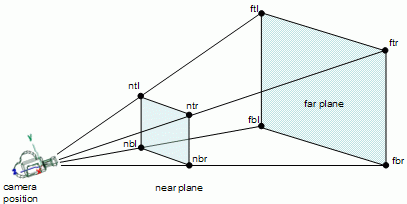
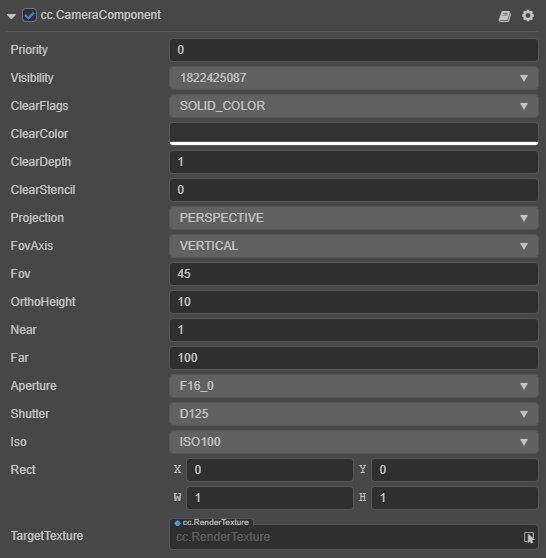
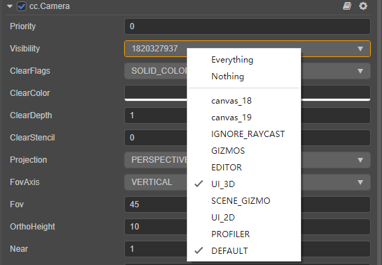

# 相机

游戏中的相机是用来捕捉场景画面的主要工具。我们通过调节相机相关参数来控制可视范围的大小，在 Cocos Creator 编辑器中相机呈如下表示：

相机的可视范围是通过 6 个平面组成一个 **视锥体（Frustum）** 构成，**近裁剪面（Near Plane）** 和 **远裁剪面（Far Plane）** 用于控制近处和远处的可视距离与范围，同时它们也构成了视口的大小。

相机组件接口请参考 [Camera API](../../../api/zh/classes/component_camera.camera.html)。

## 相机组件

相机组件是我们用来呈现场景画面的重要功能组件。

| 属性名称 | 说明 |
|:-------:|:---:|
| priority | 相机的渲染优先级，值越小越优先渲染 |
| visibility | 可见性掩码，声明在当前相机中可见的节点层级集合 |
| clearFlags | 相机的缓冲清除标志位，指定帧缓冲的哪部分要每帧清除。包含： DONT_CLEAR：不清空； DEPTH_ONLY：只清空深度；  SOLID_COLOR：清空颜色、深度与模板缓冲；  SKYBOX：启用天空盒，只清空深度 |
| clearColor | 指定清空颜色 |
| clearDepth | 指定深度缓冲清空值 |
| clearStencil | 指定模板缓冲清空值 |
| projection | 相机投影模式。分为 **透视投影（PERSPECTIVE）** 和 **正交投影（ORTHO）** |
| fovAxis | 指定视角的固定轴向，在此轴上不会跟随屏幕长宽比例变化 |
| fov | 相机的视角大小 |
| orthoHeight | 正交模式下的视角 |
| near | 相机的近裁剪距离，应在可接受范围内尽量取最大 |
| far | 相机的远裁剪距离，应在可接受范围内尽量取最小 |
| aperture | 相机光圈，影响相机的曝光参数 |
| shutter | 相机快门，影响相机的曝光参数 |
| iso | 相机感光度，影响相机的曝光参数 |
| rect | 此相机最终渲染到屏幕上的视口位置和大小 |
| targetTexture | 指定此相机的渲染输出目标贴图，默认为空，直接渲染到屏幕 |

## 相机分组渲染

分组渲染功能是通过相机组件([Camera](../../editor/components/camera-component.md)) 的 Visibility 属性配合节点的 Layer 属性共同决定。用户可通过代码设置 Visibility 的值来完成分组渲染。所有节点默认都属于 DEFAULT 层，在所有相机都可见。

### 相机的 Visibility 属性设置

Visibility 属性用于设置哪些层级（Layer）的节点应该被相机观察到，可同时选择多个 Layer。

> **注意**：从 Cocos Creator 3.0 开始，2D 元素（例如 Sprite）的渲染也遵从 Layer 与 Visibility 的判断，开发者可以根据需要自行调整 Layer 与 Visibility。

当开发者在 Visibility 属性中勾选了多个 Layer 时，Visibility 属性值便是通过将多个 Layer 的属性值执行 `|` 操作计算得出。

例如，下图中相机的 Visibility 属性同时勾选了 **UI_3D** 和 **DEFAULT** 这两个 Layer，通过 [查询 Layer 属性值](../../concepts/scene/layer.md) 可以知道 **UI_3D** 的属性值是 **1 << 23**，**DEFAULT** 的属性值是 **1 << 30**，那么 Visibility 属性值便是 **1 << 23 | 1 << 30  = 1820327937**。

关于 layer 的实现详情，请参考 [层级](../../concepts/scene/layer.md) 文档。

### 相机的可见性计算

Visibility 属性可以同时选择多个 Layer，同时 Node 上的 Layer 也有自身的值，因此相机的 Visibility 属性是一个 232 位的整数，每一种可见的 layer 占一位，采用位操作运算，最高支持 32 个不同的 Layer 标签（每一种 Layer 值占一位，即用 232 表示）。在相机 culling 时，每个节点的 layer 值会跟相机进行 `&` 操作运算，如果相机的 Visibility 属性包含这个 Layer，那么当前节点就会被相机所看见，反之则看不见。
