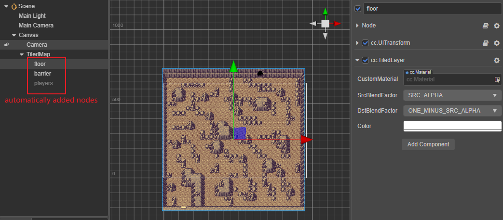
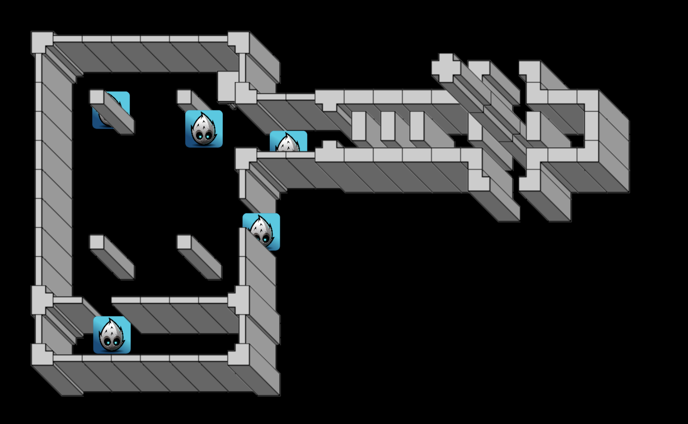

# TiledMap 组件参考

TiledMap（地图）用于在游戏中显示 TMX 格式的地图。
    

点击 **属性检查器** 下方的 **添加组件 -> Components -> TileMap** 按钮，即可添加 TiledMap 组件到节点上。
    

TiledMap 的脚本接口请参考 [TiledMap API](../../../api/zh/classes/TiledMap.html)。

## TiledMap 属性

| 属性              | 功能说明
| :---------------- | :----------------- |
| Tmx Asset         | 指定 .tmx 格式的地图资源 |
| EnableCulling     | 启用裁剪， 如果需要旋转地图或者把地图置于 3D 相机中，则需要关闭裁剪。如果地图块不是非常多，如小于 5000 块，那么关闭裁剪能减少 CPU 的运算负担，GPU 直接使用缓存进行渲染 |

## 详细说明

- 添加 TiledMap 组件之后，从 **资源管理器** 中拖拽一个 **.tmx** 格式的地图资源到 Tmx Asset 属性上就可以在场景中看到地图的显示了。
- 在 TiledMap 组件中添加了 Tmx Asset 属性后，会在节点中自动添加与地图中的 Layer 对应的节点。这些节点都添加了 TiledLayer 组件。**请勿删除这些 Layer 节点中的 TiledLayer 组件**。

    

- TiledMap 组件不支持 `mapLoaded` 回调，在 `start` 函数中可正常使用 TiledMap 组件。

## TiledLayer 与节点遮挡

TiledLayer 组件会将添加到地图层的节点坐标转化为地图块行列坐标。当按行列顺序渲染地图层中的地图块时，如果该地图块的行列中存在节点，那么将会中断渲染地图块转而渲染节点。当地图块中的节点渲染完毕后，会继续渲染地图块。以此实现节点与地图层相互遮挡关系。

**注意**：该遮挡关系只与节点的坐标有关，与节点的大小无关。

下面通过一个范例来介绍 TiledLayer 如何与节点相互遮挡。

1. 在场景中新建一个节点并添加 TiledMap 组件，设置好 TiledMap 组件属性后会自动生成带有 TiledLayer 组件的节点（即地图层）。

2. 创建 [预制资源](../asset-workflow/prefab.md) 以便在场景中实例化出多个节点。

3. 在 **资源管理器** 中新建一个 TypeScript 脚本，编写组件脚本。脚本代码如下：

    ```ts
    import { _decorator, Component, Node, TiledLayer, loader, Prefab, v2, instantiate, Vec3, SystemEventType, EventTouch } from 'cc';
    const { ccclass, property } = _decorator;

    @ccclass('ShieldNode')
    export class ShieldNode extends Component {

        @property({ type: TiledLayer })
        public tiledLayer: TiledLayer | null = null;

        @property({ type: Prefab })
        public nodePrefab: Prefab | null = null;

        start () {
            this.initScene(this.nodePrefab!);
        }

        initScene (prefab: Prefab) {
            const posArr = [v2(-249, 96), v2(-150, 76), v2(-60, 54), v2(-248, -144), v2(-89, -34)];
            const tmpP = new Vec3();
            for (let i = 0; i < posArr.length; i++) {
                const shieldNode = instantiate(prefab);
                shieldNode.setPosition(posArr[i].x, posArr[i].y);
                this.tiledLayer!.addUserNode(shieldNode);
                shieldNode.on(SystemEventType.TOUCH_MOVE, (event:EventTouch) => {
                    const deltaMove = event.getDelta();
                    shieldNode.getPosition(tmpP);
                    tmpP.x += deltaMove.x;
                    tmpP.y += deltaMove.y;
                    shieldNode.setPosition(tmpP);
                });
            }
        }
    }
    ```

4. 将脚本组件挂载到 Canvas 节点上，即将脚本拖拽到 Canvas 节点的 **属性检查器** 中。再将 **层级管理器** 中自动生成的带有 TiledLayer 组件的节点以及 **资源管理器** 中的预制资源拖拽至脚本组件对应的属性框中，然后保存场景。

5. 点击编辑器上方的预览按钮，即可看到节点与地图层相互遮挡的效果。关于代码可参考 [ShieldNode](https://github.com/cocos-creator/test-cases-3d/tree/v3.0/assets/cases/tiledmap) 范例。

    

若想移除地图层中的节点，调用 TiledLayer 的 `removeUserNode` 方法即可。

