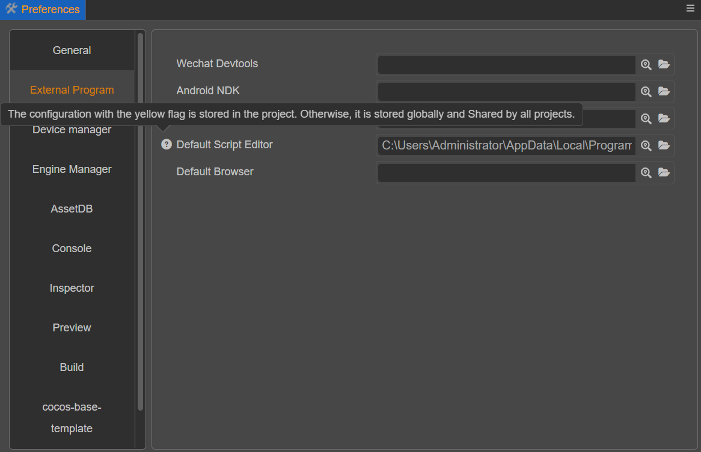

# 偏好设置

编辑器允许每个扩展注册自己的配置，然后在偏好设置面板内显示部分或全部的编辑器配置。
在这个面板里，修改的是编辑器功能相关的配置。
如果是项目相关的配置，请移步 [项目设置](./contributions-project.md) 说明。

## 偏好设置的面板说明

我们通过顶部菜单 **Cocos Creator -> 偏好设置** 打开偏好设置面板。



偏好设置面板分成左右两侧：

左侧显示的是提供配置项目的功能插件的名字。
右侧是根据配置渲染出来的操作面板。

面板上的修改，会立即修改到对应的配置项目上。

通常情况下看到的配置都存储在 global 这一层级。
如果有些配置有需要放到项目里，则可以将鼠标移动到配置条目上，在左侧出现的小图标上选择 “记录到项目”。
那么这个数据将会被保存到项目里，对其修改不会影响到其他项目。

> **注意**：如果自动渲染的配置会存储在项目里，他左侧的图标会变黄提示。

如果想重新使用全局配置，则点击左侧图标，选择还原到全局配置，这么做将会丢弃项目设置。

> **注意**：只有自动渲染的配置会自动添加图标。如果没有定义 properties，则需要自己在面板上实现图标的变化功能。

另外有一些配置是无法切换全局、本地存储位置的，例如预览场景，必须存储在项目。所以这部分配置应该使用自定义面板。

## 注册方式

偏好设置允许以两种方式显示配置：

1. 通用配置
2. 实验室配置

通用设置直接以选项卡的形式展示，而实验室开关则单独一个选项卡集中展示。

当插件提供的功能比较稳定时建议将配置数据放在通用功能内，
当插件提供的功能处于开发阶段时建议将功能的开关配置数据放在实验室配置中。

我们首先需要在 `contributions.profile.editor` 里定义好配置。
然后就可以在 `contributions.preferences` 里定义偏好设置里需要显示的数据。

关于如何定义 profile 详细请参看 [Profile](./profile.md)。

## 注册偏好设置数据

`package.json`

```JSON5
{
    "name": "hello-world",
    "contributions": {
        "profile": {
            "editor": {
                "foo": {
                    "default": 0,
                    "label": "foo"
                },
                "bar": {
                    "default": false,
                    "label": "bar"
                }
            }
        },
        "preferences": {
            "properties": {
                "foo": {
                    "ui": "ui-num-input"
                }
            },
            "laboratory": ["bar"]
        }    
    }
}
```

这样我们就分别定义了 foo 和 bar 两个编辑器配置，并且将配置添加到了偏好设置中。
其中 foo 被存放在通用配置中，bar 被存放在实验室配置中。

定义好的 profile 数据会被自动注册到 default 上。使用 Editor.Profile.getConfig 将能够获取到默认值。

`package.json` 的 `contributions` 需要像下面这样定义。

```typescript
interface package
{
    "name": string;
    "contributions": {
        "profile": {
            "editor": {
                [key:string]: ProfileItem;
            };
        };
        "preferences": {
            /**
             * 可以填写 properties 数据来自动渲染配置。
             * properties 中的 key 对应编辑器配置的 key，value 对应着自动渲染需要的信息。
             * 如果 properties 中有定义 ui 则会自动渲染到功能插件名字的选项卡下。
             **/
            "properties": {
                [key:string]: UIInfo
            };
            /**
             * 如果配置比较复杂，自动渲染无法满足需求，可以填写 custom 数据。
             * 在该处填写自定义面板的入口，
             * 该面板会在自动渲染的下方出现（如果定义了 properties）。
             **/ 
            "custom": string;
            /**
             * 编辑器内将实验室单独列成了一个选项卡，主要是提供一些实验功能的开关显示。
             * 可以填写 laboratory 数据将类型为 Boolean 的编辑器配置添加到实验室开关中。
             * laboratory 是一个数组，数组里的 key 指向到编辑器配置内的 key，对应的数据的必须是 Boolean 类型的。
             * 在此处填写的 key 将会在偏好设置的实验室选项卡内显示出来。
             **/
            "laboratory": string[];
        };
        ...
    }
    ...
}
```

```typescript
interface UIInfo {
    // 使用哪种 ui 元素渲染，例如 "ui-num-input"
    ui: string;
    attributes: {
        // ui 元素上允许传入的 attribute 数据，每一种 ui 允许传入的参数不一样，详细参考 ui-kit 章节
        // 假设 ui 为 "ui-num-input"
        // 此处可以填入 "step": 1
        [key:string]: any;
    };
}
```

关于如何自定义面板请点击查看[面板的定义](./panel.md)。
