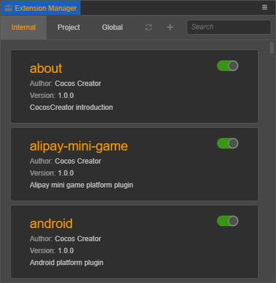

# 安装与分享

Cocos Creator 在启动项目的过程中会搜索并加载 **全局** 和 **项目** 两个路径下的扩展。

如果需要将扩展应用到所有的 Cocos Creator 项目，可以选择将扩展包放在 **全局** 扩展包路径中：

- **Windows**：`%USERPROFILE%\.CocosCreator\extensions`
- **macOS**：`$HOME/.CocosCreator/extensions`

如果只希望将扩展应用到指定的项目，可以选择将扩展包放在 **项目** 扩展包路径中：

- `$你的项目地址/extensions`

## 打包扩展

当编写好一个扩展后，如果要将扩展共享给其他人使用，则需要将该扩展包压缩。

例如扩展包 `hello-world`，如果放在项目扩展包路径中，其目录结构如下：

```
MyProject
 |--assets
 |--extensions
     |--hello-world
        |--package.json
        |--browser.js
  ...
```

全选 `hello-world` 的内部文件（`package.json` 和 `browser.js`），将所有文件压缩成 zip 包，并命名为 `hello-world.zip`。

zip 包内容格式和文件格式一致：

```
hello-world.zip
    |--package.json
    |--browser.js
```

**请注意不要在 zip 包内再嵌套一层扩展目录**

## 安装扩展包

- 首先在编辑器顶部菜单栏中点击 **扩展 -> 扩展管理器**，打开 **扩展管理器** 面板。

  

- 然后在 **扩展管理器** 中选择 **项目**/**全局** 选项卡，点击 **+** 按钮，在弹出的文件选择框中选择打包后的扩展 zip 文件，点击 **打开**。导入的扩展压缩包会被解压并放到指定的位置（**项目**/**全局** 扩展包路径）。

- 最后在 **扩展管理器** 对应的 **项目**/**全局** 选项卡中找到扩展，点击右边的 **启用** 按钮，刚刚导入的扩展就可以正常运行了。

## 卸载已安装的扩展

在 **扩展管理器** 中找到需要删除的扩展，点击 **删除** 图标按钮即可，同时扩展所在的文件夹也会删除。如果只需要禁用，可以只选择 "关闭"。

## 重载扩展

开发过程中，有时候需要修改扩展的内容，但修改后扩展已经运行的逻辑不会自动更新，这时候就需要在编辑器内手动重新载入一次扩展。

在 **扩展管理器** 中找到对应的扩展，然后点击 **重新载入** 图标按钮，这时候编辑器中的扩展将使用最新的代码和文件重新运行。
