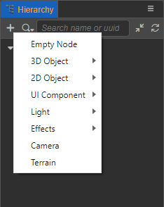
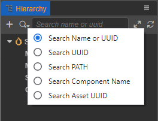
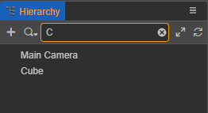
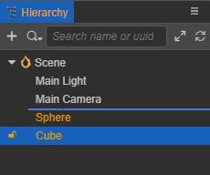
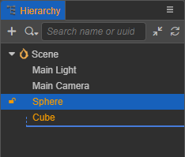

# 层级管理器

**层级管理器** 面板上主要包括 **工具栏** 和 **节点列表** 两部分内容，用于展现当前场景中可编辑的节点之间的关系。场景中仍有一些不可见的私有节点，不会在此显示。

你可以单选、多选、创建、复制、移动、删除和重命名节点，任意节点都可创建出子节点，子节点的坐标相对于父级节点，跟随父级节点移动。

- 选中节点，节点呈现蓝底黄字的高亮状态，节点的详细属性会在 **属性检查器** 中显示。点击面板空白区域，可以 **取消选中**。
- **工具栏** 中的功能包括：**新建节点按钮（+）**、**搜索类型按钮**、**搜索框**、**全部折叠/展开按钮** 和 **刷新列表按钮**。
- **节点列表** 主要体现节点的层级关系，根节点是 **场景节点（Scene）**，编辑 Prefab 文件时，自身的节点作为根节点。可以在这里用右键菜单或者拖拽操作对节点进行增删修改。
- 面板支持键盘快捷方式：
    - 复制：Ctrl/Cmd + C
    - 粘贴：Ctrl/Cmd + V
    - 克隆：Ctrl/Cmd + D，Ctrl + 拖动节点
    - 删除：Delete
    - 上下选择：上下箭头
    - 节点的折叠：左箭头
    - 节点的展开：右箭头
    - 多选：Ctrl or Cmd + 点击
    - 连续多选：Shift + 点击
    - 重命名：Enter/F2
    - 取消输入：Esc

## 新建节点

点击面板左上角的 **新建节点（+）** 按钮或者直接在面板中点击右键，即可创建节点。

创建节点的时候，会先出现一个 **输入框** 要求填入节点的名称，节点的名称允许为空，若为空则会以默认节点名称命名。

- 如果没有在树形列表中选中节点，则新建的节点会默认创建到当前根节点下（`Scene`）
- 如果有多个选中节点，则新建的节点会创建到第一个选中节点下。

### UI 节点

对于 UI 节点，为了让其正常显示，它的任意上级节点至少得有一个含有 **UITransform** 组件。所以创建 UI 节点时，如果不符合规则，则会自动创建一个 **Canvas** 节点作为 UI 节点的根节点，具体内容可参考 [UI 结构说明](../../2d-object/ui-system/index.md)。

### Prefab 节点

对于 Prefab 节点，可以直接将 **资源管理器** 中的一个 **Prefab** 资源拖动到 **层级管理器** 中生成一个 Prefab 节点。当然也可以将 **层级管理器** 中的一个 **Prefab** 节点拖动到 **资源管理器** 中生成一个 Prefab 资源。

## 搜索节点

搜索类型包括：**搜索名称或 UUID**、**搜索 UUID**、**搜索 Path**、**搜索组件名称** 和 **搜索资源 UUID**。

其中 **搜索组件名称** 会搜索出节点列表中包含指定组件的所有节点，可在 **属性检查器** 查看到组件名称，如 **MeshRenderer**。

**搜索框** 会根据输入内容即时更新搜索结果。在搜索结果中选中节点，清空搜索内容后，仍会在资源列表中定位到该选中节点。

## 更改节点的显示顺序

通过拖拽节点上下移动，可以更改节点在列表中的排序。移动节点分为 **被移动的节点** 和 **目标放置节点**：

- 将 **被移动的节点** 拖动到 **目标放置节点** 的上方，两者是 **平级** 的。

    如下图，选中 Cube 节点，并将其拖动到 Sphere 节点的上方，Sphere 节点会呈现黄字的高亮状态，并且在其上方有一条蓝色的线，表示 Cube 节点将会被插入的位置。

    

- 将 **被移动的节点** 拖动到 **目标放置节点** 上，**被移动的节点** 会作为 **目标放置节点** 的子节点排在最末尾。

    如下图，选中 Cube 节点，并将其拖动到 Sphere 节点上，Sphere 节点会呈现浅蓝底黄字的高亮状态，表示 Cube 节点将会成为 Sphere 的子节点。

    

- 将 **被移动的节点** 拖动到 **目标放置节点** 的下方，两者是 **平级** 的。

    如下图，选中 Sphere 节点，并将其拖动到 Cube 节点的下方，Cube 节点会呈现黄字的高亮状态，并且在其下方有一条蓝色的线，表示 Sphere 节点将会被插入的位置。

    

## 重命名节点

选中某个节点，然后点击右键，选择 **重命名** 即可修改节点名称，或者也可以直接使用快捷键 **Enter** 或者 **F2**。点击面板其他地方或者按快捷键 **Esc** 可以取消此次重命名。

不同节点可以有相同的名称。

## 其他操作

右键点击节点弹出的菜单里还包括下列操作：

- **复制/粘贴**：将节点复制到剪贴板上，然后可以粘贴到另外的位置，或打开另一个场景来粘贴刚才拷贝的节点。
- **生成副本**：生成和选中节点完全相同的节点副本，生成节点和选中节点在同一层级中。
- **全选**：选中同一层级中的所有节点。
- **复制并打印 UUID/PATH**：在复杂场景中，我们有时候需要获取节点的 UUID 或者完整的层级路径，以便在脚本运行时访问该节点。点击该选项，就可以在 **控制台** 中看到当前选中节点的 UUID 以及节点的层级路径。
- **锁定节点**：鼠标移到节点上，左侧会有一个锁定按钮，节点锁定后便无法在 **场景编辑器** 中选中该节点。

  从 v3.1.1 开始，支持批量锁定节点及其子节点。选中任意节点，按住 <kbd>Alt</kbd> 并点击锁定按钮，该节点及其子节点便会全部被锁定。
