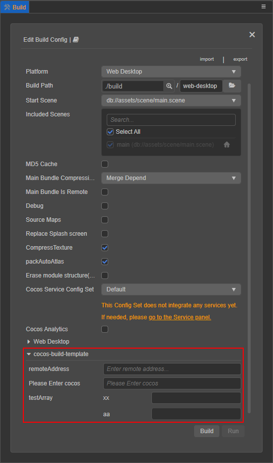
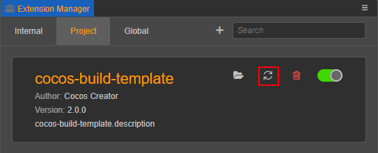
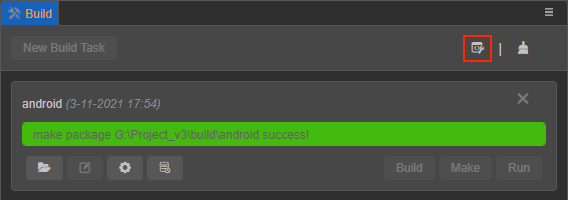

# 扩展构建流程

开发者如果想要扩展构建流程的话，可以通过插件来实现，需要使用到 [扩展包](../extension/first.md)。扩展构建功能的前提是需要对构建的整体处理流程有所了解，不熟悉的开发者建议先阅读 [构建流程简介与常见问题指南](./build-guide.md)。

## 基本操作流程

1. 在编辑器的菜单栏中点击 **项目 -> 新建构建扩展包**，选择 **全局**/**项目** 后即可创建一个构建扩展插件包。

    - 若选择 **全局**，则是将构建扩展包应用到所有的 Cocos Creator 项目，**全局** 路径为：

        - **Windows**：`%USERPROFILE%\.CocosCreator\extensions`

        - **macOS**：`$HOME/.CocosCreator/extensions`

    - 若选择 **项目**，则是将构建扩展包应用到指定的 Cocos Creator 项目，**项目** 路径为：

        - `$你的项目地址/extensions`

2. 构建扩展包创建完成后会在 **控制台** 输出生成路径，点击路径即可在操作系统的文件管理器中打开构建扩展包。

    

3. 启用构建扩展插件之前需要先在目录下执行 `npm install` 安装一些依赖的 `@types` 模块才能正常编译。编辑器自带的接口定义已经生成在编辑器根目录的 `resources\3d\engine\@types` 文件夹下了，后续通过编辑器主菜单的 **开发者 -> 导出 .d.ts** 即可获取到最新的接口定义。

4. 点击编辑器主菜单中的 **扩展 -> 扩展管理器**，打开 **扩展管理器** 面板。然后在 **扩展管理器** 中选择 **项目**/**全局** 选项卡，即可看到刚刚添加的构建扩展插件。然后点击右上方的 **启用** 按钮，即可正常运行插件。

    

5. 启用构建扩展插件后，打开 **构建发布** 面板，可以看到构建扩展插件的展开栏。点击 **构建** 即可加入构建流程。

    

6. 如果需要修改构建扩展插件的内容，直接修改 `extensions` 目录下的构建扩展包即可，具体内容请参考构建扩展包目录下的 `readme.md` 文件。然后在 **扩展管理器** 中找到对应的构建扩展插件，点击 **重新载入** 图标按钮，编辑器中的构建扩展插件便会使用最新的代码和文件重新运行。

    

## 入口脚本

构建扩展包需要在 `package.json` 的 `contributions` 中添加 `builder` 字段，然后在 `builder` 字段中指定一个 JavaScript 脚本的 **相对路径**，作为构建扩展插件参与到构建流程的入口脚本。

例如：

```json
// package.json

{
    "contributions": {
        "builder": "./dist/builder.js"
    }
}
```

> **注意**：`builder` 字段里指定的 `./dist/builder.js` 入口脚本是编译后的脚本，入口脚本的源文件则位于 `./source/builder.ts`，若需要配置入口脚本，请在源文件中修改。

### 入口脚本配置

关于入口脚本的配置，代码示例如下：

```ts
// builder.ts

export const configs: IConfigs = {
    'web-mobile': {
        hooks: './hooks',
        options: {
            remoteAddress: {
                label: 'i18n:xxx',
                render: {
                    ui: 'ui-input',
                    attributes: {
                        placeholder: 'Enter remote address...',
                    },
                },
                // 校验规则，目前内置了几种常用的校验规则，需要自定义的规则可以在 "verifyRuleMap" 字段中配置
                verifyRules: ['require', 'http'],
            },
            enterCocos: {
                    label: 'i18n:cocos-build-template.options.enterCocos',
                    description: 'i18n:cocos-build-template.options.enterCocos',
                    default: '',
                    render: {
                        // 请点击编辑器菜单栏中的“开发者 -> UI 组件”，查看所有支持的 UI 组件列表。
                        ui: 'ui-input',
                        attributes: {
                            placeholder: 'i18n:cocos-build-template.options.enterCocos',
                        },
                    },
                    verifyRules: ['ruleTest']
                }
            },
            verifyRuleMap: {
                ruleTest: {
                    message: 'i18n:cocos-build-template.ruleTest_msg',
                    func(val, option) {
                        if (val === 'cocos') {
                            return true;
                        }
                        return false;
                    }
                }
            }
        },
};
```

在编写入口脚本时还需要额外注意以下几点：

1. 不同进程中的环境变量会有所差异。入口脚本会同时被 **渲染进程** 和 **主进程** 加载，所以请不要在入口脚本中使用仅存在于单一进程中的编辑器接口。进程相关详情请参考下文 **调试构建扩展插件** 部分的内容。

2. `config` 的 key 有两种配置方式：

    - 针对 **单个平台** 的配置，`key` 值填写为 `平台构建插件名`，参考上面的代码示例。各平台对应的构建插件名可在编辑器主菜单的 **扩展 -> 扩展管理器 -> 内置** 中查看。

    - 针对 **所有平台** 的配置，`key` 值填写为 `*`，参考通过编辑器菜单栏的 **新建构建扩展包** 生成的 `source/builder.ts` 文件。

    > **注意**：这两种配置方式是互斥的，请不要在同一个构建扩展包中同时使用。否则单个平台的配置（key 值为 `平台构建插件名`）会覆盖掉所有平台的配置（key 值为 `*`）。

### 入口脚本接口定义

关于入口脚本详细的接口定义，说明如下：

```ts
declare type IConfigs = Record<Platform | '*', IPlatformConfig>;
declare interface IBuildPlugin {
    hooks?: string; // 钩子函数的存储路径
    options?: IDisplayOptions; // 需要注入的平台参数配置
    verifyRuleMap?: IVerificationRuleMap; // 注册参数校验规则函数
}
declare type IDisplayOptions = Record<string, IConfigItem>;
declare interface IConfigItem {
    // 默认值，注册的默认值将会在插件自身配置里的 "options.[platform].xxx" 字段内
    default?: any;

    render: ?{
        // 渲染 UI 组件规则，与 "ui-prop" 处统一规则一致，只有指定了 UI 属性的配置才会在构建发布面板上显示
        ui?: string;
        // 传给 UI 组件的配置参数
        attributes?: IUiOptions;
    };

    // 配置显示的名字，如果需要翻译，则传入 "i18n:${key}"
    label?: string;

    // 简单说明，当鼠标上移到配置名称时会显示在 title 中
    description?: string;

    // 配置的类型
    type?: 'array' | 'object';

    // 如果 type 是 array，则会按照指定数据类型和 "itemConfigs" 来渲染数据
    itemConfigs?: Record<string, IConfigItem> | IConfigItem[];
}

declare interface IUiOptions extends IOptionsBase {
    // 校验规则数组，构建提供一些基础规则，也可以通过 "verifyRuleMap" 来指定新的校验规则，只有当传入 "require" 时才会做无值的校验，否则仅存在值时才会校验
    verifyRules?: string[];
}

declare interface IUiOptions extends IOptionsBase {
    class?: string | string[]; // 需要设置在当前 "ui-prop" 上的样式名称
}
```

其中 `IOptionsBase` 的接口定义需要参考 [ui-prop 自动渲染规则定义](../extension/ui.md)。

### 钩子函数

在入口脚本的 `hooks` 字段中定义的脚本，可用于编写构建生命周期的钩子函数。所有的钩子函数都是在构建进程中按照顺序依次执行，不同的钩子函数接收到的数据会有所差异。在构建进程中可以直接使用引擎提供的 API 和 `Editor` 全局变量，关于 Editor 详细的接口定义请点击编辑器主菜单的 **开发者 —> 导出 .d.ts** 获取和查看。关于构建进程的说明请参考下文 **构建进程** 部分的内容。

公开的钩子函数与构建的生命周期的关系请参考下图：


钩子函数大致的接口定义如下所示：

```ts
declare interface IHook {
    throwError?: boolean; // 插件注入的钩子函数，表示在执行失败时是否直接退出构建流程，并显示构建失败
    // ------------------ 钩子函数 --------------------------
    onBeforeBuild?: IBaseHooks;
    onBeforeCompressSettings?: IBaseHooks;
    onAfterCompressSettings?: IBaseHooks;
    onAfterBuild?: IBaseHooks;

    // 编译生成的钩子函数（仅在构建有“生成”步骤的平台时才有效）
    onBeforeMake?: (root: string, options: IBuildTaskOptions) => void | Promise<void>;
    onAfterMake?: (root: string, options: IBuildTaskOptions) => void | Promise<void>;
}
type IBaseHooks = (options: IBuildTaskOptions, result?: IBuildResult) => void | Promise<void>;
```

> **注意**：
> 1. 在 `onBeforeCompressSettings` 开始才能访问到 `result` 参数，并且传递到钩子函数中的 `options` 是实际构建进程中使用的 `options` 的一个副本，仅作为信息获取的参考，因而直接修改它虽然能修改成功但并不会真正地影响构建流程。构建参数请在入口脚本的 `options` 字段中修改。由于接口定义比较多，详细的接口定义可以参考构建扩展包中 `@types/packages/builder` 目录下的内容。
> 2. 钩子函数允许为异步函数，构建执行钩子函数时默认会 await 等待其执行完毕才会执行下一个流程。

简单的代码示例：

```ts
export function onBeforeBuild(options) {
    // To do something...
}
export async function onBeforeCompressSettings(options, result) {
    // To do something...
}
```

## 调试构建扩展插件

构建扩展插件参与到构建流程时，相关代码会运行在以下三种进程：

- **主进程**：执行入口脚本及其依赖资源
- **渲染进程**：执行入口脚本中注册到 **构建发布** 面板上的部分字段
- **构建进程**：执行入口脚本中 `hooks` 字段定义的脚本

### 主进程（入口脚本）

主进程主要执行构建扩展插件中用于参与构建流程的入口脚本（`builder` 字段中指定的脚本），以及插件自身的入口脚本（`main` 字段中指定的脚本）。

当修改了运行在主进程中的代码时，必须要重启插件，然后再刷新需要更新的进程（这一点会在之后优化，尽量通过一次重启便解决代码更新问题，但刷新依旧是最彻底的重载方法）。主进程目前没有比较合适的调试方法，可以使用命令行打开编辑器查看主进程代码日志来辅助调试：

```bash
// Mac
/Applications/CocosCreator/Creator/3.0.0/CocosCreator.app/Contents/MacOS/CocosCreator --project projectPath

// Windows
...\CocosCreator.exe --project projectPath
```

### 渲染进程（构建面板）

构建扩展插件的入口脚本中，有部分字段是注册到 **构建发布** 面板上的，例如 `options` 的显示配置、`panel` 字段，以及 `panel` 脚本本身，这部分内容会在渲染进程载入执行。渲染进程其实就是窗口自己的执行进程，打开调试工具，可以调试 **构建发布** 面板上的 dom 元素、样式、脚本等。

如果是修改了注册到 **构建发布** 面板上的代码时，只需要刷新面板即可，无需重启插件。

- **打开构建发布面板渲染进程的调试工具**

  点击 **构建发布** 面板，然后按下快捷键 **Ctrl + Shift + i**（Windows）或者 **Cmd + Option + i**（Mac），即可打开 **构建发布** 面板的调试工具。

- **重新载入（刷新）面板方式**

  点击 **构建发布** 面板或者 **构建发布** 面板的调试工具后，按下 **Ctrl/Cmd + R** 即可。

### 构建进程（`hooks` 脚本）

构建的实际执行阶段是单独的一个 worker 进程，确保即使发生异常崩溃也不会影响到其他窗口的正常使用。在入口脚本的 `hooks` 字段中定义的脚本也是在这个单独的 worker 进程中载入执行的。

如果仅修改 `hook` 字段定义的脚本，刷新构建进程即可，无需重启插件。刷新方式同上文的 **构建发布** 面板一致，打开构建调试工具后，按下快捷键 **Ctrl/Cmd + R** 即可。

#### 打开构建进程的调试工具

包括以下三种方式：

1. 在 **构建发布** 面板点击构建任务窗口右上方的 **打开构建调试工具** 按钮。

    

2. 点击编辑器主菜单中的 **开发者 -> 打开构建调试工具** 即可。

3. 在任意插件代码或者控制台中，执行以下代码：

    ```ts
    Editor.Message.send('builder', 'open-devtools');
    ```

    可以在这个消息方法的基础上，根据自己的需要进行扩展。例如：可以在自己编写的构建插件的代码中捕获错误，一旦有异常就自动打开调试工具之类的。
