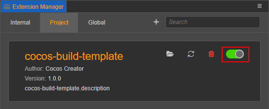
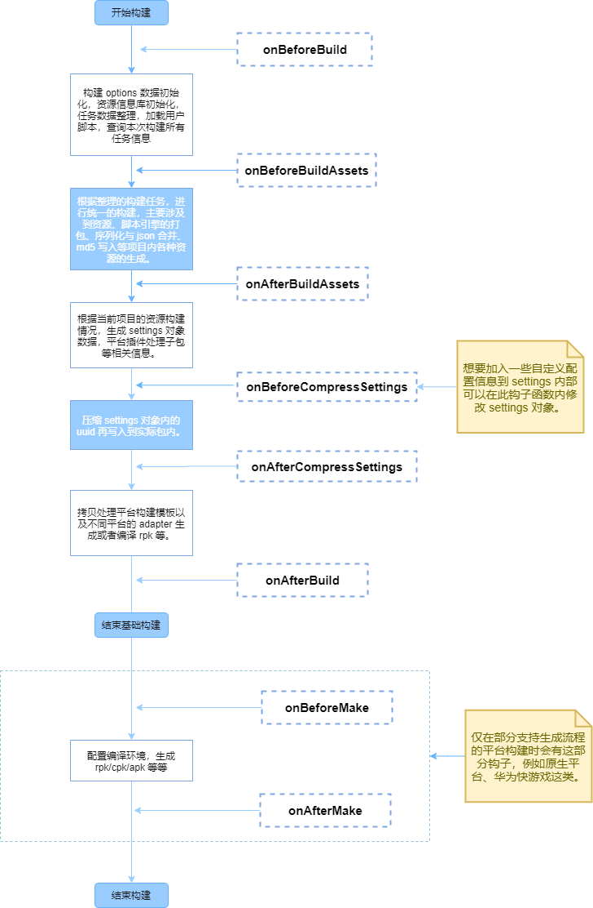

# 扩展构建流程

构建平台插件首先是需要一个普通的编辑器插件格式，关于插件的基本结构可以参考 [插件系统](../extension/install.md)。扩展构建功能首先需要对构建的整体处理流程有所了解，不熟悉的开发者建议先阅读 [构建流程简介与常见问题指南](./build-guide.md)。

## 快速开始

1. 在编辑器的菜单栏中点击 **项目 -> 新建构建扩展插件**，选择 **全局**/**项目** 后即可创建一个构建扩展插件包。

    * 若选择 **全局**，则是将构建扩展插件应用到所有的 Cocos Creator 项目，**全局** 路径为：

        * **Windows**：`%USERPROFILE%\.CocosCreator\extensions`

        * **Mac**：`$HOME/.CocosCreator/extensions`

    * 若选择 **项目**，则是将构建扩展插件应用到指定的 Cocos Creator 项目，**项目** 路径为：

        * `$你的项目地址/extensions`

2. 构建扩展插件创建完成后会在 **控制台** 中看到插件的生成路径，点击路径即可在操作系统的文件管理器中打开构建扩展插件包。

3. 启用构建扩展插件之前需要先在目录下执行 `npm install` 安装一些依赖的 @types 模块才能正常编译。编辑器自带的接口定义已经生成在根目录的 **@types** 文件夹下了，后续通过编辑器菜单栏的 **开发者 -> 导出 .d.ts** 即可获取到最新的接口定义。

4. 在编辑器的菜单栏中点击 **扩展 -> 扩展管理器**，打开 **扩展管理器** 面板。然后在 **扩展管理器** 中选择 **项目**/**全局** 选项卡，点击 **刷新图标** 按钮即可看到刚刚添加的构建扩展插件。然后点击右侧的 **启用** 按钮，即可正常运行插件。

    

5. 构建扩展插件启用后，打开 **构建发布** 面板，可以看到构建扩展插件的展开栏。点击 **构建** 即可加入构建流程。

    

6. 如果需要修改构建扩展插件的内容，直接修改 `extensions` 目录下的构建扩展插件包，然后执行第 3 个步骤。再在 **扩展管理器** 中找到对应的构建扩展插件，然后点击 **重新载入** 图标按钮，这时候编辑器中的扩展将使用最新的代码和文件重新运行。

## 基本配置流程

扩展构建功能的插件，需要在 `package.json` 中的 `contributions` 添加 `builder` 字段，字段内可以对指定平台传递对应模块的相对路径配置。

**package.json 对应示例：**

```json
{
    "contributions": {
        "builder": "./dist/builder"
    }
}
```

## 入口配置代码示例与接口定义

入口配置代码示例如下：

```ts
export const configs: IConfigs = {
    'web-mobile': {
        hooks: './hooks',
        options: {
            remoteAddress: {
                label: 'i18n:xxx',
                render: {
                    ui: 'ui-input',
                    attributes: {
                        placeholder: 'Enter remote address...',
                    },
                },
                // 校验规则，目前内置了几种常用的校验规则，需要自定义的规则可以在 verifyRuleMap 字段中配置
                verifyRules: ['require', 'http'],
            },
            enterCocos: {
                    label: 'i18n:cocos-build-template.options.enterCocos',
                    description: 'i18n:cocos-build-template.options.enterCocos',
                    default: '',
                    render: {
                        // 请点击编辑器菜单栏中的“开发者 -> UI 组件”，查看所有支持的 UI 组件列表。
                        ui: 'ui-input',
                        attributes: {
                            placeholder: 'i18n:cocos-build-template.options.enterCocos',
                        },
                    },
                    verifyRules: ['ruleTest']
                }
            },
            verifyRuleMap: {
                ruleTest: {
                    message: 'i18n:cocos-build-template.ruleTest_msg',
                    func(val, option) {
                        if (val === 'cocos') {
                            return true;
                        }
                        return false;
                    }
                }
            }
        },
};
```

需要注意的是不同进程内的环境变量会有所差异，在编写脚本时需要额外注意：

- 如果平台 key 添加的是 `*`，则对所有的平台都生效。但是用 `*` 的话，和指定平台名称是互斥的，请不要在同一个构建扩展包内部同时使用两种配置方式。
- `hooks` 字段传递的脚本将会在构建进程内执行

详细的接口定义说明如下：

```ts
declare type IConfigs = Record<Platform | '*', IPlatformConfig>;
declare interface IBuildPlugin {
    hooks?: string; // 钩子函数的存储路径
    options?: IDisplayOptions; // 需要注入的平台参数配置
    verifyRuleMap?: IVerificationRuleMap; // 注册参数校验规则函数
}
declare type IDisplayOptions = Record<string, IConfigItem>;
declare interface IConfigItem {
    // 默认值，注册的默认值将会在插件自身配置里的 options.[platform].xxx 字段内
    default?: any;

    render: ?{
        // 渲染 ui 组件规则，与 ui-prop 处统一规则一致，只有指定了 ui 属性的配置才会在构建配置面板上显示
        ui?: string;
        // 传给 ui 组件的配置参数
        attributes?: IUiOptions;
    };

    // 配置显示的名字，如果需要翻译，则传入 i18n:${key}
    label?: string;

    // 设置的简单说明，将会显示在配置名称的鼠标上移 title 上
    description?: string;

    // 配置的类型
    type?: 'array' | 'object';

    // 如果 type 是 array，则会按照指定数据类型和 itemConfigs 来渲染数据
    itemConfigs?: Record<string, IConfigItem> | IConfigItem[];
}

declare interface IUiOptions extends IOptionsBase {
    // 校验规则数组，构建提供一些基础规则，也可以通过 verifyRuleMap 来指定新的校验规则，只有当传入 require 时才会做无值的校验，否则仅存在值时才校验
    verifyRules?: string[];
}

declare interface IUiOptions extends IOptionsBase {
    class?: string | string[]; // 需要设置在当前 ui-prop 上的样式名称
}
```

其中 `IOptionsBase` 的接口定义需要参考 [ui-prop 自动渲染规则定义](../extension/ui.md)。

## 自定义构建钩子函数代码配置

入口配置里的 hooks 字段定义的脚本模块内可以编写构建生命周期的钩子函数，在不同的钩子函数内部，接受到的数据会有差异。钩子函数全部都运行在构建进程内，在构建进程内可以直接使用引擎方法，如需使用 `Editor` 需要添加代码 `import * as Editor from 'editor';` 手动 require，关于 Editor 的接口介绍还请参考编辑器的插件开发文档。公开的钩子函数与构建的生命周期的关系可以参考下图：



钩子函数的大致接口定义如下图：

```ts
declare interface IHook {
    throwError?: boolean; // 插件注入的钩子函数，在执行失败时是否直接退出构建流程，并显示构建失败
    // ------------------ 钩子函数 --------------------------
    onBeforeBuild?: IBaseHooks;
    onBeforeCompressSettings?: IBaseHooks;
    onAfterCompressSettings?: IBaseHooks;
    onAfterBuild?: IBaseHooks;

    // 编译生成的钩子函数（仅在构建有“生成”流程的平台时才有效）
    onBeforeMake?: (root: string, options: IBuildTaskOptions) => void;
    onAfterMake?: (root: string, options: IBuildTaskOptions) => void;
}
type IBaseHooks = (options: IBuildTaskOptions, result?: IBuildResult) => void;
```

> **注意**：在 `onBeforeCompressSettings` 开始才能访问到 `result` 参数，并且传递到钩子函数内的 `options` 是实际构建进程中使用 `options` 的一个副本，仅作为信息的获取参考，直接修改它虽然能修改成功但并不会真正地影响构建流程。构建参数请在入口配置代码的 `options` 字段中修改。由于接口定义比较多，详细的接口定义可以参考构建扩展插件包中的 `@types/packages/builder` 文件夹。

简单的代码示例：

```ts
export function onBeforeBuild(options) {
    // Todo some thing...
}
export function onBeforeCompressSettings(options, result) {
    // Todo some thing...
}
```

## 构建扩展插件调试

点击菜单里的 **开发者 —> 打开构建调试工具**，即可正常调试添加的构建插件脚本。
