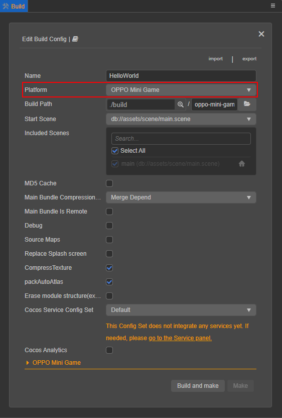
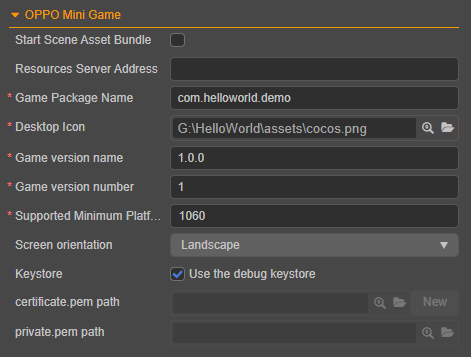
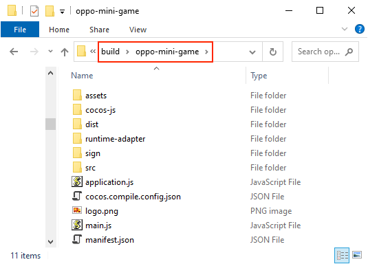
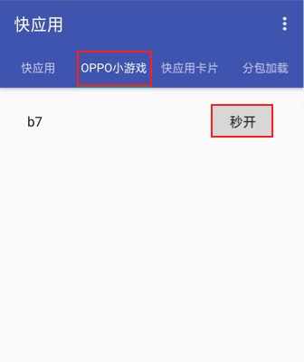

# 发布到 OPPO 小游戏

## 环境配置

- 下载 [OPPO 小游戏调试器](https://cdofs.oppomobile.com/cdo-activity/static/201810/26/quickgame/documentation/#/games/use?id=_2-%e5%ae%89%e8%a3%85-runtimeapk-%e5%8c%85%e5%88%b0-oppo-%e6%89%8b%e6%9c%ba%e4%b8%8a)，并安装到 OPPO 手机上（建议 Android Phone 6.0 或以上版本）

- 全局安装 [nodejs-8.1.4](https://nodejs.org/zh-cn/download/) 或以上版本

## 发布流程

使用 Cocos Creator 3.0 打开需要发布的项目工程，从 **菜单栏 -> 项目** 中打开 **构建发布** 面板，**发布平台** 选择 **OPPO 小游戏**。



点击下方的 **oppo-mini-game**，展开 OPPO 小游戏的参数配置。



各平台通用的构建参数，详情请参考 [通用构建参数](build-options.md)。OPPO 小游戏相关参数配置具体的填写规则如下：

| 选项名 | 可选 | 说明 | 字段名 |
| :--- | :--- | :--- | :--- |
| **初始场景分包** | 选填项 | 勾选后，首场景及其相关的依赖资源会被构建到发布包目录 assets 下的内置 Asset Bundle — [start-scene](../../asset/bundle.html#%E5%86%85%E7%BD%AE-asset-bundle) 中，提高初始场景的资源加载速度。 | `startSceneAssetBundle` |
| **资源服务器路径** | 选填项 | 该项用于填写资源存放在服务器上的地址。<br>若 **不填写** 该项，则发布包目录下的 `remote` 文件夹会被打包到构建出来的 rpk 包中。<br>若 **填写** 该项，则不会打包到 rpk 包中，开发者需要在构建后手动将发布包目录下的 `remote` 文件夹上传到所填写的资源服务器地址上。具体的资源管理细节，请参考文档下方的资源管理部分。 | `remoteServerAddress` |
| **游戏包名** | 必填项 | 游戏包名，根据开发者的需求进行填写，例如 `com.example.demo`。 | `package` |
| **桌面图标** | 必填项 | 点击输入框后面的搜索图标按钮选择所需的图标。构建时，图标将会被构建到 OPPO 小游戏的工程中。桌面图标建议使用 **png** 图片。 | `icon` |
| **游戏版本名称** | 必填项 | 游戏版本名称是真实的版本，如：1.0.0 | `versionName` |
| **游戏版本号** | 必填项 | **游戏版本号** 与 **游戏版本名称** 不同，**游戏版本号** 主要用于区别版本更新。每次提交审核时游戏版本号都要比上次提交审核的值至少 +1，一定不能等于或者小于上次提交审核的值，建议每次提交审核时游戏版本号递归 +1。**注意**：**游戏版本号** 必须为正整数。 | `versionCode` |
| **支持的最小平台版本号** | 必填项 | 推荐使用 **1060**。该项原理同 Android API Level，用于兼容性检查，避免游戏上线后在低版本平台运行不兼容。具体内容可点击 [使用说明](https://cdofs.oppomobile.com/cdo-activity/static/201810/26/quickgame/documentation/#/games/use) 查看。 | `minPlatformVersion` |
| **屏幕方向** | - | 设备方向，构建后将会写入 `manifest.json` 中。| `deviceOrientation` |
| **密钥库** | 必填项 | 勾选 **使用调试密钥库** 时，表示默认使用的是 Creator 自带的证书构建 rpk 包，仅用于 **调试** 时使用。**注意**：若 rpk 包要用于提交审核，则构建时不要勾选该项。| `useDebugKey` |
| **密钥证书路径** | - | 如果不勾选 **密钥库**，则需要配置签名文件 **certificate.pem 路径** 和 **private.pem 路径**，此时构建后生成的是可以 **直接发布** 的 rpk 包。开发者可通过输入框右边的搜索图标按钮来配置两个签名文件。**注意**：这两个签名文件建议不要放在发布包 `build/quickgame` 目录下，否则每次构建时都会清空该目录，导致文件丢失。生成签名文件的方式可参考下方的 **生成签名文件** 部分。 | `privatePemPath`、`certificatePemPath` |

**生成签名文件**

有以下两种方式可以生成签名文件：

- 通过 **构建发布** 面板 **certificate.pem 路径** 后的 **新建** 按钮生成

- 通过命令行生成 release 签名

    开发者需要通过 openssl 命令等工具生成签名文件 `private.pem`、`certificate.pem`。

    ```bash
    # 通过 openssl 命令工具生成签名文件
    openssl req -newkey rsa:2048 -nodes -keyout private.pem -x509 -days 3650 -out certificate.pem
    ```

    > **注意**：openssl 工具在 linux 或 Mac 环境下可在终端直接打开。而在 Windows 环境下则需要安装 openssl 工具并且配置系统环境变量，配置完成后需重启 Creator。

### 构建

**构建发布** 面板的相关参数设置完成后，点击 **构建**。构建完成后点击 **构建任务** 左下角的文件夹图标按钮打开构建发布包，可以看到在默认发布路径 build 目录下生成了 `oppo-mini-game` 目录，该目录就是导出的 OPPO 小游戏工程目录和 rpk，rpk 包在 `build/oppo-mini-game/dist` 目录下。



### 将构建出来的 rpk 运行到手机上

将构建生成的小游戏 rpk 包（ dist 目录中）拷贝到手机 SD 卡的 `/sdcard/games` 目录。然后在 OPPO 手机上打开之前已经安装完成的 **OPPO 小游戏调试器**，点击 **OPPO 小游戏** 栏目，然后找到填写游戏名相对应的图标即可，如果没有发现，可点击右上角的 **更多 -> 刷新** 按钮进行刷新。

> **注意**：OPPO 小游戏调试器为 **v3.2.0** 及以上的需要将准备好的 rpk 拷贝到手机的 `/sdcard/Android/data/com.nearme.instant.platform/files/games` 中，如果没有 games 目录则需新建。具体内容可点击 [使用说明 — 新建目录](https://cdofs.oppomobile.com/cdo-activity/static/201810/26/quickgame/documentation/#/games/use?id=_3-%e6%96%b0%e5%bb%ba%e7%9b%ae%e5%bd%95) 查看。



## 分包加载

分包加载，即把游戏内容按一定规则拆分成几个包，在首次启动的时候只下载必要的包，这个必要的包称为 **主包**，开发者可以在主包内触发下载其他子包，这样可以有效降低首次启动的消耗时间。若要使用该功能需要在 Creator 中设置 [小游戏分包](subpackage.md)，设置完成后构建时就会自动分包。

构建完成后，分包 rpk 在 `dist` 目录下。这时需要在 OPPO 手机的 `sdcard` 目录下新建一个 `subPkg` 目录，然后把 `dist` 目录下的 **.rpk** 文件拷贝到 `subPkg` 目录中。<br>
然后切换到 **OPPO 小游戏调试器** 的 **分包加载** 栏目，点击右上方的刷新即可看到分包的游戏名称，点击 **秒开** 即可跟正常打包的 rpk 一样使用。


分包 rpk 需要拷贝到 OPPO 手机的 `/sdcard/subPkg` 目录，未分包的 rpk 需要拷贝到 OPPO 手机的 `/sdcard/games` 目录，两者不可混用。

> **注意**：OPPO 小游戏调试器为 **v3.2.0** 及以上的，需要将分包 rpk 拷贝到手机的 `/sdcard/Android/data/com.nearme.instant.platform/files/subPkg` 目录，如果没有 subPkg 目录则需新建。而未分包的 rpk 则是拷贝到手机的 `/sdcard/Android/data/com.nearme.instant.platform/files/games` 目录，两者同样不可混用。

## 资源管理

OPPO 小游戏与微信小游戏类似，都存在着包体限制, OPPO 的主包包体限制是 **10MB**，超过的部分必须通过网络请求下载。

Cocos Creator 已经帮开发者做好了远程资源的下载、缓存和版本管理，详情请参考 [资源管理](../../asset/cache-manager.md#%E8%B5%84%E6%BA%90%E4%B8%8B%E8%BD%BD%E6%B5%81%E7%A8%8B)。

## 相关参考链接

- [OPPO 开放平台](https://open.oppomobile.com/wiki/doc#id=10445)
- [OPPO 小游戏教程](https://cdofs.oppomobile.com/cdo-activity/static/201810/26/quickgame/documentation/#/games/quickgame)
- [OPPO 小游戏 API 文档](https://cdofs.oppomobile.com/cdo-activity/static/201810/26/quickgame/documentation/#/feature/account)
- [OPPO 小游戏工具下载](https://cdofs.oppomobile.com/cdo-activity/static/201810/26/quickgame/documentation/#/games/use)
- [OPPO 小游戏使用说明 — 新建目录](https://cdofs.oppomobile.com/cdo-activity/static/201810/26/quickgame/documentation/#/games/use?id=_3-%e6%96%b0%e5%bb%ba%e7%9b%ae%e5%bd%95)
