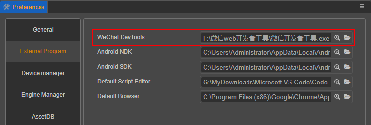
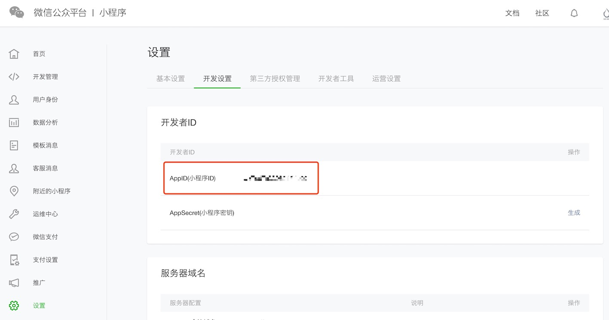
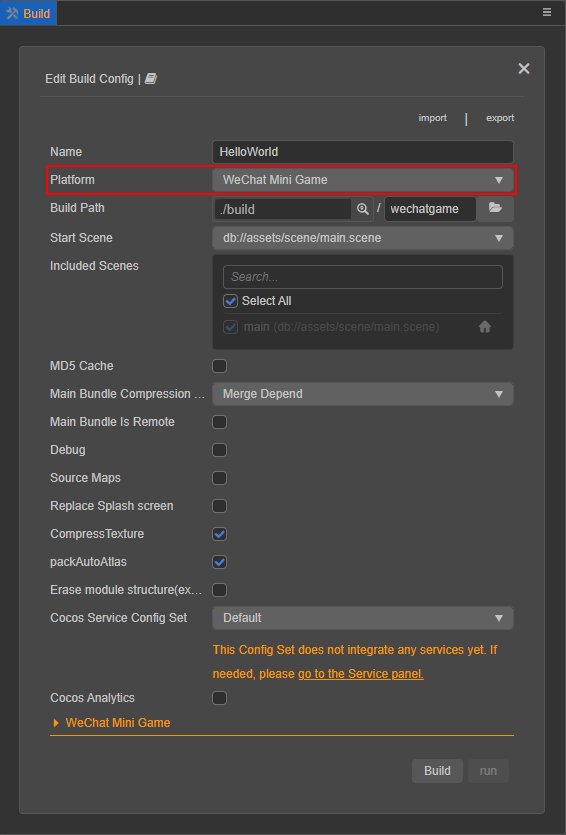

# 发布到微信小游戏

微信小游戏的运行环境是微信小程序环境的扩展，在小程序环境的基础上提供了 WebGL 接口的封装，使得渲染能力和性能有了大幅度提升。不过由于这些接口都是微信团队通过自研的原生实现封装的，所以并不可以等同为浏览器环境。

作为引擎方，为了尽可能简化开发者的工作量，我们为用户完成的主要工作包括：

- 引擎框架适配微信小游戏 API，纯游戏逻辑层面，用户不需要任何额外的修改
- Cocos Creator 编辑器提供了快捷的打包流程，直接发布为微信小游戏，并自动唤起小游戏的开发者工具
- 自动加载远程资源，缓存资源以及缓存资源版本控制

除此之外，小游戏的游戏提交，审核和发布流程和小程序是没有区别的，都需要遵守微信团队的要求和标准流程，具体信息可以参考文末的链接。

## 使用 Cocos Creator 发布微信小游戏

1. 在 [微信官方文档](https://mp.weixin.qq.com/debug/wxagame/dev/devtools/download.html) 下载微信开发者工具

2. 在编辑器菜单栏的 **Cocos Creator -> 偏好设置 -> [原生开发环境](../../editor/preferences/index.md#%E5%8E%9F%E7%94%9F%E5%BC%80%E5%8F%91%E7%8E%AF%E5%A2%83)** 中设置微信开发者工具路径

    

3. 登陆微信公众平台，找到 appid

    

4. 在 **构建发布** 面板的 **发布平台** 中选择 **微信小游戏**，填入小游戏 appid，然后点击 **构建**

    

5. 点击 **运行** 打开微信开发者工具

    

    **注意**：微信开发者工具，如果之前在点击上没运行过，会出现：`Please ensure that the IDE has been properly installed` 的报错。需要手动打开一次微信开发者工具，然后才能在 Cocos Creator 里直接点击 **运行** 调用。

6. 预览部署

    按照这样的流程，项目的 build 目录下就会生成一个微信小游戏的发布包 **wechatgame** 文件夹(具体构建任务名为准），其中已经包含了微信小游戏环境的配置文件：`game.json` 和 `project.config.json`

    

## 构建选项介绍

一些通用的构建通用参数介绍，请参考 [通用构建参数介绍](build-options.md)。

选项名 | 可选 | 默认值 | 说明 | 字段名
| - | - | - | - | -
初始场景分包 | - | false | 勾选后，首场景及其相关的依赖资源会被构建到发布包目录 assets 下的内置 Asset Bundle — [start-scene](../../asset/bundle.md#内置-Asset-Bundle) 中，提高初始场景的资源加载速度。 | startSceneAssetBundle
appid | 必填 | 'wx6ac3f5090a6b99c5' | 微信小游戏 appid，填写后将会写入在 `project.config.json` 内。| appid
远程服务器地址 | - | - | 远程服务器地址，开发者需要在构建后手动将发布包目录下的 remote 文件夹上传到所填写的资源服务器地址上。 | remoteServerAddress
生成开放数据与工程模板 | - | false | 详情可以参考[开放数据域](./build-open-data-context.md) | buildOpenDataContextTemplate
设备方向 | 必填 | landscape | 设备方向，填写后将会写入在 `game.json` 内。| orientation
引擎分离 | - | false | 是否使用微信引擎插件 | separateEngine

## 微信小游戏的资源管理

关于小游戏的资源管理细节详情可以参考 [资源管理管理](./asset-bundle.md)，下面介绍微信小游戏上资源管理的一些特殊细节点。

### 上传资源到远程服务器

在资源上传服务器后，需要删除本地发布包目录下的 remote 文件夹。

在测试阶段，开发者可能无法将项目部署到正式服务器，那就需要在本地服务器测试，请在微信开发者工具的菜单栏中打开 **工具 -> 详情 -> 本地设置** 页面，勾选 **不检验安全域名、TLS 版本以及 HTTPS 证书** 选项。

### 清除缓存资源

在 **微信开发者工具** 中点击菜单栏的 **工具 -> 清除缓存 -> 全部清除** 来清空缓存。

## 分包加载

微信小游戏需要特定的版本才能支持分包功能。微信 6.6.7 客户端，2.1.0 及以上基础库开始支持，请更新至最新客户端版本，开发者工具请使用 1.02.1806120 及以上版本。更新了开发者工具后不要忘记修改开发者工具中的 **详情 -> 本地设置 -> 调试基础库** 为 2.1.0 及以上：

目前微信小游戏分包大小有以下限制：

- 整个微信小游戏所有分包大小不超过 **16M**
- 单个分包/主包大小不能超过 **4M**

具体请参考 [微信小游戏分包加载官方文档](https://developers.weixin.qq.com/minigame/dev/guide/base-ability/sub-packages.html)。

## 平台 SDK 接入

除了纯游戏内容以外，其实微信小游戏环境还提供了非常强大的原生 SDK 接口，其中最重要的就是用户、社交、支付等，这些接口都是仅存在于微信小游戏环境中的，等同于其他平台的第三方 SDK 接口。这类 SDK 接口的移植工作在现阶段还是需要开发者自己处理。下面列举一些微信小游戏所提供的强大 SDK 能力：

1. 用户接口：登陆，授权，用户信息等
2. 微信支付
3. 转发以及获得转发信息
4. 文件上传下载
5. 媒体：图片、录音、相机等
6. 其他：位置、设备信息、扫码、NFC、等等

## 微信小游戏已知问题

微信小游戏不支持 WebView。

## 参考链接

- [微信小游戏开发文档](https://developers.weixin.qq.com/minigame/dev/guide/)
- [微信公众平台](https://mp.weixin.qq.com/)
- [小游戏 API 文档](https://developers.weixin.qq.com/minigame/dev/api/)
- [微信开发者工具下载](https://developers.weixin.qq.com/miniprogram/dev/devtools/download.html)
- [微信开发者工具文档](https://developers.weixin.qq.com/miniprogram/dev/devtools/devtools.html)
- [微信缓存空间溢出测试案例](https://github.com/cocos-creator/WeChatMiniGameTest)
