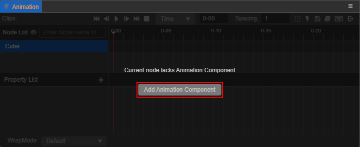

# 动画组件

动画组件控制动画的播放。

添加动画组件的方式有三种：

1. 像其他节点添加组件一样。选中节点，在 **属性检查器** 面板点击添加组件，搜索 `Animation`，点击即可添加。
2. 在 **动画编辑器** 面板开启的状态下，选中节点，点击 **动画编辑器** 面板上的 **添加 Animation 组件** 按钮即可添加。

    

3. 通过代码方式添加：

    ```ts
    import { Animation, Node } from 'cc';

    function (node: Node) {
        const animationComponent = node.addComponent(Animation);
    }
    ```

动画组件管理了一组动画剪辑。

动画组件开始运作前，它为每一个动画剪辑都创建了相应的 **动画状态** 对象。动画状态控制某个动画剪辑在节点的播放过程，一个动画剪辑可以同时为多个动画状态所用。

在动画组件中，动画状态是通过名称来标识的。每个动画状态的默认名称就是其动画剪辑的名称。

## 动画的播放与切换

`play()` 使得动画组件开始播放指定的动画：

```ts
animationComponent.play('idle'); // 播放动画状态 'idle'
```

在播放时，旧的动画将立即被停止，这种切换是非常突兀的。在某些情况下，我们希望这种切换是“淡入淡出”的效果，此时应该使用 `crossFade()` 方法。`crossFade()` 会在指定的周期内平滑地完成切换：

```ts
animationComponent.play('walk');

/* ... */

// 当需要切换到跑的动画时
animationComponent.crossFade('run', 0.3); // 在 0.3 秒内平滑地从走的动画切换为跑的动画
```

`crossFade()` 的这种淡入淡出机制使得同一时刻可能有不止一个动画状态在播放。因此，动画组件没有 **当前动画** 的概念。

即便如此，动画组件仍提供了 `pause()`、`resume()`、`stop()` 方法，这些方法在暂停、继续以及停止正在播放的所有动画状态的同时，也暂停、继续以及停止动画的切换。

## 动画状态

有时候你可能需要对动画状态进行其他操作，例如设置速度。

首先可以通过 `getState()` 获取动画状态：

```ts
const animationComponent = node.getComponent(Animation);
animationComponent.clips = [ idleClip, runClip ];

// 获取 `idleClip` 的状态
const idleState = animationComponent.getState(idleClip.name);
```

然后设置动画播放的速度：

```ts
animationComponent.getState('idle').speed = 2.0; // 以两倍速播放待机动画
```

动画状态也提供了 `play()`、`pause()`、`resume()`、`stop()` 这些用于播放控制的方法。当动画组件本身的播放控制功能已经不能满足需求时，也可以按照自己的方式操纵动画状态的播放。

## 默认动画

当动画组件的 `playOnLoad` 为 `true` 时，动画组件将在第一次运行时自动播放默认动画剪辑 `defaultClip`。

## 帧事件

你可以为动画的每一时间点添加事件。

`AnimationClip` 的 `events` 包含了此动画所有的事件描述，每个事件描述都具有以下属性：

```ts
{
    frame: number;
    func: string;
    params: any[];
}
```

- `frame` 表示事件触发的时间点，单位为秒。例如 `0.618` 就表示当动画到达第 0.618 秒时将触发事件。
- `func` 表示事件触发时回调的方法名称。事件触发时，会 **在当前节点的所有组件上搜索** 名为 `func` 的方法，一旦找到，将 `params` 传递给它并调用。

以下代码演示了这一过程：

```ts
import { Animation, Component } from 'cc';
class MyScript extends Component {
    constructor() {

    }

    public start() {
        const animationComponent = this.node.getComponent(Animation);
        if (animationComponent && animationComponent.defaultClip) {
            const { defaultClip } = animationComponent;
            defaultClip.events.push({
                frame: 0.5, // 第 0.5 秒时触发事件
                func: 'onTriggered', // 事件触发时调用的函数名称
                params: [ 0 ], // 向 `func` 传递的参数
            });
            defaultClip.updateEventDatas();
        }
    }

    public onTriggered(arg: number) {
        console.log('I am triggered!');
    }
}
```

以上代码表示 `MyScript` 脚本组件所在节点的动画组件的默认动画剪辑在进行到第 0.5 秒时，将调用 `MyScript` 组件的 `test()` 方法并传递参数 `0`。

动画组件接口请参考 [MeshRenderer API](__APIDOC__/zh/classes/animation.animation-1.html)。
