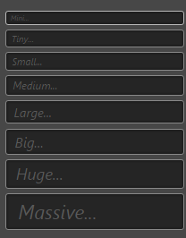

# ui-input 参考

## 基础用法

```html
<ui-input placeholder="Search..."></ui-input>
```
    


## 属性
属性  | 参数值类型 | 功能说明
------|--------------|-------------  
`value`| string | 输入框中的内容值
[`focused`](#`focused,-disabled`-控制状态)| boolean | 控制 `focused` 状态 
[`disabled`](#`focused,-disabled`-控制状态)| boolean | 控制 `disabled` 状态，设置此属性后不再响应事件
[`readonly`](#readonly)| boolean | 控制 `readonly` 状态，设置此属性后不再响应事件
[`password`](#设置-password)| boolean | 控制是否为 `password` 类型，设置此属性后输入值显示为 "•"
`unnavigable`| boolean | 控制是否可导航，组件默认可以通过 tab 键获取焦点，设置此属性后无法通过 tab 获取焦点，并且鼠标获取焦点后不会有 focus 样式
`placeholder`| string | input 不存在 `value` 值时显示的内容

## 样式控制
种类              | 参数值类型 | 功能说明
----------------|-----------|-------------
[size](#size-控制大小)      | `class` 样式名，string，支持值"**mini, tiny, samll, medium, large, big, huge, massive**" | 控制按钮大小

## event 事件
事件名称|是否冒泡|触发机制
-------|-------|--------
`change` |是|input 进行输入改变值时或因触发 `cancel` 改值
`confirm` |是|发生 `change` 改值后，失去焦点或键入 **enter**
`cancel` |是|发生 `change` 改值后，键入 **esc** （将恢复原值）

## 使用效果示例

### `focused, disabled` 控制状态
```html
<ui-input placeholder="Normal..."></ui-input>
<ui-input placeholder="Focused..." focused></ui-input>
<ui-input placeholder="Disabled..." disabled></ui-input>
```
    


### readonly
```html
<ui-input placeholder="Readonly..." readonly></ui-input>
```
   


### 设置 `password`
```html
<ui-input placeholder="Password..." password></ui-input>
```
   

> 注意 readonly 为全小写

### size 控制大小
直接添加对应的 calss 样式名即可，支持的值范围"**mini, tiny, samll, medium, large, big, huge, massive**"
```html
<ui-input class="mini"></ui-input>
<ui-input class="tiny"></ui-input>
 ····
```
