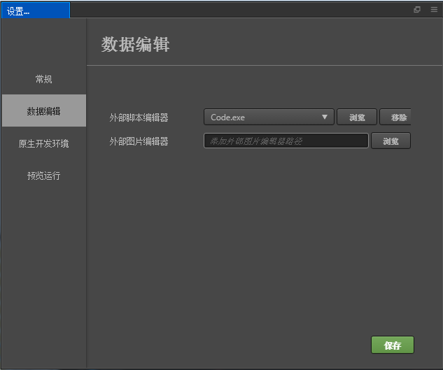
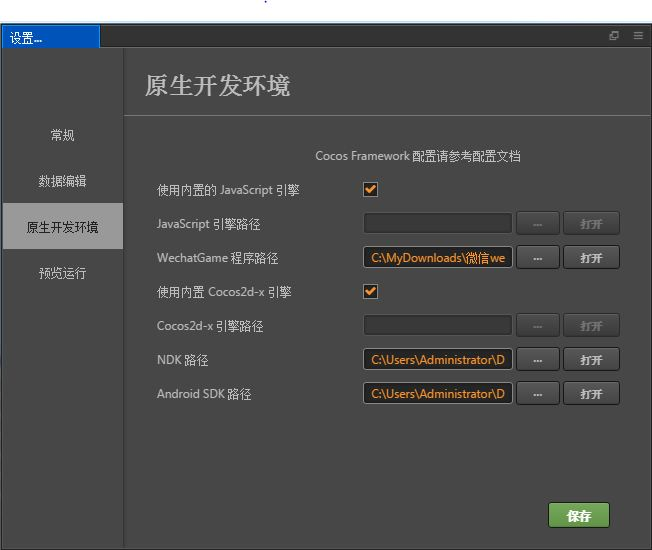

# 设置

**设置** 面板中提供各种编辑器个性化的全局设置，要打开 **设置** 窗口，请选择主菜单的 `CocosCreator -> 设置`。

**设置** 部分由几个不同的分页组成，将各种设置分为以下几类。修改设置之后点击 **保存** 按钮。

## 常规

* **编辑器语言**：可以选择中文或英文，修改语言设置后要重新启动 Cocos Creator 才能生效。

* **默认层级管理器节点折叠状态**：切换层级管理器节点树所有子节点的默认状态，有 `全部展开`、`全部折叠` 和 `记住上一次状态` 三种选项。

* **选择本机 IP 地址**：用户可以在本机有多个 IP 地址的情况下，手动选择其中之一作为预览时的默认地址和二维码地址。这里会列出所有本机的 IP，您也可以选择 **自动** 让编辑器帮您自动挑选一个 IP。

* **构建日志是否在控制台显示**：这一项在选中状态时，构建发布原生项目的过程日志会直接显示在控制台面板里。非选中状态时，构建发布原生项目的日志会保存在 `%USER/.CocosCreator/logs/native.log`，您也可以通过控制台左上角的日志按钮的 **Cocos Console 日志** 选项打开这份文件。

* **数值调节钮步长**：在属性检查器里，所有数值属性输入框的旁边都有一组上下箭头，可以用于步进输入的数值：

   

  当鼠标悬浮在数值属性的名称附近时，光标会变成  这样的形状，然后左右拖动鼠标，也可以按照一定的步进幅度连续增加或减小数值。 
  以上两种修改数值的方式，默认的步长都是 **0.1**，而设置里 **数值调节钮步长** 这里设置的就是每次点击步进按钮或拖拽鼠标时数值变化的步长幅度。举例来说，如果您在脚本中使用的数字以整数为主，就可以把这个步长设置为 **1**，可以更方便的进行调节。 
  **注意**：修改步长后要刷新编辑器窗口（按 Ctrl / Cmd + R），设置的步长才会生效。

* **meta 文件备份时显示确认**：在 meta 文件所属的资源丢失时，是否弹出对话框提示备份或删除 meta 文件。如果选择备份，可以在稍后手动恢复资源，并将 meta 文件手动拷贝回项目 **assets** 目录，防止资源相关的重要设置（如场景、prefab）丢失。

* **导入图片自动裁剪**：导入图片时，是否自动裁剪掉图片的透明像素。不管默认选择如何，导入图片之后可以在图片资源上手动设置裁剪选项。

* **默认开启 prefab 自动同步模式**：新建 prefab 时，是否自动开启 prefab 资源上的「自动同步」选项。开启自动同步后，保存 prefab 资源修改时会自动同步场景中所有该 prefab 的实例。

## 数据编辑

这一类别用来设置脚本和资源的默认打开方式。

* **外部脚本编辑器**：可以选用任意外部文本编辑工具的可执行文件，作为在资源管理器里双击脚本文件时的打开方式。您可以点击 **浏览** 按钮选择偏好的文本编辑器的可执行文件，也可以点击 **移除** 按钮来切换脚本编辑器。不推荐使用内置脚本编辑器。

* **外部图片编辑器**：和上面的选项类似，这里用来设置在资源管理器中双击图片文件时，默认打开图片用的应用程序路径。

## 原生开发环境

这个分类用于设置构建发布到原生平台（iOS, Android, Mac, Windows）时，所需的开发环境路径。

* **使用内置 JavaScript 引擎**：是否使用 Cocos Creator 安装路径下自带的 `engine` 路径作为 JavaScript 引擎路径。这个引擎用于场景编辑器里场景的渲染，内置组件的声明和其他 Web 环境下的引擎模块。

* **JavaScript 引擎路径**：除了使用自带的 `engine`，您也可以前往 [engine](https://github.com/cocos-creator/engine) 来克隆或 fork 一份引擎到本地的任意位置进行定制，然后取消勾选 `使用内置 JavaScript 引擎`，然后设置 `JavaScript 引擎路径` 到您定制好的引擎路径，就可以在编辑器中使用这份定制后的引擎了。

* **使用内置 Cocos2d-x 引擎**：是否使用 Cocos Creator 安装路径下自带的 `cocos2d-x` 路径作为 cocos2d-x C++ 引擎路径。这个引擎用于构建发布时所有原生平台（iOS, Android, Mac, Windows）的工程构建和编译。

* **Cocos2d-x 路径**：取消上一项 `使用内置 cocos2d-x 引擎` 的选择后，就可以手动指定 cocos2d-x 路径了。注意这里使用的 cocos2d-x 引擎必须从 [cocos2d-x-lite](https://github.com/cocos-creator/cocos2d-x-lite) 或该仓库的 fork 下载。

* **WeChatGame 程序路径**：设置 WeChatGame 程序路径，详情见 [发布到微信小游戏](../../../publish/publish-wechatgame.md#%E4%BD%BF%E7%94%A8-cocos-creator-%E5%8F%91%E5%B8%83%E5%BE%AE%E4%BF%A1%E5%B0%8F%E6%B8%B8%E6%88%8F)

* **NDK 路径**：设置 NDK 路径，详情见 [安装配置原生开发环境](../../../publish/setup-native-development.md)。

* **Android SDK 路径**：设置 Android SDK 路径，详情见 [安装配置原生开发环境](../../../publish/setup-native-development.md)。

## 预览运行

使用主窗口正上方的 **运行预览** 按钮时，可以设置的各种选项。

* **自动刷新已启动的预览**：当已经有浏览器或模拟器在运行你的场景时，保存场景或重新编译脚本后是否需要刷新这些正在预览的设备。

* **预览使用浏览器**：可以从下拉菜单中选择系统默认的浏览器，或点击 **浏览** 按钮手动指定一个浏览器的路径。

* **模拟器路径**：从 v1.1.0 版开始，Cocos Creator 中使用的 Cocos 模拟器会放置在 cocos2d-x 引擎路径下。在使用定制版引擎时，需要自己编译模拟器到引擎路径下。点击 **打开** 按钮可以在文件系统中打开当前指定的模拟器路径，方便调试时定位。

* **模拟器横竖屏设置**：指定模拟器运行时是横屏显示还是竖屏显示。

* **模拟器分辨率设置**：从预设的设备分辨率中选择一个作为模拟器的分辨率。

* **模拟器自定义分辨率设置**：如果预设的分辨率不能满足要求，您可以手动输入屏幕宽高来设置模拟器分辨率。

* **开启模拟器调试界面**：在模拟器预览项目时将自动打开调试窗口（**v2.0.7** 新增）。

* **等待调试器连接**：勾选了 **开启模拟器调试界面** 后会开启该项，该选项的作用是暂停启动过程直至调试器连接完成，用于调试加载过程（**v2.0.7** 新增）。
