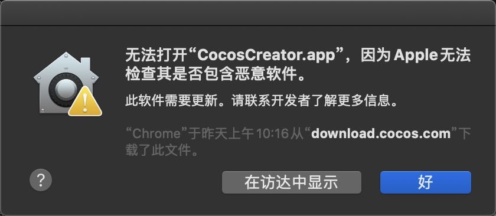

# 安装和启动

如果阅读此文档时您还没有下载和启动 Cocos Creator，请按照以下步骤开始。

## 下载 Cocos Creator

您可以通过访问 [Cocos Creator 产品首页](https://www.cocos.com/creator/) 上的下载链接获得 Cocos Creator 的安装包。

下载完成后双击安装包。

### Windows 安装说明

Windows 版的安装程序是一个 `.exe` 可执行文件，通常命名会是 `CocosCreator_vX.X.X_20XXXXXX_setup.exe`，其中 `vX.X.X` 是 Cocos Creator 的版本号，如 `v1.2.2`，后面的一串数字是版本日期编号。

**注意**：

- 日期编号在使用内测版时会更新的比较频繁，如果当前 PC 上已安装的版本号和安装包的版本号相同时，无法自动覆盖安装相同版本号的安装包，需要先卸载之前的版本才能继续安装。

  应用的安装路径默认选择 `C:\CocosCreator`，可以在安装过程中进行更改。

  Cocos Creator 将会占据系统盘中大约 1.25 GB 的空间，请在安装前整理您的系统盘空间。

- 如果出现 “不能安装需要的文件，因为 CAB 文件没有正确的数字签名。可能表明 CAB 文件损坏” 的弹窗警告，请尝试使用管理员权限进行安装。

- 对于部分很老并且长期处于内网或者很久没有升级操作系统补丁的 Windows 系统，运行时可能会出现一些 dll 缺失引起的相关报错，可尝试安装该系统补丁解决：<https://support.microsoft.com/zh-cn/help/2999226/update-for-universal-c-runtime-in-windows>

- 如果安装过程中出现 “拒绝访问” 的弹窗，请确保本机安装的操作系统是微软官方的正式版本，而不是经过定制或精简的第三方版本。

- 如果仍然出现安装失败，请尝试通过命令行执行安装程序：

  ```bash
  CocosCreator_v1.2.0_2016080301_setup.exe /exelog "exe_log.txt" /L*V "msi_log.txt"
  ```

  然后将生成的安装日志（`exe_log.txt` 和 `msi_log.txt`）提交给开发团队寻求帮助。如果通过以上命令无法获取安装日志，也可以通过为安装程序创建一个快捷方式，并将该命令行参数填入快捷方式的 **目标** 属性中来获取安装日志。

### Mac 安装说明

Mac 版 Cocos Creator 的安装程序是 dmg 镜像文件，双击 dmg 文件，然后将 `CocosCreator.app` 拖拽到您的 **应用程序** 文件夹快捷方式，或任意其他位置。然后双击拖拽出来的 `CocosCreator.app` 就可以开始使用了。

**注意**：

- 如果下载后无法打开，提示 dmg 或者 app 文件已损坏、来自身份不明的开发者或者包含恶意软件等。

  

  请在 Finder（访达）中右键点击 dmg 或 app 文件，选择 **打开**，接着在弹出对话框中再次点击 **打开** 即可。然后请进入 **系统偏好设置 -> 安全性与隐私**，点击 **仍要打开**，这样以后就可以正常启动了。

- 在安装过程中如果出现 “Cocos Creator 已损坏，无法打开” 的提示，需要检查是否有类似 Xcode 的软件占用了 Creator 安装目录下的相关文件。如果有的话，请先退出，然后再卸载 Creator 并重新安装。

### 操作系统要求

Cocos Creator 所支持的系统环境是：

- Mac OS X 所支持的最低版本是 OS X 10.9。
- Windows 所支持的最低版本是 Windows 7 64位。

## 运行 Cocos Creator

在 Windows 系统，双击解压后文件夹中的 `CocosCreator.exe` 文件即可启动 Cocos Creator。

在 Mac 系统，双击拖动出来的 `CocosCreator.app` 应用图标即可启动 Cocos Creator。

您可以按照习惯为入口文件设置快速启动、Dock 或快捷方式，方便您随时运行使用。

### 检查显卡驱动

对于部分 Windows 操作系统和显卡型号，可能会遇到

```
This browser does not support WebGL...
```

的报错信息。这是由于编辑器依赖 GPU 渲染，而显卡驱动不支持导致的。如果出现这种情况，通常只要确保已成功安装显卡对应型号的官方驱动即可解决。

## 使用 Cocos 开发者帐号登录

如果您不需要发布游戏到原生平台，以上的两步简单操作就能为您准备好使用 Cocos Creator 制作游戏的一切开发环境。

Cocos Creator 启动后，会进入 Cocos 开发者帐号的登录界面。登录之后就可以享受我们为开发者提供的各种在线服务、产品更新通知和各种开发者福利。

如果之前没有 Cocos 开发者帐号，您可以使用登录界面中的 **注册** 按钮前往 **Cocos 开发者中心** 进行注册。或者直接进入下面的链接注册：

<https://passport.cocos.com/auth/signup>

注册完成后就可以回到 Cocos Creator 登录界面完成登录了！验证身份后，我们就会进入 Dashboard 界面。除了手动登出或登录信息过期，其他情况下都会用本地 session 保存的信息自动登录。

## 版本兼容性和回退方法

Cocos Creator 版本升级时，新版本的编辑器可以打开旧版本的项目，但当您在项目开发到一半时升级新版本的 Cocos Creator 时也可能会遇到一些问题。因为在早期版本中引擎和编辑器的实现可能存在 bug 和其他不合理的问题，这些问题可以通过用户项目和脚本的特定使用方法来规避，但当后续版本中修复了这些 bug 和问题时就可能会对现有项目造成影响。

在发现这种版本升级造成的问题时，除了联系开发团队寻求解决办法，您也可以卸载新版本的 Cocos Creator 并重新安装旧版本。安装旧版本过程中可能遇到的问题有：

- **Windows**：您可能会遇到安装旧版本时提示「已经有一个更新版本的应用程序已安装」的情况，如果确定已经通过控制面板正确卸载了新版本的 Cocos Creator 还不能安装旧版本，可以访问 [微软官方解决无法安装或卸载程序](https://support.microsoft.com/zh-cn/help/17588/windows-fix-problems-that-block-programs-being-installed-or-removed) 的帮助页，按照提示下载小工具并修复损坏的安装信息，即可继续安装旧版本了。
- 使用新版本 Cocos Creator 打开过的项目，在旧版本 Cocos Creator 中打开可能会遇到编辑器面板无法显示内容的问题，可以尝试选择主菜单中的 **布局 -> 恢复默认布局** 来进行修复。

## 原生发布相关配置

如果您只想开发 Web 平台的游戏，完成上面的步骤就足够了。如果您希望发布游戏到原生平台，请参考 [安装配置原生开发环境](../publish/setup-native-development.md)
