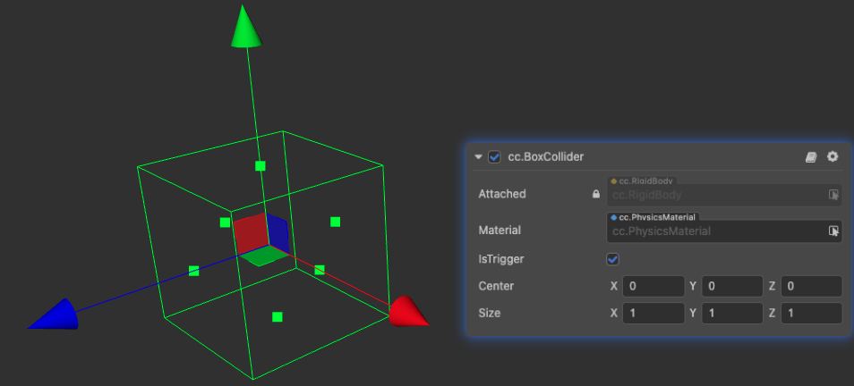
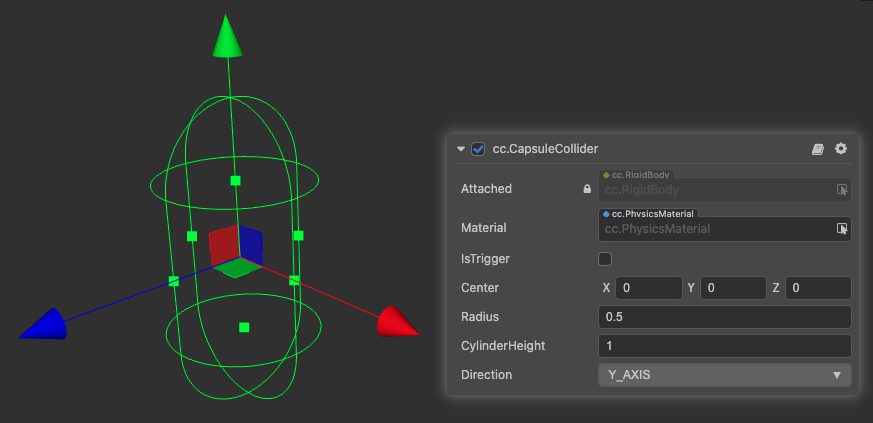
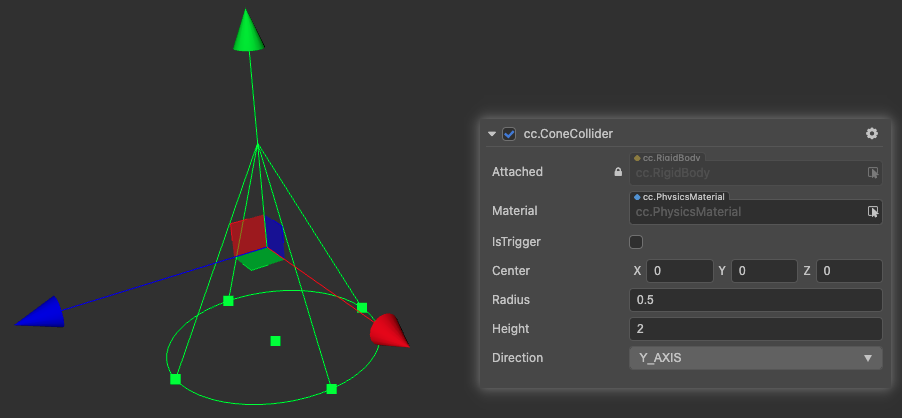
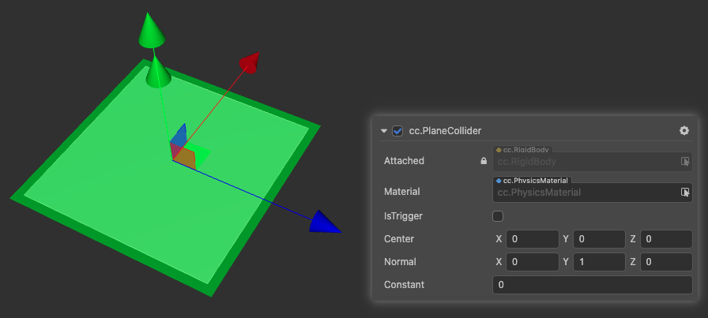
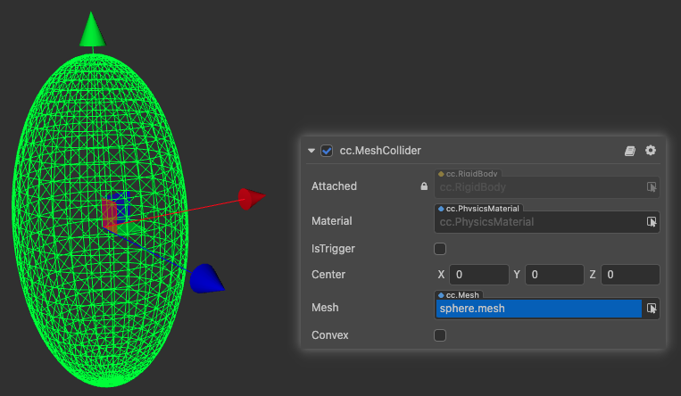
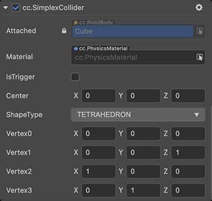

# 碰撞组件与基础属性

碰撞器组件用于表示刚体的碰撞体形状，不同的几何形状拥有不同的属性。碰撞体通常分为以下几种：
1. 常规碰撞体。常见的包含 [盒](#盒碰撞器组件-BoxCollider)、[球](#球碰撞器组件-SphereCollider)、[圆柱](#圆柱碰撞器组件-CylinderCollider)、[圆锥](#圆锥碰撞器组件-ConeCollider)、[胶囊](#胶囊碰撞器组件-CapsuleCollider) 碰撞体。
2. 复合碰撞体。可以通过在一个节点身上添加多个碰撞组件简易模拟游戏对象形状，同时保持较低的性能开销。
3. [网格碰撞体](#网格碰撞器组件-MeshCollider)。根据物体网格信息生成碰撞体，完全的贴合网格。
4. [单纯形碰撞体](#单纯形碰撞器组件-SimplexCollider)。提供点、线、三角面、四面体碰撞。
5. [平面碰撞体](#平面碰撞器组件-PlaneCollider)。可以代表无限平面或半空间。这个形状只能用于静态的、非移动的物体。
6. [地形碰撞体](#地形碰撞器组件-TerrainCollider)。一种用于凹地形的特殊支持。

共有属性部分：

| 属性 | 说明 |
| :---|:--- |
| **Attached** | 碰撞器所绑定的刚体 |
| **Material** | 碰撞器所使用的物理材质，未设置时为默认值 |
| **IsTrigger** | 是否为 [触发器](physics-event.md)，触发器不会产生物理反馈 |

> **注意**：在使用碰撞体前请先查阅 [不同物理后端碰撞形状支持情况](physics-item.md#不同物理后端碰撞形状支持情况)，确保当前使用的物理引擎支持。

## 碰撞组件

### 盒碰撞器组件 BoxCollider



| 属性 | 说明 |
| :---|:--- |
| **Center**  | 在本地坐标系中，形状的中心位置 |
| **Size**  |  在本地坐标系中，盒的大小，即长、宽、高 |

盒碰撞器组件接口请参考 [BoxCollider API](__APIDOC__/zh/classes/physics.boxcollider.html)。

### 球碰撞器组件 SphereCollider


| 属性 | 说明 |
| :---|:--- |
| **Center**  | 在本地坐标系中，形状的中心位置 |
| **Radius** | 在本地坐标系中，球的半径 |

球碰撞器组件接口请参考 [SphereCollider API](__APIDOC__/zh/classes/physics.spherecollider.html)。

### 胶囊碰撞器组件 CapsuleCollider

> **注意**：`cannon.js` 不支持胶囊组件，建议使用两个球体和圆柱拼凑。



| 属性 | 说明 |
| :---|:--- |
| **Center**  | 在本地坐标系中，形状的中心位置 |
| **Radius** | 在本地坐标系中，胶囊体上的球的半径 |
| **CylinderHeight** | 在本地坐标系中，胶囊体上圆柱体高度 |
| **Direction** | 在本地坐标系中，胶囊体的朝向 |

胶囊碰撞器组件接口请参考 [CapsuleCollider API](__APIDOC__/zh/classes/physics.capsulecollider.html)。

## 圆柱碰撞器组件 CylinderCollider


| 属性 | 说明 |
| :---|:--- |
| **Center**  | 在本地坐标系中，形状的中心位置 |
| **Radius** | 在本地坐标系中，圆柱体上圆面的半径 |
| **Height** | 在本地坐标系中，圆柱体在相应轴向的高度 |
| **Direction** | 在本地坐标系中，圆柱体的朝向 |

圆柱碰撞器组件接口请参考 [CylinderCollider API](__APIDOC__/zh/classes/physics.cylindercollider.html)。

## 圆锥碰撞器组件 ConeCollider



| 属性 | 说明 |
| :---|:--- |
| **Center**  | 在本地坐标系中，形状的中心位置 |
| **Height** | 在本地坐标系中，圆锥体在相应轴向的高度 |
| **Direction** | 在本地坐标系中，圆锥体的朝向 |

圆锥碰撞器组件接口请参考 [ConeCollider API](__APIDOC__/zh/classes/physics.conecollider.html)。

### 平面碰撞器组件 PlaneCollider



| 属性 | 说明 |
| :---|:--- |
| **Center**  | 在本地坐标系中，形状的中心位置 |
| **Normal** | 在本地坐标系中，平面的法线 |
| **Constant** | 在本地坐标系中，平面从原点开始沿着法线运动的距离 |

平面碰撞器组件接口请参考 [PlaneCollider API](__APIDOC__/zh/classes/physics.planecollider.html)。

### 网格碰撞器组件 MeshCollider

> **注意**：
> 1. `cannon.js` 对网格碰撞器组件支持程度较差，只允许与少数碰撞器（球、平面）产生检测。
> 2. `convex` 功能目前仅 `ammo.js` 后端支持。



| 属性 | 说明 |
| :---|:--- |
| **Center**  | 在本地坐标系中，形状的中心位置 |
| **Mesh** | 网格碰撞器所使用的网格资源，用于初始化网格碰撞体 |
| **Convex** | 是否使用网格的凸包近似代替，网格顶点数应小于 **255**，开启后可以支持动力学 |

网格碰撞器组件接口请参考 [MeshCollider API](__APIDOC__/zh/classes/physics.meshcollider.html)。

### 单纯形碰撞器组件 SimplexCollider

> **注意**：`cannon.js` 对线和三角面的支持目前还不完善。



| 属性 | 说明 |
| :---|:--- |
| **Center**  | 在本地坐标系中，形状的中心位置 |
| **ShapeType** | 单纯形类型，包括四种：点、线、三角面、四面体 |
| **Vertex0** | 单纯形的顶点 0，点（由 0 组成） |
| **Vertex1** | 单纯形的顶点 1，线（由 0、1 组成） |
| **Vertex2** | 单纯形的顶点 2，三角面（以此类推） |
| **Vertex3** | 单纯形的顶点 3，四面体 |

单纯形碰撞器组件接口请参考 [SimplexCollider API](__APIDOC__/zh/classes/physics.simplexcollider.html)。

### 地形碰撞器组件 TerrainCollider


| 属性 | 说明 |
| :---|:--- |
| **Terrain** | 获取或设置此碰撞体引用的网格资源 |

地形碰撞器组件接口请参考 [TerrainCollider API](__APIDOC__/zh/classes/physics.terraincollider.html)。

## 添加碰撞组件

这里以获取 **BoxCollider** 盒碰撞器组件为例。

### 通过编辑器添加

1. 新建一个 3D 对象 Cube，在 **资源管理器** 中点击左上角的 **+** 创建按钮，然后选择 **创建 -> 3D 对象 -> Cube 立方体**。

    

2. 选中新建的 Cube 立方体节点，在右侧的 **属性检查器** 面板下方点击 **添加组件** 按钮，选择 **Physics -> BoxCollider** 添加一个碰撞器组件.

    

### 通过代码添加

```ts
import { BoxCollider } from 'cc'

const boxCollider = this.node.getComponent(BoxCollider);
```

## 基础属性介绍

### IsTrigger 是否为触发器

**IsTrigger** 属性决定该碰撞组件是触发器状态还是碰撞器状态，具体请参考：[触发与碰撞](physics-event.md)。

### Attached 关联刚体

**Attached** 属性决定该碰撞组件在碰撞器状态下所绑定的刚体，具体请参考：[刚体](physics-rigidbody.md)。

刚体获取请注意以下几点：

- 在自身节点无 `RigidBody` 组件时，该属性返回为 `null`。
- Attached 对应的真实属性名为 attachedRigidBody，attachedRigidbody 是一个只读的属性，不可修改。

```ts
let collider = this.node.getComponent(BoxCollider);
let rigidbody = collider?.attachedRigidBody;
```

### Material 物理材质

**Material** 属性决定该碰撞组件在碰撞器状态下碰撞体所拥有物理材质属性，具体请参考：[物理材质](physics-material.md)。
