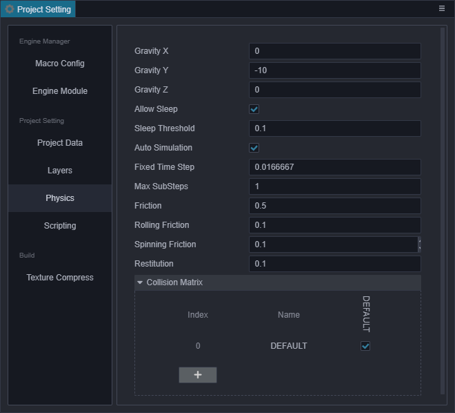
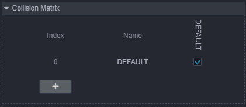
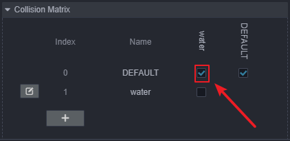
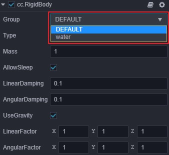

# 物理配置

物理配置用于配置各种常用属性，目前 **2D**/**3D** 共用一个配置。

## 属性说明

| 属性 | 说明 |
| :--- | :--- |
| **gravity** | 重力矢量，默认值 `{ x: 0, y: -10, z: 0 }` |
| **allowSleep** | 是否允许系统进入休眠状态，默认值 `true` |
| **sleepThreshold** | 进入休眠的默认速度临界值，默认值 `0.1`，最小值 `0` |
| **autoSimulation** | 是否开启自动模拟, 默认值 `true` |
| **fixedTimeStep** | 每步模拟消耗的固定时间，默认值 `1/60`，最小值 `0` |
| **maxSubSteps** | 每步模拟的最大子步数，默认值 `1`，最小值 `0` |
| **friction** | 摩擦系数，默认值 `0.5` |
| **rollingFriction** | 滚动摩擦系数，默认值 `0.1` |
| **spinningFriction** | 自旋摩擦系数，默认值 `0.1` |
| **restitution** | 弹性系数，默认值 `0.1` |
| **collisionMatrix** | 碰撞矩阵，仅用于初始化 |
<!-- - `useNodeChains` 是否使用节点链组合刚体，默认值 *true* -->

## 碰撞矩阵

碰撞矩阵是 [分组和掩码](physics-group-mask.md) 功能的进一步封装，它用于初始化物理元素的分组和掩码。

默认情况下只有一个 **DEFAULT** 分组，新建分组默认不与其它组碰撞。

### 分组的概念

在编辑器中，碰撞矩阵分组的存储格式为 `{index, name}` ，`index` 是从 `0` 到 `31` 的位数，而 `name` 是该组的名称，新项目工程会有一个默认分组：`{index: 0, name: 'DEFAULT'}`。

点击 **+** 按钮可以新增分组。

> 注意：
> - 新增分组的 **index** 和 **name** 均不能为空，且不能与现有项重复。
> - 分组不可以删除，但可以修改分组的名称。

### 如何配置

以新增一个 **water** 分组为例：

这张表列出了所有的分组，可以通过勾选来决定哪两组会进行碰撞检测。

如上图所示，**DEFAULT** 和 **water** 是否会进行碰撞检测将取决于是否选中了对应的复选框。

根据上面的规则，在这张表里产生的碰撞对有：

- **DEFAULT** - **water**
- **DEFAULT** - **DEFAULT**

而不进行碰撞检测的分组对有：

- **water** - **water**

### 配置物理组件的分组

通过刚体组件上的 **Group** 属性来配置对应的物理元素的分组：

