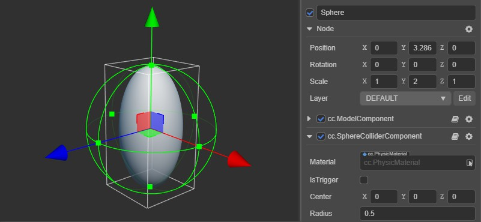
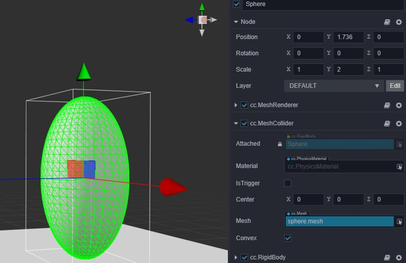

# 触发和碰撞

碰撞组件属性 **IsTrigger** 决定了组件为触发器还是碰撞器。将 **IsTrigger** 设置为 `true` 时，组件为触发器。触发器只用于碰撞检测和触发事件，会被物理引擎忽略。默认设置 `false`，组件为碰撞器，可以结合[刚体](physics-rigidbody.md)产生碰撞效果。

两者的区别如下：

- 触发器不会与其它触发器或者碰撞器做更精细的检测。
- 碰撞器与碰撞器会做更精细的检测，并会产生碰撞数据，如碰撞点、法线等。
- 如果一个节点默认只添加了碰撞器而没有添加刚体，那么这个节点可以认为默认使用的是 **静态刚体**。

## 触发事件

触发事件目前包括以下三种：

| 事件  | 说明 |
| :--- | :--- |
| `onTriggerEnter` | 触发开始 |
| `onTriggerStay`  | 触发保持 |
| `onTriggerExit`  | 触发结束 |

其中可产生触发事件的碰撞对为：

| 类型  | 静态刚体 | 运动学刚体 | 动力学刚体 |
| :--- | :--- | :--- | :--- |
| 静态刚体 |  | ✔ | ✔ |
| 运动学刚体 | ✔ | ✔ | ✔ |
| 动力学刚体 | ✔ | ✔ | ✔ |

**注意**：前提是两者都必须带有碰撞组件，并且至少有一个是触发器类型。

### 监听触发事件

```ts
// 此处的节点添加了 BoxCollider 组件
import { ITriggerEvent } from 'cc'

public start () {
    let collider = this.node.getComponent(BoxCollider);
    collider?.on('onTriggerStay', this.onTriggerStay, this);
}

private onTriggerStay (event: ITriggerEvent) {
    console.log(event.type, event);
}
```

## 碰撞事件

碰撞事件根据碰撞数据生成，静态类型的刚体之间不会产生碰撞数据。

目前碰撞事件包括以下三种：

| 事件  | 说明 |
| :--- | :--- |
| `onCollisionEnter` | 碰撞开始 |
| `onCollisionStay`  | 碰撞保持 |
| `onCollisionExit`  | 碰撞结束 |

其中可产生碰撞事件的碰撞对为：

| 类型  | 静态刚体 | 运动学刚体 | 动力学刚体 |
| :--- | :--- | :--- | :--- |
| 静态刚体 |  | ✔ | ✔ |
| 运动学刚体 | ✔ | ✔ | ✔ |
| 动力学刚体 | ✔ | ✔ | ✔ |

**注意**：前提是两者都必须带有碰撞组件，并且都必须是碰撞器类型。

### 监听碰撞事件

```ts
import { ICollisionEvent } from 'cc'

public start () {
    let Collider = this.node.getComponent(Collider);
    // 监听触发事件
    Collider?.on('onCollisionStay', this.onCollision, this);
}

private onCollision (event: ICollisionEvent) {
    console.log(event.type, event);
}
```

**注意**：目前碰撞事件以物理元素为单位，所有该元素上的碰撞器组件都会接收到碰撞事件。

## 触发事件和碰撞事件区别

- 触发事件由触发器生成，碰撞事件根据碰撞数据生成。
- 触发事件可以由触发器和另一个触发器/碰撞器产生。
- 碰撞事件需要由两个碰撞器产生，并且至少有一个是动力学刚体。

## 自动缩放

每个组件都会绑定在一个节点上，有些组件会根据绑定的节点动态更新数据。其中碰撞体组件会根据节点信息自动更新相应的形状数据，让碰撞体可以更贴合渲染模型。

更新数据，以模型组件举例：

模型组件会根据绑定节点自动更新模型的世界矩阵，从而实现改变节点的位置、缩放、旋转等信息，可以使渲染的模型有相应仿射变换。

但碰撞体的有些性质导致缩放的处理不太一样：

- 碰撞体一般用几何结构来描述
- 碰撞体大部分都是凸包类型

这些性质限制了切变、非均一缩放等变换，以球举例：

假设绑定节点的缩放信息是 **(1,2,1)**（非均一缩放），由于模型和碰撞体描述的结构不一样，球模型使用多个基础图元（如三角面）来表示，缩放后会形变成类似于鹅卵石的形状；而球碰撞体是根据半径大小来描述，缩放时会取数值最大的维度来缩放半径（这样是为了碰撞体尽可能的包围住模型），**但缩放后还是一个球**，因此无法精确的包裹着类似于鹅软石大小的球模型。



### 非标准形状

对于像鹅卵石这样非标准形状，可以使用 [MeshCollider 网格碰撞体](physics-component.md#%E7%BD%91%E6%A0%BC%E7%A2%B0%E6%92%9E%E5%99%A8%E7%BB%84%E4%BB%B6%20MeshCollider) 来代替基础的碰撞体。

**注意**：若需要支持动力学刚体，则必须开启 **convex** 功能。


