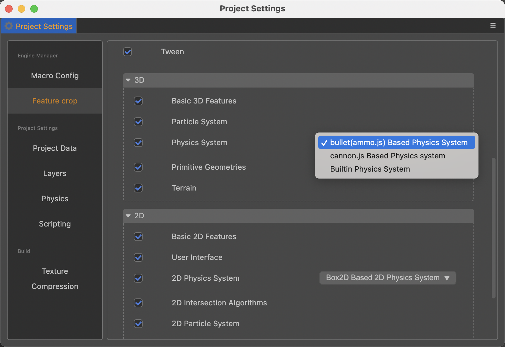

# 选择适合你项目的物理系统

在编辑器上方的菜单栏中选择 **项目 -> 项目设置 -> 功能裁剪 -> 物理系统**，您可以选择适合项目需求的物理引擎进行开发。



> **注意**：
> 1. 默认为物理引擎 bullet(ammo.js)。
> 2. 开发过程中物理引擎可随意切换。

## 碰撞检测：builtin

__builtin__ 仅有碰撞检测的功能，相对于其它的物理引擎，它没有复杂的物理模拟计算。如果您的项目不需要这一部分的物理模拟，那么可以考虑使用 __builtin__，这将使得游戏的包体更小。

若使用 __builtin__ 进行开发，请注意以下几点：

- __builtin__ 只有 __trigger__ 类型的事件。
- __Collider__ 中的 __isTrigger__ 无论值真假，都为运动学类型的触发器。

## 物理引擎：cannon.js

**cannon.js**（[GitHub](https://github.com/cocos-creator/cannon.js) | [Gitee](https://gitee.com/mirrors_cocos-creator/cannon.js)）是一个开源的物理引擎，它使用 __js__ 语言开发并实现了比较全面的物理功能，如果您的项目需要更多复杂的物理功能，那么您可以考虑使用它。 __cannon.js__ 模块大小约为 __141KB__。

## 物理引擎：bullet(ammo.js)

**ammo.js**（[GitHub](https://github.com/cocos-creator/ammo.js) | [Gitee](https://gitee.com/mirrors_cocos-creator/ammo.js)）是 [bullet](https://github.com/bulletphysics/bullet3) 物理引擎的 __asm.js__/__wasm__ 版本，由 [emscripten](https://github.com/emscripten-core/emscripten) 工具编译而来。 __Bullet__ 具有完善的物理功能，以及更佳的性能，未来我们也将在此投入更多工作。

需要注意的是，目前 __ammo.js__ 模块具有 __1.5MB__ 左右的大小。

## 物理引擎：PhysX

**PhysX**（[GitHub](https://github.com/NVIDIAGameWorks/PhysX)）是由英伟达公司开发的开源实时商业物理引擎，它具有完善的功能特性和极高的稳定性，同时也兼具极佳的性能表现。

目前在 Cocos Creator 中支持的 **PhysX** 是 4.1 版本，并允许在绝大部分平台中使用，但由于 **PhysX** 目前的包体过于庞大以及其自身的一些限制，因此有部分平台无法得到良好支持，这些平台分别是：

- 各类有包体限制的小游戏平台（原因是目前 **PhysX** 库的包体大约是 5 MB）
- 安卓 x86 设备

有部分较新的平台和设备，如鸿蒙、苹果 M1 设备，将在后续支持，请留意更新公告。除此之外，字节平台提供了底层的原生物理功能，因此在字节小游戏中同样可以运行该模块，具体的相关细节请查看[发布字节小游戏](../editor/pulish/../publish/publish-bytedance-mini-game.md)。

如果是发布到原生相关平台，哪么强烈建议使用此模块，这样可以得到良好的物理性能，尤其是 IOS 系统的原生应用。

## 不使用物理

若不需要用到任何物理相关的组件和接口，可以取消黄色框的勾选，这样在发布时将有更小的包体。

> **注意**：若处于取消勾选的状态，项目将不可以使用物理相关的组件和接口，否则运行时将会报错。

<!-- ## 扩展物理后端 -->

# 物理引擎的性能表现

主要针对各类小游戏平台和原生平台，并对 **Bullet** 和 **PhysX** 进行对比：

- 在原生和字节小游戏平台上，使用 **PhysX** 可以得到最为良好的性能
- 在各类小游戏平台上，使用 **Bullet** 可以得到最为良好的性能

# 物理引擎的效果差异

不同的物理引擎，其内部的设计和算法都不相同，因此会有一些相同参数下效果不同的表现，这些差异主要是：

- 刚体组件上的 `damping` 属性
- 刚体组件上的 `factor` 属性
- 物理材质

这些差异的区别和目前的解决方法：

1. `damping` 差异
由于 PhysX 使用了不同的阻尼算法模型，因此造成了差异。
但此差异已被内部消除，如果需要同步之前在 PhysX 中设置的阻尼值，可以参考以下代码进行转换：
```ts
const dt = PhysicsSystem.instance.fixedTimeStep;
const newDamping = 1 - (1 - oldDamping * dt) ** (1 / dt);
```

2. `factor` 差异
在 PhysX 中仅有限制的功能，因此在使用 PhysX 模块时，因子为 0 时表示对应轴的运动被限制，非 0 时表示对应轴可自由运动，未来将会在内部消除此差异。

3. 物理材质差异
在 PhysX 中的物理材质支持静态摩擦系数、动态摩擦系数和弹性系数，与 Cocos Creator 中的物理材质资源相比较，缺少了动态摩擦系数，该系数目前与静态摩擦系数保持一致，这部分的差异无法提供表达式进行转换。

除了以上提到的几点之外，也存在其它算法的差异，例如数值积分方法、LCP求解算法、求解精度等的差异，因此始终会有不同的效果，不过这些在实际项目开发中不太容易感知。