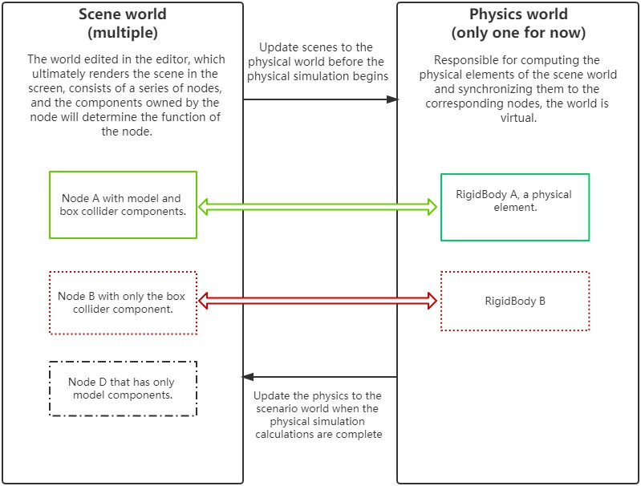

# 物理系统

物理系统（PhysicsSystem）用于管理所有物理相关的功能，目前它负责同步物理元素、触发物理事件和调度物理世界的迭代。

## 物理世界

物理世界迭代时会对物理元素进行物理计算，比如计算各物体是否产生碰撞，以及物体的受力情况。当计算完成后，物理系统会将物理世界更新到场景世界中，从而使游戏对象产生相应的物理行为。

> **注意**：目前只有单一的物理世界，后续会探讨多物理世界的功能支持。

场景世界与物理世界：

## 部分属性

目前物理系统的属性暂时只能通过代码进行设置，后续将会增加设置面板，请留意更新公告。

> **注意**：请先通过 `PhysicsSystem.instance` 获取物理系统实例

| 属性 | 说明 |
| :--- | :--- |
| **enable** | 是否开启物理系统，默认为 `true` |
| **gravity** | 物理世界的重力值，默认为 `(0, -10, 0)` |
| **allowSleep** | 是否允许物理系统自动休眠，默认为 `true` |
| **maxSubSteps** | 每帧模拟的最大子步数，默认为 `2` |
| **fixedTimeStep** | 每次子步进消耗的时间，默认为 `1/60` |
| **sleepThreshold** | 进入休眠的默认速度临界值 |
| **autoSimulation** | 是否开启自动模拟，默认为 `true` |
| **defaultMaterial** | 获取默认物理材质（只读） |
| **raycastResults** | 获取 **raycast** 的检测结果（只读） |
| **raycastClosestResult** | 获取 **raycastClosest** 的检测结果（只读） |
| **collisionMatrix** | 获取碰撞矩阵，仅用于初始化 |

物理系统接口请参考 [PhysicsSystem API](__APIDOC__/zh/classes/physics.physicssystem.html)。