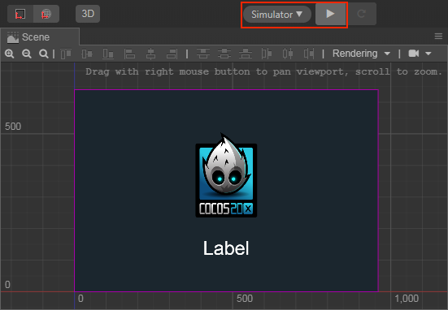
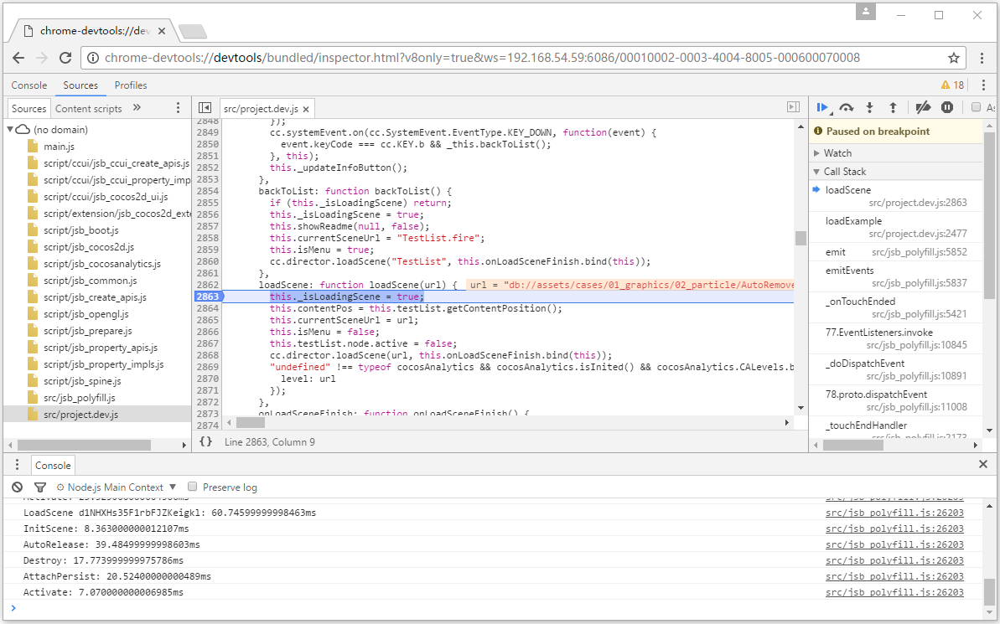

# 原生平台 JavaScript 调试

游戏发布到原生平台后，由于运行环境不同，可能会出现在浏览器预览时无法重现的 Bug，这时我们就必须直接在原生平台下进行调试。Cocos Creator 可以很方便地对原生平台中的 JavaScript 进行远程调试。

## 模拟器调试

一般来说，原生平台的大多数问题都可以在模拟器中进行重现，我们可以先在模拟器中测试，有问题的话直接在模拟器中调试即可。模拟器调试有以下两种方法。

### 方法一

首先在编辑器工具栏正上方选择使用 **模拟器（调试）** 作为预览平台，然后点击编辑器中的 **运行预览** 按钮在模拟器中运行游戏。

运行模拟器后，直接用 Chrome 浏览器打开地址：<devtools://devtools/bundled/js_app.html?v8only=true&ws=127.0.0.1:5086/00010002-0003-4004-8005-000600070008> 即可进行调试。（若使用的是旧版 Chrome，则需要将地址开头的 `devtools` 改成 `chrome-devtools`）

### 方法二

从 **v2.0.7** 开始，**设置** 面板的 **预览运行** 中新增了 [开启模拟器调试界面](../getting-started/basics/editor-panels/preferences.md#%E9%A2%84%E8%A7%88%E8%BF%90%E8%A1%8C) 功能。调试步骤如下：

- 在 **设置 -> 预览运行** 面板中勾选 **开启模拟器调试界面**，然后点击**保存**。

- 在编辑器上方选择模拟器并点击 **运行预览** 按钮，即可在模拟器预览项目时自动打开调试窗口进行调试。

## 真机调试

如果游戏只有在真机上才能运行，或者模拟器重现不了问题，那就必须用真机对打包后的游戏进行调试。调试步骤如下：

- 确保 Android/iOS 设备与 Windows 或者 Mac 在同一个局域网中。注意在调试过程中请勿开启代理，否则可能导致无法正常调试。

- 在 Creator 的 **构建发布** 面板选择 Android/iOS 平台、Debug 模式，构建编译运行工程（iOS 平台建议通过 Xcode 连接真机进行编译运行）。

- 用 Chrome 浏览器打开地址：<devtools://devtools/bundled/js_app.html?v8only=true&ws={IP}:6086/00010002-0003-4004-8005-000600070008> 即可进行调试。其中 `{IP}` 为 Android/iOS 设备的本地 IP。（若使用的是旧版 Chrome，则需要将地址开头的 `devtools` 改成 `chrome-devtools`）

  

## 其它平台调试

如果需要在 Release 模式下调试，或者需要发布到 Windows 或者 Mac 平台上调试，或者需要调试定制后的原生引擎，可参考更详细的 [JSB 2.0 使用指南：远程调试与 Profile](../advanced-topics/JSB2.0-learning.md#%E8%BF%9C%E7%A8%8B%E8%B0%83%E8%AF%95%E4%B8%8E-profile)。
