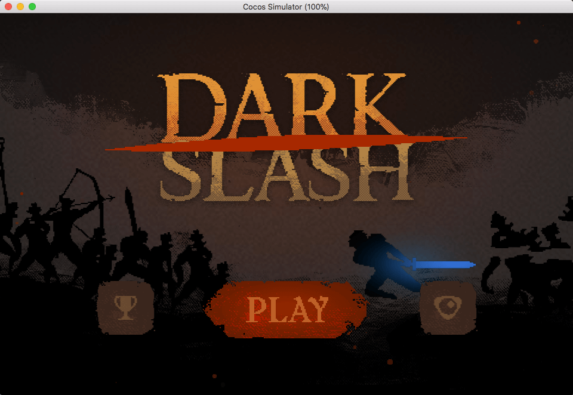

# 发布到 Google Play Instant

从 v2.0.4 版本开始，Cocos Creator 正式支持将游戏发布到 Google Play Instant。Google Play Instant 依赖于 Google Play，并不是一个新的分发渠道，而更接近一种游戏微端方案。它能够实现游戏的免安装即开即玩，有利于游戏的试玩、分享和转化。它和 Android Instant App 的主要区别在于：

- 首包和 APK 附加包都限制在 10MB 以内（而不是 4MB）
- 可以从第三方 CDN 动态加载不含二进制代码的资源（JS 也可以）
- APK 附加包只能从 Google Play Store 下载，可以包含二进制代码和资源，可以后台加载，不需要切换 activity。

采用 Cocos Creator 开发的游戏，只需选择 Google Play Instant 作为发布平台，就可以自动完成标准适配工作，输出符合 Google Play Instant 技术标准的游戏。

## 使用 Cocos Creator 一键发布到 Google Play Instant

### 环境配置

- 需要使用 Android Studio 3.0 版本及以上
- Android Phone 6.0 及以上 
**注意**：Android SDK 版本在 6.0 到 7.0 之间的设备需要安装 Google 服务框架，SDK 版本在 8.0 以上的则不需要，可直接安装使用。
- NDK 建议使用的版本为 **r17 - r19**
  
### 发布流程

1. 使用 Cocos Creator 打开需要发布的项目工程，在 **构建发布** 面板的 **发布平台** 中选择 **Android Instant**，**模板** 选择 **android-instant**，**API Level** 选择 **android-26** 及以上。

    

    Android Instant 的构建模版从 v2.3.0 开始与 Android 平台一致，详情可参考 [打包发布原生平台](./publish-native.md#%E4%BD%BF%E7%94%A8%E5%8E%9F%E7%94%9F%E5%B7%A5%E7%A8%8B)。

2. 如果希望直接打包而不使用分包功能的话，可以勾选 **跳过录制和分包**，然后直接点击 **构建 -> 编译 -> 运行**，连接手机之后即可看到 Google Play Instant 的运行效果。

    首次编译的话需要用 Android Studio 打开构建后的工程以下载 **Google Play Instant Development SDK（windows 平台）** 支持包，Mac 平台为 Instant Apps Development SDK 支持包。如果下载不成功的话建议设置一下 Android Studio 的 HTTP 代理。

    

3. 如果需要进行分包操作就在 **构建发布** 面板点击 **录制**，该操作将会打开模拟器。然后进行游戏，模拟器会根据游戏流程自动记录游戏过程中使用到的资源信息。

    

4. 录制完成后，点击 **分包**，该操作将会打开分包界面来完成分包操作。具体的分包步骤请查看下方的 <a href="#refactor">分包器</a>。

5. 分包完成后，在 **构建发布** 面板中选择 **分包配置路径 -> ...**，该步骤会打开 **profiles** 文件夹来选择分包记录所在的路径（分包记录保存在 `path_to_your_project/temp/android-instant-games/profiles` 目录下）。用户可以通过删除对应的文件夹来删除不需要的分包记录。

    

6. 在 **构建发布** 面板中点击 **构建**，就会使用该分包记录进行首包的分割。然后点击 **编译 -> 运行** 并确保手机跟 PC 在同一个局域网内，就可以测试游戏运行的情况了。

    **若之前已经运行过游戏，要再次运行新的项目工程，需要在手机上将之前的游戏进程关闭，否则新的项目工程会因为端口被占用而导致无法在手机上运行。**

### 相关配置说明

**构建发布** 面板中关于发布到 Google Play Instant 的几个主要配置说明如下：
- **服务器地址**：远端资源的下载地址，可以是 CDN 地址，将 `path_to_your_project/build/jsb-link/remote_assets` 文件夹放入服务器或者 CDN 中即可，Creator 会去这个地址下载没有在首包当中的资源
- **启动 URL**：Google Play Instant 会根据这个协议启动对应的应用和对应的 activity。该参数可为空，若不为空，当提交到 Google Store 的时候需要确保输入的 URL 是可以访问的。详情请查看 [Google Instant App 文档](https://developer.android.google.cn/topic/google-play-instant/getting-started/first-instant-app)。
- **分包配置路径**：Creator 会根据这个分包配置生成首包的资源

**注意**：
1. 填写资源服务器地址时不用包含 `/remote_assets`。
2. 如果 Google Play Instant 包的权限大于 Google Store 上 APP 的权限，在安装 APP 的时候可能会导致无法正常安装：

## <a name="refactor">分包器</a>

分包器，主要用来编辑游戏的首包，选择放入首包的资源。

### 使用方法

1. 当录制完成后，选择 **分包** 就会打开分包界面，如上图所示

2. 分包器默认打开的是最新的录制记录。也可以通过 **+ 打开记录** 来打开之前的记录进行对比。切换不同的录制记录，下方资源的文件数量和资源大小等数据也会随着变化。

    

3. 拖动录制记录中的 **终止点**，可以选择分入首包的资源。当拖动终止点时，下方文件列表的文件数量和总大小等数据也会随着变化。选择合适游戏的首包大小，即可粗略的分好首包资源。

4. 分包器可以对所有资源进行调整。在文件列表的页面，展开各个分类的节点，可以看到对应各个文件的大小，取消 **操作** 的打钩就可以手动 **取消** 某个资源放入首包当中

    

5. 如果想要把终止点之后的资源放入首包中，可以点击左下角的 **+ 手动添加** 选择资源添加。只需要找到对应资源并在资源后面打上勾，然后点击 **添加** 即可

    

6. 如果还有额外的资源需要加入首包，那么也可以从 **资源管理器** 面板选择资源，并拖拽进入 **分包器** 面板即可

7. 分包完成之后，点击 **保存**。

## Android Studio 支持

- Cocos Creator 推荐使用 Android Studio 进行编译
- 对 Android 工程的其他修改，我们可以使用 Android Studio 直接打开工程，对 Android 工程进行其他代码的集成（工程路径：`path_to_your_project/build/jsb-link/frameworks/runtime-src/proj.android-studio`）
- 在 Android Studio 中可以对 SDK 版本进行修改，修改路径及最低支持版本如下：

  

## Instant Cookie API

我们提供了一些 API 方便开发者直接调用 Google 的一些功能，目前开放了 Instant Google Cookie API，详情请前往谷歌文档查看。同时，我们也提供了 API 相关的 demo：[AndroidInstantCookieDemo](https://github.com/wuzhiming/AndroidInstantCookieDemo)

- `cc.androidInstant.showInstallPrompt()` 请参考 Google 相关文档 <a href="https://developers.google.com/android/reference/com/google/android/gms/instantapps/InstantApps.html#showInstallPrompt(android.app.Activity,%20android.content.Intent,%20int,%20java.lang.String)">showInstallPrompt</a>

- `cc.androidInstant.isInstantApp()` 请参考 Google 相关文档 [isInstantApp](https://developers.google.com/android/reference/com/google/android/gms/instantapps/PackageManagerCompat#isInstantApp%28%29)

- `cc.androidInstant.getInstantAppCookie()` 请参考 Google 相关文档 [getInstantAppCookie](https://developers.google.com/android/reference/com/google/android/gms/instantapps/PackageManagerCompat#getInstantAppCookie%28%29)

- `cc.androidInstant.setInstantAppCookie()` 请参考 Google 相关文档 [setInstantAppCookie](https://developers.google.com/android/reference/com/google/android/gms/instantapps/PackageManagerCompat#setInstantAppCookie%28byte%5B%5D%29)

- `cc.androidInstant.getInstantAppCookieMaxSize()` 请参考 Google 相关文档 [getInstantAppCookieMaxSize](https://developers.google.com/android/reference/com/google/android/gms/instantapps/PackageManagerCompat#getInstantAppCookieMaxSize%28%29)

## 相关参考链接

- [Instant App](https://developer.android.google.cn/topic/google-play-instant/getting-started/first-instant-app)

- [Google InstantApps API](https://developers.google.com/android/reference/com/google/android/gms/instantapps/InstantApps)

- [Google Instant App Samples](https://github.com/googlesamples/android-instant-apps)

- [CocosCreator AndroidInstantCookieDemo](https://github.com/wuzhiming/AndroidInstantCookieDemo)
