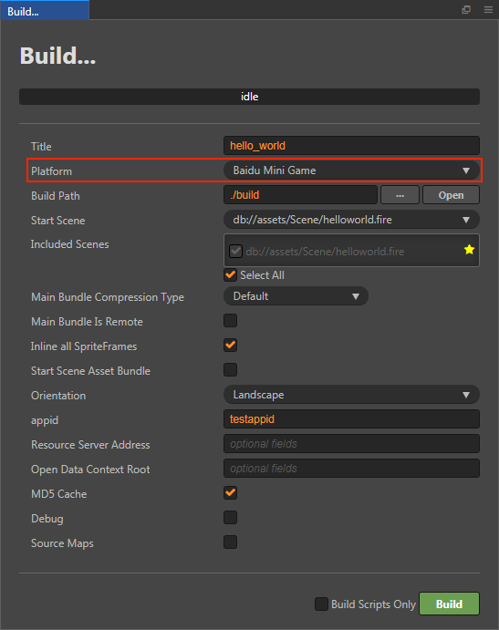
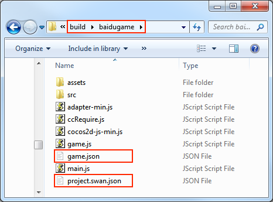
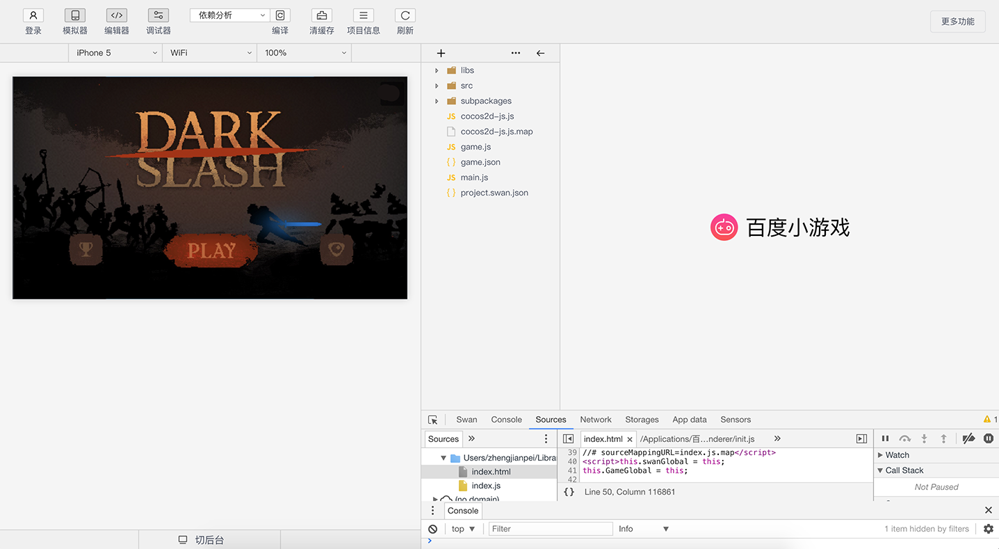

# 发布到百度小游戏

百度小游戏是基于手机百度 app 上的智能小程序进行扩展的小游戏，它不仅提供了强大的游戏能力，还和智能小程序一样，提供了大量的原生接口，比如支付，文件系统，位置，分享等。相当于同时结合了 WEB 易于传播以及 Native 功能丰富的优势。

百度小游戏的运行环境和微信小游戏类似，基本思路也是封装必要的 WEB 接口提供给开发者，尽可能追求和 WEB 同样的开发体验。百度小游戏在智能小程序环境的基础上提供了 WebGL 接口的封装，使得渲染能力和性能有了大幅度提升。不过由于这些接口都是百度团队通过自研的原生实现封装的，所以并不可以等同为浏览器环境。

作为引擎方，为了尽可能简化开发者的工作量，我们为开发者完成的主要工作包括：

- 引擎框架适配百度小游戏 API，纯游戏逻辑层面，开发者不需要任何额外的修改
- Cocos Creator 编辑器提供了快捷的打包流程，直接发布为百度小游戏
- 自动加载远程资源，缓存资源以及缓存资源版本控制

具体百度小游戏的申请入驻，开发准备，游戏提交，审核和发布流程可以参考 [百度小游戏注册指导文档](https://smartprogram.baidu.com/docs/game/)。

## 准备工作

- 在 [百度开发者工具文档](https://smartprogram.baidu.com/docs/game/tutorials/howto/dev/) 里下载并安装百度开发者工具
- 在手机的应用商店中下载并安装百度应用
- 登录 [智能小程序平台](https://smartprogram.baidu.com/developer/index.html)，找到 appid

  

## 发布流程

在 **构建发布** 面板中选择 **发布平台** 为 **百度小游戏**，填入 **appid**，然后点击 **构建**。

### 参数项配置

相关参数配置具体的填写规则如下：

- **主包压缩类型**

  设置主包的压缩类型，具体内容可参考文档 [Asset Bundle — 压缩类型](../asset-manager/bundle.md#%E5%8E%8B%E7%BC%A9%E7%B1%BB%E5%9E%8B)。

- **配置主包为远程包**

  该项为可选项，需要与 **资源服务器地址** 选项配合使用。 
  勾选后，主包会配置为远程包，并且与其相关依赖资源一起被构建到发布包目录 remote 下的内置 Asset Bundle — [main](../asset-manager/bundle.md#%E5%86%85%E7%BD%AE-asset-bundle) 中。开发者需要将整个 remote 文件夹上传到远程服务器。

- **初始场景分包**

  该项为可选项。 
  勾选后，首场景及其相关的依赖资源会被构建到发布包目录 assets 下的内置 Asset Bundle — [start-scene](../asset-manager/bundle.md#%E5%86%85%E7%BD%AE-asset-bundle) 中，提高初始场景的资源加载速度。具体内容可参考文档下方的 [初始场景的资源加载](#%E5%88%9D%E5%A7%8B%E5%9C%BA%E6%99%AF%E7%9A%84%E5%8A%A0%E8%BD%BD%E9%80%9F%E5%BA%A6)。

- **资源服务器地址**

  该项为选填项，用于填写资源存放在远程服务器上的地址。开发者需要在构建后手动将发布包目录下的 remote 文件夹上传到所填写的资源服务器地址上。

- **开放数据域代码目录**

  该项为选填项，用于接入开放数据域，具体内容请参考 [接入百度小游戏的开放数据域](publish-baidugame-sub-domain.md)。

### 运行预览

- 构建完成后，会在发布包的目录下生成一个 **baidugame** 的百度小游戏工程文件夹，其中已经包含了百度小游戏环境的配置文件：`game.json` 和 `project.swan.json`。

  

- 使用 **百度开发者工具** 打开构建生成的 **baidugame** 文件夹，即可打开百度小游戏项目及预览调试游戏内容。**百度开发者工具** 的使用方式请参考 [百度开发者工具文档](https://smartprogram.baidu.com/docs/game/tutorials/howto/dev/)。

  

  **注意**：预览调试时若出现了 **当前版本的开发者工具无法发布小程序，请更新最新的开发者工具** 的提示，说明填写的 appid 是小程序的 appid，不是小游戏的 appid，请重新申请一个小游戏 appid。

## 百度小游戏环境的资源管理

百度小游戏与微信小游戏类似，都存在着包体限制，超过 4MB 的额外资源，必须通过网络请求下载。

Cocos Creator 已经帮开发者做好了远程资源的下载、缓存和版本管理。具体的实现逻辑和操作步骤都与微信小游戏类似，请参考 [微信小游戏资源管理](./publish-wechatgame.md#%E5%BE%AE%E4%BF%A1%E5%B0%8F%E6%B8%B8%E6%88%8F%E7%9A%84%E8%B5%84%E6%BA%90%E7%AE%A1%E7%90%86)。

**注意**：目前百度小游戏在真机上只支持通过 **HTTPS** 从远程服务器加载资源，所以必须将资源文件放在 **HTTPS** 服务器上，否则会出现资源加载失败的情况。

## 百度小游戏分包加载

百度小游戏的分包加载方式和微信小游戏类似，其包体限制如下：

- 所有包的总大小不超过 **8MB**
- 单个分包/主包大小不超过 **4MB**

具体的分包加载机制可参考 [小游戏分包](subpackage.md#%E5%BE%AE%E4%BF%A1%E5%B0%8F%E6%B8%B8%E6%88%8F)。

## 平台 SDK 接入

除了纯游戏内容以外，百度小游戏环境还提供了非常强大的原生 SDK 接口，这些接口都是仅存在于百度小游戏环境中的，等同于其他平台的第三方 SDK 接口。这类 SDK 接口的移植工作在现阶段还是需要开发者自己处理。下面列举一些百度小游戏所提供的强大 SDK 能力：

1. 用户接口：登录，授权，用户信息等
2. 百度收银台支付
3. 转发信息
4. 文件上传下载
5. 其他：图片、位置、广告、设备信息等等

## 接入百度小游戏的开放数据域

类似微信小游戏，百度小游戏为了保护其社交关系链数据，也实现了一个 **开放数据域** ，可以获取到同玩且双向关注的好友信息。这是一个单独的游戏执行环境。开放数据域中的资源、引擎、程序，都和主游戏完全隔离，开发者只有在开放数据域中才能访问百度小游戏提供的 `swan.getUserInfo()`、`swan.getUserCloudStorage()` 和 `swan.getFriendCloudStorage()` 三个 API，用于获取相应的用户数据。

详细的百度小游戏开放域发布流程，请参考 [接入百度小游戏的开放数据域](../publish/publish-baidugame-sub-domain.md)。

## 百度小游戏的限制

百度小游戏不支持 WebView。

## 参考链接

- [百度小游戏注册指导文档](https://smartprogram.baidu.com/docs/game/)
- [百度开发者工具文档](https://smartprogram.baidu.com/docs/game/tutorials/howto/dev/)
- [百度小游戏 API 文档](https://smartprogram.baidu.com/docs/game/api/openApi/authorize/)
