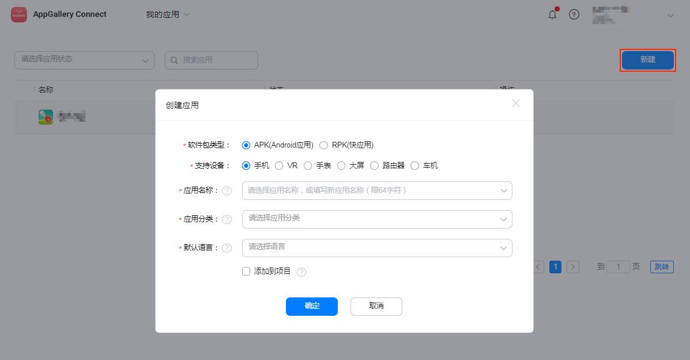
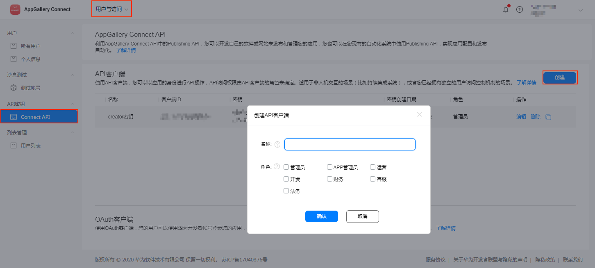
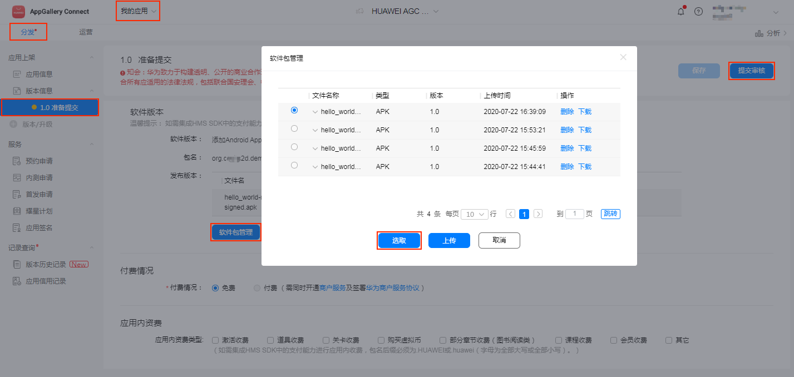

# 发布到 HUAWEI AppGallery Connect

从 v2.4.1 开始，Cocos Creator 支持发布到 **HUAWEI AppGallery Connect**，帮助开发者接入到华为的应用市场。

## 准备工作

- 进入 [AppGallery Connect 后台](https://developer.huawei.com/consumer/cn/service/josp/agc/index.html) 并登录，需要先完成 [开发者注册](https://developer.huawei.com/consumer/cn/doc/20300)，然后再 [创建应用](https://developer.huawei.com/consumer/cn/doc/distribution/app/agc-create_app)。创建应用时，**软件包类型** 选择 **APK**。

  

- 通过 Cocos Service 面板接入所需的 HUAWEI AppGallery Connect 相关服务。目前 SDK 仅支持 **Android** 平台，具体的操作步骤可参考文档 [HUAWEI HMS Core](../cocos-service/sdkhub-plugins/sdkhub-hms.md)。

## 发布流程

使用 Cocos Creator 打开需要发布的项目工程，从 **菜单栏 -> 项目** 中打开 **构建发布** 面板，**发布平台** 项选择 **HUAWEI AppGallery Connect**。

通用选项的设置请参考 [构建选项](publish-native.md#%E6%9E%84%E5%BB%BA%E9%80%89%E9%A1%B9)。

**SDKHub 配置**：该项用于帮助游戏快速集成渠道。请选择之前在 Cocos Service 服务面板开通好的 SDKHub 服务。

  

### 构建编译

**构建发布** 面板的相关参数项设置完成后，点击 **构建**。 
构建完成后点击 **发布路径** 后面的 **打开** 按钮，可以看到在默认发布路径 build 目录下生成了 `jsb-default` 或者 `jsb-link` 文件夹（根据构建发布面板中选择 **模板** 的不同），其中已经自动集成了 HUAWEI AppGallery Connect 相关服务。

然后点击 **编译**，或者使用 [Android Studio](publish-native.md#%E4%BD%BF%E7%94%A8%E5%8E%9F%E7%94%9F%E5%B7%A5%E7%A8%8B) 打开项目进行编译，编译完成后在发布包目录下会生成 HUAWEI AppGallery Connect 的 APK。

### 上传 APK 到 AppGallery Connect

有以下两种方式可以将 APK 上传到 AppGallery Connect。

#### 1. 通过构建发布面板上传

Creator 支持直接将构建编译生成的 APK 上传到 AppGallery Connect 后台。 
在 **构建发布** 面板点击右下方的 **上传** 按钮，即可打开 **上传** 面板，然后填写相关信息。

- APP ID：填写应用的 APP ID。登录 AppGallery Connect 后台，选择 **我的应用 -> 应用信息**，即可获取应用的 APP ID。

- 版本号：根据需要填写。

- APK 路径：选择之前构建编译生成的 APK。

- 登录方式：包括 **OAuth** 和 **API 客户端** 两种。

  - **OAuth**

    OAuth 登录方式只需要在点击 **确认上传** 的时候，根据提示登录 HUAWEI 账号（账号需要有足够的 [权限](https://developer.huawei.com/consumer/cn/doc/distribution/app/agc-team_account_mgt#appendix)），然后勾选对应权限的允许框，窗口会自动关闭并自动上传 APK。

    

  - **API 客户端**

    - 若首次使用 **API 客户端** 登录方式，需要登录 AppGallery Connect 后台获取相关配置信息。

      

    - 选择 **用户与访问 -> Connect API -> 创建**，创建一个 API 客户端，并根据需要选择 [权限](https://developer.huawei.com/consumer/cn/doc/distribution/app/agc-team_account_mgt#appendix)，然后点击 **确认**。

      

    - 将 API 客户端的 **客户端 ID** 和 **密钥** 填入 Creator **上传** 面板中的对应输入框。

    - 配置完成后点击 **确认上传** 即可。

  两种登录方式的详细说明可参考文档 [AppGallery Connect 使用入门](https://developer.huawei.com/consumer/cn/doc/development/AppGallery-connect-Guides/agcapi-getstarted)。

#### 2. 通过 AppGallery Connect 后台上传

在 AppGallery Connect 后台进入 **我的应用**，选择应用，切换到 **分发** 栏。然后点击左侧的 **版本信息 -> 准备提交**，找到软件版本，点击 **软件包管理**，然后点击 **上传**。

### 提交审核

1. 在 AppGallery Connect 后台进入 **我的应用**，选择应用，切换到 **分发** 栏。然后点击左侧的 **版本信息 -> 准备提交**，找到软件版本，点击 **软件包管理**，选中刚刚上传的 APK，然后点击 **选取**。

    

2. 其他的配置信息填写可参考文档 [发布应用](https://developer.huawei.com/consumer/cn/doc/distribution/app/agc-release_app)。填写完成确认各个信息没有问题后，便可以直接点击页面右上方的 **提交审核** 按钮。华为应用市场将在 **3~5** 个工作日内完成审核。

## 相关参考链接

- [AppGallery Connect 后台](https://developer.huawei.com/consumer/cn/service/josp/agc/index.html)
- [AppGallery Connect 操作指南](https://developer.huawei.com/consumer/cn/doc/distribution/app/agc-create_app)
