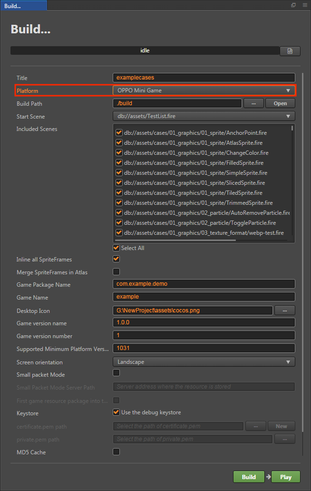

# 发布到 OPPO 小游戏

## 环境配置

- 下载 [OPPO 小游戏调试器](https://cdofs.oppomobile.com/cdo-activity/static/201810/26/quickgame/documentation/games/use.html)，并安装到 Android 设备上（建议 Android Phone 6.0 或以上版本）

- 全局安装 [nodejs-8.1.4](https://nodejs.org/zh-cn/download/) 或以上版本

- 根据用户自己的开发需求判断是否需要安装 [调试工具](https://cdofs.oppomobile.com/cdo-activity/static/201810/26/quickgame/documentation/games/use.html)。

## 发布流程

一、使用 Cocos Creator 打开需要发布的项目工程，在 **构建发布** 面板的 **发布平台** 中选择 **OPPO Mini Game**。



相关参数配置具体的填写规则如下：

- **游戏包名**

  该项为必填项，根据用户的需求进行填写。

- **游戏名称**

  该项为必填项。是 OPPO 小游戏的名称。而 **构建发布** 面板最上方的 **游戏名称** 则不参与 OPPO 小游戏打包流程。

- **桌面图标**

  **桌面图标** 为必填项。点击输入框后面的 **...** 按钮选择所需的图标。构建时，图标将会被构建到 OPPO 小游戏的工程中。桌面图标建议使用 **png** 图片。

- **游戏版本名称**

  该项为必填项。**游戏版本名称** 是真实的版本，如：1.0.0

- **游戏版本号**

  该项为必填项。**游戏版本号** 与 **游戏版本名称** 不同，**游戏版本号** 主要用于区别版本更新。每次提交审核时游戏版本号都要比上次提交审核的值至少 +1，一定不能等于或者小于上次提交审核的值，建议每次提交审核时游戏版本号递归 +1。**注意**：**游戏版本号** 必须为正整数。

- **支持的最小平台版本号**

  该项为必填项。根据 OPPO 小游戏的要求目前这个值必须大于或等于 **1031**。

- **资源服务器地址**

  该项为选填项，用于填写资源存放在服务器上的地址。

  - 若不填写该项，则发布包目录下的 **build/quickgame/remote** 文件夹将会被打包到 rpk 包内。

  - 若填写该项，则构建出来的 rpk 包将不包括 remote 文件夹，你需要手动将 remote 文件夹上传到所填写的资源服务器地址上。

  具体的资源管理细节，请参考 [OPPO 小游戏环境的资源管理](#OPPO 小游戏环境的资源管理)。

- **密钥库**

  勾选 **密钥库** 时，表示默认用的是 Creator 自带的证书构建 rpk 包，仅用于 **调试** 时使用。**注意**：若 rpk 包要用于提交审核，则构建时不要勾选该项。

  如果不勾选 **密钥库**，则需要配置签名文件 **certificate.pem 路径** 和 **private.pem 路径**，此时构建出的是可以 **直接发布** 的 rpk 包。用户可通过输入框右边的 **...** 按钮来配置两个签名文件。**注意**：这两个签名文件建议不要放在发布包 **build/quickgame** 目录下，否则每次构建时都会清空该目录，导致文件丢失。

  有以下两种方式可以生成签名文件：

    - 通过 **构建发布** 面板 **certificate.pem 路径** 后的 **新建** 按钮生成。

    - 通过命令行生成 release 签名。

      用户需要通过 openssl 命令等工具生成签名文件 private.pem、certificate.pem。

      ```bash
      # 通过 openssl 命令工具生成签名文件
      openssl req -newkey rsa:2048 -nodes -keyout private.pem -x509 -days 3650 -out certificate.pem
      ```

      **注意**：openssl 工具在 linux 或 Mac 环境下可在终端直接打开。而在 Windows 环境下则需要安装 openssl 工具并且配置系统环境变量，配置完成后需重启 Creator。

- **自定义 npm 文件夹路径**

  该项为选填项，从 **v2.0.10** 开始可以自动获取到操作系统全局的 npm 路径，无需再手动设置。获取方法为：

  - Windows 系统：从系统获取环境变量中的路径
  - Mac 系统：从 Shell 的配置文件获取环境变量中的路径。

  如果获取不到，请确保 npm 已正常安装，并且能够在命令行环境下直接启动。获取到的 npm 将用于构建生成可运行的小游戏 rpk 包（rpk 包位于构建生成的发布包目录 quickgame 目录下的 dist 目录）。如果构建时找不到 npm 文件夹路径，则发布包目录下的 dist 目录中不会生成 rpk 包。

  **v2.0.10** 以下版本的填写规则如下：

  - 若不填写该项时，Creator 会默认在 Windows 系统上读取环境变量中的 npm 路径，在 Mac 系统上默认读取 **/usr/bin/local** 目录下的 npm 来构建导出可运行的小游戏 rpk 包。
  - 如果用户的电脑环境未安装 npm 或者读取不到系统中的 npm 路径时，则需要填写 **自定义 npm 文件夹路径** 来构建和导出 rpk 包。填写规则如下：

    - Windows 系统

      ```bash
      # 获取本地 npm 安装路径
      where npm
      # 如果输出结果为：
      C:\Program Files\nodejs\npm
      # 则自定义 npm 文件夹路径填写为：
      C:\Program Files\nodejs
      ```

    - Mac 系统

      ```bash
      # 获取本地 npm 安装路径
      which npm
      # 如果输出结果为：
      /Users/yourname/.nvm/versions/node/v8.1.4/bin/npm
      # 则自定义 npm 文件夹路径填写为：
      /Users/yourname/.nvm/versions/node/v8.1.4/bin
      ```

二、**构建发布** 面板的相关参数设置完成后，点击 **构建**。构建完成后点击 **发布路径** 后面的 **打开** 按钮来打开构建发布包，可以看到在默认发布路径 build 目录下生成了 **quickgame** 目录，该目录就是导出的 OPPO 小游戏工程目录和 rpk，rpk 包在 /build/quickgame/dist 目录下。


三、将构建出来的 rpk 运行到手机上。

将构建生成的小游戏 rpk 包（/build/quickgame/dist 目录中）拷贝到手机 SD 卡的 **/sdcard/games/** 目录。然后在 Android 设备上打开之前已经安装完成的 **OPPO 小游戏调试器**，点击 **OPPO 小游戏** 栏目，然后找到填写游戏名相对应的图标即可，如没有发现，可点击右上角的更多按钮-刷新按钮进行刷新。


四、分包 rpk

分包加载，即把游戏内容按一定规则拆分成几个包，在首次启动的时候只下载必要的包，这个必要的包称为 **主包**，开发者可以在主包内触发下载其他子包，这样可以有效降低首次启动的消耗时间。若要使用该功能需要在 Creator 中设置 [分包配置](../scripting/asset-bundle.md)，设置完成后构建时就会自动分包。

构建完成后，分包的目录在 /build/quickgame/dist 目录下。<br>
这时需要在 Android 设备的 **sdcard** 目录下，新建一个 **subPkg** 目录，然后把 /build/quickgame/dist 目录下的 **.rpk** 文件拷贝到 subPkg 目录中。<br>
然后切换到 **OPPO 小游戏调试器** 的 **分包加载** 栏目，点击右上方的刷新即可看到分包的游戏名称，点击 **秒开** 即可跟正常打包的 rpk 一样使用。


**注意**：分包 rpk 需要拷贝到 Android 设备的 **/sdcard/subPkg/** 目录，未分包的 rpk 需要拷贝到 Android 设备的 **/sdcard/games/** 目录，两者不可混用。

## OPPO 小游戏环境的资源管理

OPPO 小游戏与微信小游戏类似，都存在着包体限制，不过 OPPO 的主包包体限制是 **10MB**, 超过的部分必须通过网络请求下载。

我们建议开发者在小游戏包内只保存脚本文件，其他的资源都从远程服务器下载。Cocos Creator 已经帮开发者做好了远程资源的下载、缓存和版本管理。具体的实现逻辑和操作步骤都与微信小游戏类似，请参考 [微信小游戏资源管理](./publish-wechatgame.md#%E5%B0%8F%E6%B8%B8%E6%88%8F%E7%8E%AF%E5%A2%83%E7%9A%84%E8%B5%84%E6%BA%90%E7%AE%A1%E7%90%86)。

## 相关参考链接

- [OPPO 小游戏教程](https://cdofs.oppomobile.com/cdo-activity/static/201810/26/quickgame/documentation/games/quickgame.html)
- [OPPO 小游戏 API 文档](https://cdofs.oppomobile.com/cdo-activity/static/201810/26/quickgame/documentation/feature/account.html)
- [OPPO 小游戏工具下载](https://cdofs.oppomobile.com/cdo-activity/static/201810/26/quickgame/documentation/games/use.html)
