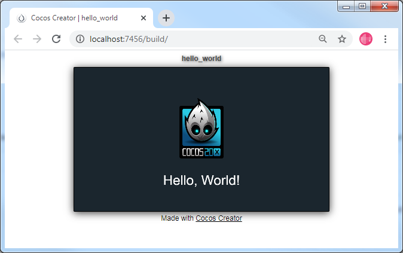

# 发布到 Web 平台

打开主菜单的 `项目/构建发布`，打开构建发布窗口。

Cocos Creator 提供了两种 Web 平台的页面模板，可以通过 **发布平台** 的下拉菜单选择 `Web Mobile` 或 `Web Desktop`，他们的区别主要在于 `Web Mobile` 会默认将游戏视图撑满整个浏览器窗口，而 `Web Desktop` 允许在发布时指定一个游戏视图的分辨率，而且之后游戏视图也不会随着浏览器窗口大小变化而变化。

## 发布路径

通过在 **发布路径** 输入框输入路径或通过 `...` 浏览按钮直接选择，我们可以为游戏指定一个发布路径，后续的多平台发布都会在这个发布路径中的子文件夹中创建资源或工程。

默认的发布路径在项目文件夹下的 `build` 文件夹中，如果您使用 git、svn 等版本控制系统，可以将 `build` 文件夹在版本控制中忽略。

## 构建选项

### 内联所有 SpriteFrame

自动合并资源时，将所有 SpriteFrame 与被依赖的资源合并到同一个包中。建议网页平台开启，启用后会略微增大总包体，多消耗一点点网络流量，但是能显著减少网络请求数量。建议原生平台关闭，因为会增大热更新时的体积。

### 合并初始场景依赖的所有 JSON

自动合并资源时，将初始场景依赖的所有 JSON 文件都合并到初始场景所在的包中。默认关闭，启用后不会增大总包体，但如果这些 JSON 也被其它场景公用，则后面再次加载它们时 CPU 开销可能会稍微增加。

### MD5 Cache

给构建后的所有资源文件名将加上 MD5 信息，解决 CDN 资源缓存问题。

启用后，如果出现资源加载不了的情况，说明找不到重名后的新文件。这通常是因为有些第三方资源没通过 cc.loader 加载引起的。这时可以在加载前先用以下方法转换 url，转换后的路径就能正确加载。

```js
url = cc.loader.md5Pipe.transformURL(url);
```

### Eruda

插入 Eruda 调试插件，Eruda 类似 DevTools 的迷你版，用于辅助调试。

如果需要调试，也可以开启 **调试模式** 和 **Source Maps** 的选项，这样构建出的版本会保留 sourcemap。

## 构建和预览

点击 **构建** 按钮，开始 Web 平台版本构建。面板上方会出现一个进度条，当进度条达到 100% 完成度时，构建就完成了。

接下来可以点击 **运行预览** 按钮，在浏览器中打开构建后的游戏版本进行预览和调试。



上图所示就是 Web Desktop 模式的预览，可以看到游戏视图是固定分辨率的，不会占满整个浏览器窗口。

### 浏览器兼容性

Cocos Creator 开发过程中测试的桌面浏览器包括：Chrome、Firefox（火狐）、IE11。其他浏览器只要内核版本够高也可以正常使用，对部分浏览器来说请勿开启 IE6 兼容模式。

移动设备上测试的浏览器包括：Safari (iOS)、Chrome、QQ 浏览器、UC 浏览器、百度浏览器、微信内置 Webview。

## Retina 设置

在脚本中通过 `cc.view.enableRetina(true)` 可以控制是否使用高分辨率，构建到 Web 平台时默认会开启 Retina 显示，在不支持 WebGL 渲染的 Android 平台上，开启 Retina 会对帧率造成较大影响。

## 发布到 Web 服务器

要在互联网上发布或分享您的游戏，只要点击 **发布路径** 旁边的 **打开** 按钮，打开发布路径之后，将构建出的 `web-mobile` 或 `web-desktop` 文件夹里的内容整个复制到您的 Web 服务器上就可以通过相应的地址访问了。

关于 Web 服务器的架设，可以自行搜索 Apache、Nginx、IIS、Express 等相关解决方案。
