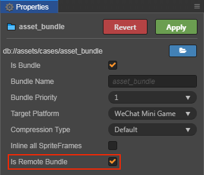
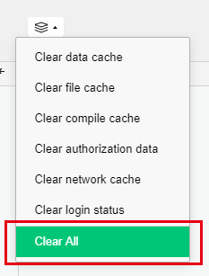

# 发布到微信小游戏

微信小游戏的运行环境是微信小程序的扩展，在小程序环境的基础上提供了 WebGL 接口的封装，使得渲染能力和性能有了大幅度提升。不过由于这些接口都是微信团队通过自研的原生实现封装的，所以并不可以等同为浏览器环境。

作为引擎方，为了尽可能简化开发者的工作量，我们为开发者完成的主要工作包括：

- 引擎框架适配微信小游戏 API，纯游戏逻辑层面，开发者不需要任何额外的修改
- Cocos Creator 编辑器提供了快捷的打包流程，直接发布为微信小游戏，并自动唤起小游戏的开发者工具
- 自动加载远程资源，缓存资源以及缓存资源版本控制

除此之外，小游戏的游戏提交，审核和发布流程和小程序是没有区别的，具体可参考 [微信小游戏开发文档](https://developers.weixin.qq.com/minigame/dev/guide/)。

## 使用 Cocos Creator 发布微信小游戏

1. 在 [微信官方文档](https://mp.weixin.qq.com/debug/wxagame/dev/devtools/download.html) 下载微信开发者工具

2. 在编辑器菜单栏的 [原生开发环境](../getting-started/basics/editor-panels/preferences.md#%E5%8E%9F%E7%94%9F%E5%BC%80%E5%8F%91%E7%8E%AF%E5%A2%83) 中设置微信开发者工具路径。 
    > Mac：Cocos Creator -> 偏好设置 -> 原生开发环境 
    > Windows：文件 -> 设置 -> 原生开发环境

    

3. 登录微信公众平台，找到 appid

    

4. 在 **构建发布** 面板的 **发布平台** 中选择 **微信小游戏**，填入小游戏 appid，然后点击 **构建**

    

5. 点击 **运行** 打开微信开发者工具

    

    **注意**：微信开发者工具，如果之前在 Mac 上没运行过，会出现：`Please ensure that the IDE has been properly installed` 的报错。需要手动打开一次微信开发者工具，然后才能在 Creator 里直接点击 **运行** 调用。

6. 预览部署

    按照这样的流程，项目的 build 目录下就会生成一个微信小游戏的发布包 **wechatgame** 文件夹，其中已经包含了微信小游戏环境的配置文件：`game.json` 和 `project.config.json`

    

## 小游戏环境的资源管理

在小游戏环境中，资源管理是最特殊的部分，它和浏览器的不同在于下面四点：

1. 小游戏的包内体积不能超过 4MB，包含所有代码和资源，额外的资源必须通过网络请求下载。
2. 对于从远程服务器下载的文件，小游戏环境没有浏览器的缓存以及过期更新机制。
3. 对于小游戏包内资源，小游戏环境内并不是按需加载的，而是一次性加载所有包内资源，然后再启动页面。
4. 不可以从远程服务器下载脚本文件。

这里引出了两个关键的问题，首页面加载速度和远程资源缓存及版本管理。对于首页面加载速度，我们建议开发者只保存脚本文件在小游戏包内，其他资源都从远程服务器下载。而远程资源的下载、缓存和版本管理，Cocos Creator 已经帮开发者做好了。下面我们来看一下这部分的逻辑。

接下来，我们将介绍 v2.4 相关的资源管理流程。如果要了解 v2.4 之前的资源管理流程，请参考其他分支的相关文档说明。

在小游戏环境中，引擎下载资源的逻辑是这样的：

1. 检查资源是否在本地缓存内
2. 不存在则查询是否在小游戏包
3. 如果找不到就从远程服务器下载
4. 下载到临时目录后直接使用
5. 后台缓慢地将资源从临时目录保存到小游戏应用缓存内供再次访问时使用
6. 缓存空间有大小限制，如果超出限制则会保存失败，此时打印提示信息并停止缓存，但不会影响游戏的运行

**注意**：一旦缓存空间占满之后，所有需要下载的资源都无法进行保存，只能使用下载保存的临时文件，而微信会在小游戏退出之后自动清理所有临时文件，所以下次再次运行小游戏时，这些资源又会再度下载，然后一直循环往复此过程。另外，缓存空间超出限制导致文件保存失败的问题不会在微信开发者工具上出现，因为微信开发者工具没有限制缓存大小，所以测试缓存时需要真实微信环境进行测试。

同时，当开启引擎的 md5Cache 功能后，文件的 url 会随着文件内容的改变而改变，这样当游戏发布新版本后，旧版本的资源在缓存中就自然失效了，只能从服务器请求新的资源，也就达到了版本控制的效果。

从 v2.4.0 开始，所有的资源都是以 asset bundle 为单位进行管理的。引擎内置了一些 bundle：
- main: 游戏的主包，除去所有其他 asset bundle 的资源，剩下的资源都属于主包
- resources: 位于 `assets://resources` 目录下的资源
- internal: 位于 `internal://resources` 目录下的资源

如果你需要将资源放在服务器上，请将资源所在的 asset bundle 配置为远程包。接下来，我们将介绍具体如何操作：

1. 将需要放在服务器上的 asset bundle 配置为远程包。
    
    

2. 如果主包需要配置为远程包，需要在构建面板里进行设置。
3. 构建时，在 **构建发布** 面板中勾选 md5Cache 功能。
4. 设置 **远程服务器地址**，然后点击 **构建**。

    
    
5. 构建完成后将微信小游戏发布包目录下的 remote 文件夹完整的上传到服务器。
6. 删除本地发布包目录下的 remote 文件夹。
7. 对于测试阶段来说，可能开发者无法部署到正式服务器上，需要用本地服务器来测试，那么请在微信开发者工具中打开 **详情** 页面，勾选项目设置中的 **不检验安全域名、TLS 版本以及 HTTPS 证书** 选项。

    

**注意**：

1. 如果缓存资源超过微信环境限制，开发者需要手动清除资源，可以在微信小游戏下使用 `cc.assetManager.cacheManager` 暴露的方法 `clearCache()`, `clearLRU()` 和 `removeCache(cacheId: number)`来清除缓存。具体区别如下：
    - `clearCache()` 方法会清除缓存目录下的所有缓存资源，请慎重使用。
    - `clearLRU()` 方法会清除缓存目录下目前应用中最近最少使用的缓存。
    - `removeCache(cacheId: number)` 方法可以精确移除某个资源在缓存中的记录。

2. 当小游戏升级引擎版本后，留在本地的缓存资源并不会自动清空，还是之前老版本引擎对应的资源。这可能会造成各类异常或渲染错误。解决方案有两个：
    - 构建时勾选 `MD5 Cache` 选项，这将确保使用最新版本的资源，或者手动清空之前缓存的资源。
    - 在真机上，你可以使用 `cc.assetManager.cacheManager.clearCache()` 清空缓存，在开发者工具上，你可以使用此选项清空：

        

### 加速初始场景资源加载

有时候我们希望将主包资源放在服务器上，同时希望将初始场景相关的资源放在包内来加快初始场景的加载速度。这时候我们可以在构建面板上，勾选 **初始场景分包**。

构建完成后，`assets` 目录下将生成一个 `start-scene` 的 bundle。该 bundle 不会放在服务器上，引擎在启动阶段将会自动从包内加载这个 bundle，从而加快初始场景的加载速度。

## 微信小游戏引擎插件

请参考 [微信小游戏引擎插件](./wechat-engine-plugin.md)。

## 微信小游戏分包加载

请参考 [分包加载](../scripting/subpackage.md)。

## 平台 SDK 接入

除了纯游戏内容以外，其实微信小游戏环境还提供了非常强大的原生 SDK 接口，其中最重要的就是用户、社交、支付等，这些接口都是只存在于微信小游戏环境中的，等同于其他平台的第三方 SDK 接口。这类 SDK 接口的移植工作在现阶段还是需要开发者自己处理。下面列举一些微信小游戏所提供的强大 SDK：

1. 用户接口：登录，授权，用户信息等
2. 微信支付
3. 转发以及获得转发信息
4. 文件上传下载
5. 媒体：图片、录音、相机等
6. 其他：位置、设备信息、扫码、NFC、等等

## 接入微信小游戏的开放数据域

微信小游戏为了保护其社交关系链数据，增加了 **开放数据域** 的概念，这是一个单独的游戏执行环境。开放数据域中的资源、引擎、程序，都和主游戏完全隔离，开发者只有在开放数据域中才能访问微信提供的 `wx.getFriendCloudStorage()` 和 `wx.getGroupCloudStorage()` 两个 API，用于实现一些例如排行榜的功能。

Cocos Creator 从 v1.9.1 版本开始支持打包到开放数据域，详情请参考 [接入微信小游戏的开放数据域](../publish/publish-wechatgame-sub-domain.md)。

## 微信小游戏已知问题：

我们对微信小游戏的适配工作还未完全结束，目前仍不支持以下组件：

- WebView

开发者如果有需要，目前可以通过直接调用微信的 API 来使用。

## 参考链接

- [微信小游戏开发文档](https://developers.weixin.qq.com/minigame/dev/guide/)
- [微信公众平台](https://mp.weixin.qq.com/)
- [小游戏 API 文档](https://developers.weixin.qq.com/minigame/dev/api/)
- [微信开发者工具下载](https://mp.weixin.qq.com/debug/wxagame/dev/devtools/download.html)
- [微信缓存空间溢出测试案例](https://github.com/cocos-creator/WeChatMiniGameTest)
