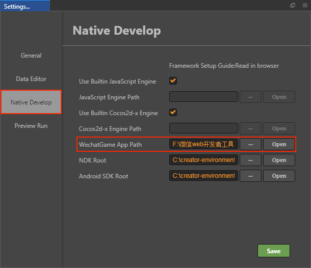
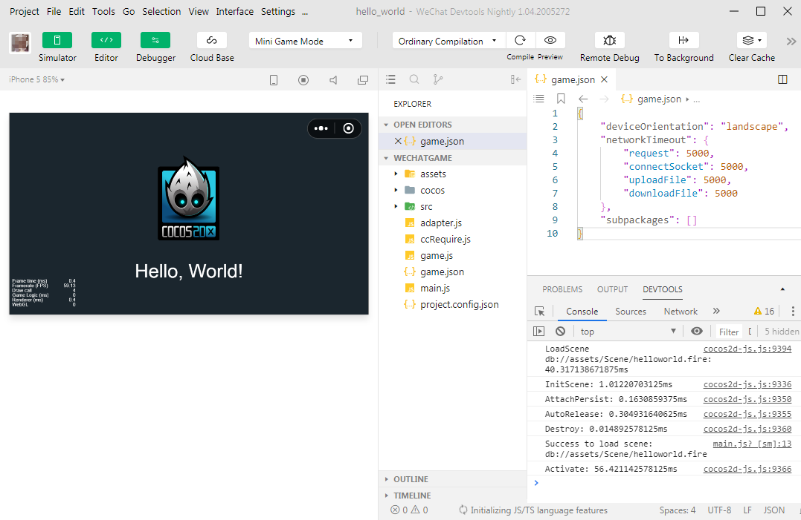
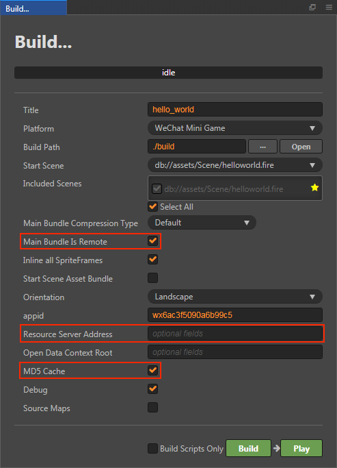

# 发布到微信小游戏

微信小游戏的运行环境是微信小程序的扩展，在小程序环境的基础上提供了 WebGL 接口的封装，使得渲染能力和性能有了大幅度提升。不过由于这些接口都是微信团队通过自研的原生实现封装的，所以并不可以等同为浏览器环境。

作为引擎方，为了尽可能简化开发者的工作量，我们为开发者完成的主要工作包括：

- 引擎框架适配微信小游戏 API，纯游戏逻辑层面，开发者不需要任何额外的修改
- Cocos Creator 编辑器提供了快捷的打包流程，直接发布为微信小游戏，并自动唤起小游戏的开发者工具
- 自动加载远程资源，缓存资源以及缓存资源版本控制

除此之外，小游戏的游戏提交，审核和发布流程和小程序是没有区别的，具体可参考 [微信小游戏开发文档](https://developers.weixin.qq.com/minigame/dev/guide/)。

## 环境配置

- 下载 [微信开发者工具](https://mp.weixin.qq.com/debug/wxagame/dev/devtools/download.html) 并安装。

- 在编辑器菜单栏的 [原生开发环境](../getting-started/basics/editor-panels/preferences.md#%E5%8E%9F%E7%94%9F%E5%BC%80%E5%8F%91%E7%8E%AF%E5%A2%83) 中设置微信开发者工具路径。 
    > Mac：Cocos Creator -> 偏好设置 -> 原生开发环境 
    > Windows：文件 -> 设置 -> 原生开发环境

    

## 发布流程

在 **构建发布** 面板的 **发布平台** 中选择 **微信小游戏**，填入小游戏 appid，然后点击 **构建**。

### 参数项配置

相关参数配置具体的填写规则如下：

- **主包压缩类型**

  设置主包的压缩类型，具体内容可参考文档 [Asset Bundle — 压缩类型](../asset-manager/bundle.md#%E5%8E%8B%E7%BC%A9%E7%B1%BB%E5%9E%8B)。

- **配置主包为远程包**

  该项为可选项，需要与 **资源服务器地址** 选项配合使用。 
  勾选后，主包会配置为远程包，并且与其相关依赖资源一起被构建到发布包目录 remote 下的内置 Asset Bundle — [main](../asset-manager/bundle.md#%E5%86%85%E7%BD%AE-asset-bundle) 中。开发者需要将整个 remote 文件夹上传到远程服务器。

- **初始场景分包**

  该项为可选项。 
  勾选后，首场景及其相关的依赖资源会被构建到发布包目录 assets 下的内置 Asset Bundle — [start-scene](../asset-manager/bundle.md#%E5%86%85%E7%BD%AE-asset-bundle) 中，提高初始场景的资源加载速度。具体内容可参考文档下方的 [初始场景的资源加载](#%E5%88%9D%E5%A7%8B%E5%9C%BA%E6%99%AF%E7%9A%84%E5%8A%A0%E8%BD%BD%E9%80%9F%E5%BA%A6)。

- **appid**

  **构建发布** 面板中默认填写的 appid 仅用于测试，若要用于发布，请登录微信公众平台，找到 appid。

  

- **资源服务器地址**

  该项为选填项，用于填写资源存放在远程服务器上的地址。开发者需要在构建后手动将发布包目录下的 remote 文件夹上传到所填写的资源服务器地址上。

- **开放数据域代码目录**

  该项为选填项，用于接入开放数据域，具体内容请参考 [接入微信小游戏的开放数据域](publish-wechatgame-sub-domain.md)。

### 运行预览

- 构建完成后点击 **发布路径** 后面的 **打开** 按钮，可以看到在发布包 build 目录下生成了微信小游戏工程文件夹 wechatgame，其中已经包含了微信小游戏环境的配置文件：`game.json` 和 `project.config.json`。

  

- 然后点击 **运行**，Creator 会自动打开微信开发者工具来打开项目工程。

  

  **注意**：如果之前在 Mac 上没运行过微信开发者工具，会出现：`Please ensure that the IDE has been properly installed` 的报错，需要手动打开一次微信开发者工具，然后才能在 Creator 中直接点击 **运行** 来调用它。

## 微信小游戏的资源管理

在微信小游戏环境中，资源管理是最特殊的部分，它和浏览器的不同包括以下几点：

1. 小游戏的主包体积不能超过 4MB，包含所有代码和资源，额外的资源必须通过网络请求下载。
2. 对于小游戏包内资源，小游戏环境内并不是按需加载的，而是一次性加载所有包内资源，然后再启动页面。
3. 不可以从远程服务器下载脚本文件。

这里引出了两个关键的问题，一个是远程资源的下载、缓存及版本管理，另一个是首场景的加载速度。下面我们来看一下这部分的逻辑，需要注意的是这部分内容在 **v2.4** 中有更新，如果使用的是 v2.4 之前的版本，请注意切换到对应的文档分支。

### 远程资源的下载、缓存及版本管理

从 v2.4.0 开始，所有的资源都是以 [Asset Bundle](../asset-manager/bundle.md) 为单元进行管理的。对于远程资源的下载、缓存和版本管理，Creator 已经帮开发者做好了。我们来看一下在小游戏环境中，引擎下载资源的逻辑：

1. 判断资源是否在小游戏包中
2. 如果不在则检查资源是否在本地缓存中
3. 如果不在则检查资源是否在临时文件中
4. 如果找不到就从远程服务器下载资源
5. 资源下载到临时文件后直接使用
6. 后台缓慢地将资源从临时文件保存到本地缓存中，以便再次访问时使用
7. 缓存空间有大小限制，如果超出限制则资源会保存失败，此时会使用 LRU 算法删除比较久远的资源

一旦缓存空间占满，所有需要下载的资源都无法保存，只能使用下载保存在临时文件中的资源。而当退出小游戏时，所有的临时文件都会被清理，再次运行小游戏时，这些资源又会被再次下载，如此循环往复。 
另外，缓存空间超出限制导致文件保存失败的问题不会在 **微信开发者工具** 上出现，因为微信开发者工具没有限制缓存大小，所以测试缓存时需要在真实的微信环境中进行测试。

当开启引擎的 md5Cache 功能后，文件的 url 会随着文件内容的改变而改变，这样当游戏发布新版本后，旧版本的资源在缓存中就自然失效了，只能从服务器请求新的资源，也就达到了版本控制的效果。

#### 上传资源到远程服务器

如果你需要将资源上传到远程服务器，请将资源所在的 Asset Bundle 配置为远程包。接下来，我们来看一下具体的操作步骤：

1. 合理分配资源，将需要模块化管理的资源文件夹配置为 Asset Bundle，并勾选 **配置为远程包**，具体可参考文档 [配置 Asset Bundle](../scripting/asset-bundle.md)。
    
    

2. 如果主包需要配置为远程包，请在 **构建发布** 面板中勾选 **配置主包为远程包**。
3. 勾选 **MD5 Cache**。
4. 设置 **资源服务器地址**，然后点击 **构建**。

    
    
5. 构建完成后将发布包目录下的 remote 文件夹完整地上传到上一步填写的服务器上。
6. 删除本地发布包目录下的 remote 文件夹。
7. 在测试阶段，开发者可能无法将项目部署到正式服务器，那就需要在本地服务器测试，请在微信开发者工具的菜单栏中打开 **工具 -> 详情 -> 本地设置** 页面，勾选 **不检验安全域名、TLS 版本以及 HTTPS 证书** 选项。

    

#### 清除缓存资源

如果缓存资源超出限制，开发者需要手动清除资源，可以使用 `cc.assetManager.cacheManager` 提供的方法 `clearCache()`、`clearLRU()` 和 `removeCache(cacheId: string)` 来清除缓存。
  - `clearCache()` —— 清除缓存目录下的所有缓存资源，请慎重使用。
  - `clearLRU()` —— 清除缓存目录下目前应用中最近最少使用的缓存。
  - `removeCache(cacheId: string)` —— 精确移除某个资源在缓存中的记录。

当开发者升级引擎版本后，留在本地的缓存资源还是之前旧版本引擎对应的资源，并不会自动清空。这可能会导致资源加载出错或渲染错误等问题。解决方案有以下两种：

  - 构建时在 **构建发布** 面板勾选 **MD5 Cache** 选项，这将确保使用最新版本的资源。
  - 手动清空之前缓存的资源。
    - 在 **真机** 上通过 `cc.assetManager.cacheManager.clearCache()` 清空缓存。
    - 在 **微信开发者工具** 中点击菜单栏的 **工具 -> 清除缓存 -> 全部清除** 来清空缓存。

### 初始场景的加载速度

当主包资源放到远程服务器上时，如果要提高初始场景的加载速度，可以在构建时勾选 **构建发布** 面板中的 **初始场景分包** 选项。 
构建完成后，初始场景及其相关的依赖资源会被构建到发布包目录下的 `assets/start-scene` bundle 中。该 bundle 不会放在远程服务器上，而是放在本地，引擎在启动阶段时就会自动从本地包内加载这个 bundle，从而加快初始场景的加载速度。

## 微信小游戏引擎插件

请参考 [微信小游戏引擎插件](./wechat-engine-plugin.md)。

## 微信小游戏分包加载

微信小游戏如何实现分包加载请参考 [小游戏分包](subpackage.md#%E5%BE%AE%E4%BF%A1%E5%B0%8F%E6%B8%B8%E6%88%8F)。

## 平台 SDK 接入

除了纯游戏内容以外，其实微信小游戏环境还提供了非常强大的原生 SDK 接口，其中最重要的就是用户、社交、支付等，这些接口都是只存在于微信小游戏环境中的，等同于其他平台的第三方 SDK 接口。这类 SDK 接口的移植工作在现阶段还是需要开发者自己处理。下面列举一些微信小游戏所提供的强大 SDK：

1. 用户接口：登录，授权，用户信息等
2. 微信支付
3. 转发以及获得转发信息
4. 文件上传下载
5. 媒体：图片、录音、相机等
6. 其他：位置、设备信息、扫码、NFC、等等

## 接入微信小游戏的开放数据域

微信小游戏为了保护其社交关系链数据，增加了 **开放数据域** 的概念，这是一个单独的游戏执行环境。开放数据域中的资源、引擎、程序，都和主游戏完全隔离，开发者只有在开放数据域中才能访问微信提供的 API `wx.getFriendCloudStorage()` 和 `wx.getGroupCloudStorage()`，用于实现一些例如排行榜的功能。具体内容请参考 [接入微信小游戏的开放数据域](../publish/publish-wechatgame-sub-domain.md)。

## 微信小游戏的限制

微信小游戏不支持 WebView。

## 参考链接

- [微信小游戏开发文档](https://developers.weixin.qq.com/minigame/dev/guide/)
- [微信公众平台](https://mp.weixin.qq.com/)
- [小游戏 API 文档](https://developers.weixin.qq.com/minigame/dev/api/)
- [微信开发者工具下载](https://mp.weixin.qq.com/debug/wxagame/dev/devtools/download.html)
- [微信小游戏性能优化](https://developers.weixin.qq.com/minigame/dev/guide/performance/perf-overview.html)
- [微信缓存空间溢出测试案例](https://github.com/cocos-creator/WeChatMiniGameTest)
