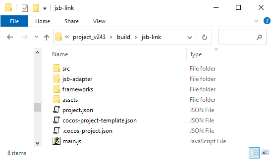

# Cocos Creator 3.0 升级指南

## 版本介绍

Cocos Creator 3.0 集成了原有 2D 和 3D 两套产品的所有功能，带来了诸多重大更新，将做为 Creator 之后的主力版本。同时 3.0 还延续了 Cocos 在 2D 品类上轻量高效的优势，并且为 3D 重度游戏提供高效的开发体验。

- **对于 Cocos Creator 2.x**

  为了保障现有的 Cocos Creator 2.4 项目平稳过渡，我们会将 2.4 做为 LTS（长期支持）版本，提供后续 **两年** 的持续更新！在 **2021** 年，2.4 将继续更新版本，提供缺陷修复和新的小游戏平台支持，保障大家的项目成功上线；在 **2022** 年我们还将为开发者持续提供 2.4 的关键问题修复，保障已上线的游戏平稳运营！因此：

  - **现有的 2.x 项目可以安心继续开发，无需强制升级到 3.0**。
  - **新项目建议使用 3.0 版本开发**，我们会不断优化 3.0 的开发体验和运行效率，支撑好 2D、3D 等不同品类的重度游戏顺利上线。

- **对于 Cocos Creator 3D**

  原有的 Cocos Creator 3D 做为 Creator 的分支版本，已经面向中国进行了长达一年的迭代，成功上线了 **星空大决战**、**最强魔斗士** 等重度项目！3.0 发布后，Creator 3D 也将包含在 3.0 中，现有的 1.2 项目都可直接升级，因此 Cocos Creator 3D 后续不会再发布独立版本。

此次发布的 3.0 Preview 版本，在功能上已经接近正式版，可以用于新项目立项和特性预研，欢迎大家使用！后续的正式版会在春节前后发布，届时将进一步完善性能、修复问题，确保大家的新项目能顺利推进。

3.0 使用了面向未来的全新引擎架构，将为引擎带来高性能、面向数据以及负载均衡的渲染器，并且无缝支持 Vulkan & Metal 多后端渲染，未来还会支持移动端 VR/AR 及部分主机平台。

关于 3.0 的详细介绍，请移步 [官网更新说明](https://cocos.com/creator)。

## 如何迁移（Preview 版本暂不支持）

虽然 **我们不建议开发中的项目，特别是即将上线的项目强升 3.0**，但是我们仍将在 3.0 正式版推出 2.x 资源导入工具。此工具支持旧项目资源完美导入，以及代码的辅助导入。代码辅助导入会把 JavaScript 转换成 TypeScript，并自动添加组件类型声明、属性声明及函数声明，组件在场景中的引用都会得到保留，并且函数内部的代码会以注释的形式导入，减轻开发者的升级难度。

开发者只需要点击主菜单中的 **文件 -> 导入 -> Cocos Creator 2D 项目**，即可出现导入插件的窗口。


然后点击下方左图中的按钮并选择 Cocos Creator 2D 项目的根目录，插件会自动遍历项目中所有的资源并呈现在窗口。开发者可以自行勾选需要导入的资源，然后点击下方右图中的 **导入** 按钮即可完成导入。


如果现有项目因为特殊原因需要升级，并且遇到了技术上或者工作量上的困难，也可以联系 `zhengxiong.zhao@cocos.com` 获取我们的人工协助！

## 旧版本开发者快速上手

### 引擎 API 升级

loader API 与 Creator v2.4 一致，可以参考 [v2.4 资源管理模块升级指南](https://docs.cocos.com/creator/manual/zh/release-notes/asset-manager-upgrade-guide.html)

#### 组件类名更改（针对 v1.2 用户）

为了符合 Creator v2.x 的 API 规范，Creator 3.0 将组件类名包含 Component 后缀这样的命名方式舍弃了，并做了数据的自动升级和代码的兼容。

不过建议开发者还是要在代码中搜索所有类似命名方式的使用，并尽快更改为无 Component 后缀的类名。可以使用下面正则表达式进行全局搜索（打开大小写敏感和正则匹配）：

```
([A-Z]\w+)Component
```

#### 废弃节点上 UI 相关接口（针对 v2.x 用户）

被废弃的接口如下：
- 属性：`width`、`height`、`anchorX`、`anchorY`
- 方法：`getAnchorPoint`、`setAnchorPoint`、`getContentSize`、`setContentSize`

请先获取节点上的 `UITransform` 组件，再使用对应的接口，例如：

```typescript
node.getComponent(UITransform).setContentSize(size);
```

#### 其它废弃的接口

（暂缺）

### 编辑器升级

#### 构建发布面板

Creator 3.0 中所有平台的构建都内置为插件，因此 **构建发布** 面板也与 Creator v2.4 的不同，各平台独有的构建选项会单独放在一个可折叠的 section 控件内。


点击 **构建** 按钮后会跳转到 **构建任务** 面板，所有构建后的平台都会显示在这个面板中。可以在这个面板中修改构建后工程的构建选项再重新构建、可以查看构建日志、打开工程目录等。如果需要返回 **构建发布** 面板编译其他平台的话，点击 **构建任务** 面板左上方的 **新建构建任务** 按钮即可。


另外，构建时支持构建成文件分离的多模块结果，便于多模块并发加载、动态加载模块，并且微信引擎插件支持选择不同物理引擎后端。构建完成后生成的 `settings.js` 也改为 `settings.json`，并放置在 `src` 目录下，允许作为资源上传到服务器。

#### 资源缩略图面板

在 **资源管理器** 中选中资源，即可在 **资源预览** 面板中显示资源的缩略图。若选中资源所在的文件夹，即可显示文件夹下所有资源的缩略图，方便查看。


#### 动画编辑器升级

- 支持节点树面板中对节点的搜索与显示过滤
- 支持使用系统剪贴板复制粘贴节点上的所有动画数据（节点、轨道以及关键帧）
- 支持多选节点后批量添加属性轨道
- 优化关键帧选取和取消选取的操作体验（Ctrl + 鼠标点击选中关键帧可取消选中）
- 支持在动画编辑状态下继续编辑节点属性，包括粒子和模型材质属性等


#### 项目设置面板更新

分成 **Engine 管理器**、**项目设置**、**构建发布** 三大部分。

物理碰撞组独立使用 `PhysicsSystem.PhysicsGroup` 类型，不再与 `Node.Layers` 共享分组配置：


**压缩纹理配置** 修改为在 **项目设置 -> 构建发布** 中配置预设。在 **资源管理器** 中选中图片资源，然后再在 **属性检查器** 中选择预设的方式。<br>
旧项目升级后，编辑器会自动扫描项目内的所有压缩纹理配置情况，整理出几个预设。由于是自动扫描的，生成的名称可能不是想要的，可以自行在此处修改：


#### 编辑器插件系统升级

（暂缺）

### 构建目录区别

Creator v2.x 不同平台构建后生成的目录与 Creator 3.0 也有着一定程度上的不同。接下来我们以 Creator v2.4.3 为例，和 Creator 3.0 分别在 Web、原生和微信小游戏平台上进行对比。

#### Web 平台

Creator v2.4.3 构建 Web Desktop 平台后生成的目录：


Creator 3.0 构建 Web Desktop 平台后生成的目录：


从以上两张图可以看出，Web 平台 Creator v2.4.3 构建出来的内容与 Creator 3.0 大部分是相同的，不同之处包括以下几点：

1. Creator 3.0 将引擎相关的代码，例如核心模块、物理模块、插件脚本等都统一放到了 **cocos-js** 目录下，相比 Creator v2.4.3 分散放在构建目录中看起来更加清晰。

    

2. Creator v2.4.3 只有一个启动脚本 `main.js`，而 Creator 3.0 则有以下两个启动脚本：
    - `index.js`：用于做一些预处理工作
    - `application.js`：用于启动游戏

3. Creator v2.4.3 中用于管理配置的 `src/settings.js` 在 Creator 3.0 改为 `src/settings.json`。

4. Creator v2.4.3 中的首屏图片 `splash.png`，在 Creator 3.0 则默认存储在 `settings.json` 中。

5. Creator v2.4.3 中的 `style-desktop.css` 和 `style-mobile.css`，在 Creator 3.0 则合并为 `style.css`。

#### 微信小游戏平台

Creator v2.4.3 构建微信小游戏后生成的目录：


Creator 3.0 构建微信小游戏后生成的目录：


从以上两张图可以看出，微信小游戏平台 Creator v2.4.3 构建出来的内容与 Creator 3.0 大部分是相同的，不同之处包括以下几点：

1. Creator 3.0 将引擎相关的代码，例如核心模块、物理模块、插件脚本等都统一放到了 `wechatgame/cocos-js` 目录下。而 Creator v2.4.3 则分散一部分放在 `wechatgame` 目录下，一部分放在 `wechatgame/cocos` 目录下。

    

2. Creator v2.4.3 将小游戏的适配层代码都编译到 `adapter-min.js` 中，而 Creator 3.0 则是将适配层代码全部以散文件的形式存储在 `libs` 目录下，没有进行编译。

3. Creator v2.4.3 的启动脚本是 `main.js`，Creator 3.0 的启动脚本则是 `application.js`。

4. Creator v2.4.3 将所有动态代码的引用记录在了 `ccRequire.js` 中，而 Creator 3.0 目前暂时没有这个功能。

5. Creator v2.4.3 中用于管理配置的 `src/settings.js` 在 Creator 3.0 改为 `src/settings.json`。

#### 原生平台

Creator v2.4.3 构建 Windows 平台后生成的目录：


Creator 3.0 构建 Windows 平台后生成的目录：


从以上两张图可以看出，Windows 平台 Creator v2.4.3 构建出来的目录与 Creator 3.0 差异较大。<br>
因为各个原生平台（例如 Android、Windows）构建后生成的底层 C++ 代码是完全一致的，所以在 Creator 3.0，我们将 Creator v2.4.3 存放在构建目录 `frameworks/runtime-src/Classes` 中的底层 C++ 代码单独提取出来，根据构建 **模板** 放在共享的 `common-link`/`common-default` 文件夹中。这样在构建原生平台时，如果检测到已经存在 `common-link`/`common-default` 文件夹，这部分内容便不会再进行处理，加快构建速度。

而 `Windows` 文件夹则是 Creator 3.0 用于存储当前构建的原生平台相关的内容（如果构建的是 Android 平台则生成 `android` 文件夹）：


我们再来看一下 v2.4.3 构建后生成的目录 `jsb-link`：



这两者的区别主要在于：

1. Creator v2.4.3 构建目录中属于应用层的文件在 Creator 3.0 都统一合并到了 `assets` 目录中。应用层的文件包括：

    - `assets` 目录（资源）
    - `jsb-adapter` 目录（适配层代码）
    - `src` 目录（引擎相关代码、插件脚本、配置管理脚本 `settings.js` 等）
    - 相关配置文件（`.cocos-project.json`、`cocos-project-template.json`、`project.json`）
    - 启动脚本（`main.js`）

    Creator 3.0 `assets` 目录结构如下：

    

    Creator 3.0 在合并的过程中也做了相应的调整和改动：

    - 将原先 Creator v2.4.3 全部放在构建目录 `src/cocos2d-jsb.js` 文件中引擎相关的代码（例如核心模块、物理模块、插件脚本等）都放到了构建目录 `assets/src/cocos-js` 目录下。

      

    - Creator v2.4.3 只有一个启动脚本 `main.js`，而 Creator 3.0 除了 `main.js` 之外还在 `src` 目录下新增了一个启动脚本 `application.js`，用于启动游戏。

    - Creator v2.4.3 中用于管理配置的 `src/settings.js` 在 Creator 3.0 改为 `assets/src/settings.json`。

2. Creator v2.4.3 将所有原生平台的构建模板都生成在 `frameworks/runtime-src` 目录下：

    

    而 Creator 3.0 则是将构建模板生成在 `build` 目录下，且只生成当前构建平台的构建模板：

    

3. 一些编译时需要用到的资源，例如应用图标、应用启动脚本等，Creator v2.4.3 是存储在构建模板中，而 Creator 3.0 则是存储在构建目录的 `windows/proj` 目录下。

## TypeScript 参考教程

- [TypeScript 官方网站](https://www.typescriptlang.org/)
- [TypeScript - Classes](https://www.typescriptlang.org/docs/handbook/classes.html)
- [TypeScript - Decorators](https://www.typescriptlang.org/docs/handbook/decorators.html)
- [TypeScript - DefinitelyTyped](http://definitelytyped.org/)
- [X 分钟速成 TypeScript](https://learnxinyminutes.com/docs/zh-cn/typescript-cn/)
- [TypeScript 源码](https://github.com/Microsoft/TypeScript)
