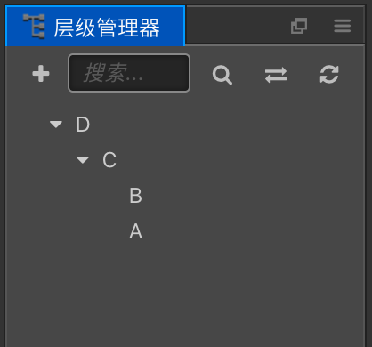

# 节点系统事件

如上一篇文档所述，`cc.Node` 有一套完整的[事件监听和分发机制](./events.md)。在这套机制之上，我们提供了一些基础的节点相关的系统事件，这篇文档将介绍这些事件的使用方式。

Cocos Creator 支持的系统事件包含鼠标、触摸、键盘、重力传感四种，其中本章节重点介绍与节点树相关联的鼠标和触摸事件，这些事件是被直接触发在相关节点上的，所以被称为节点系统事件。与之对应的，键盘和重力传感事件被称为全局系统事件，细节可以参考[全局系统事件文档](./player-controls.md)。

系统事件遵守通用的注册方式，开发者既可以使用枚举类型也可以直接使用事件名来注册事件的监听器，事件名的定义遵循 DOM 事件标准。

```javascript
// 使用枚举类型来注册
node.on(cc.Node.EventType.MOUSE_DOWN, function (event) {
  console.log('Mouse down');
}, this);

// 使用事件名来注册
node.on('mousedown', function (event) {
  console.log('Mouse down');
}, this);
```

## 鼠标事件类型和事件对象

鼠标事件在桌面平台才会触发，系统提供的事件类型如下：

| 枚举对象定义 | 对应的事件名 | 事件触发的时机 |
| ---------- |:----------:|:-----------:|
| `cc.Node.EventType.MOUSE_DOWN` | `mousedown` | 当鼠标在目标节点区域按下时触发一次 |
| `cc.Node.EventType.MOUSE_ENTER` | `mouseenter` | 当鼠标移入目标节点区域时，不论是否按下 |
| `cc.Node.EventType.MOUSE_MOVE` | `mousemove` | 当鼠标在目标节点在目标节点区域中移动时，不论是否按下 |
| `cc.Node.EventType.MOUSE_LEAVE` | `mouseleave` | 当鼠标移出目标节点区域时，不论是否按下 |
| `cc.Node.EventType.MOUSE_UP` | `mouseup` | 当鼠标从按下状态松开时触发一次 |
| `cc.Node.EventType.MOUSE_WHEEL` | `mousewheel` | 当鼠标滚轮滚动时 |

鼠标事件（`cc.Event.EventMouse`）的重要 API 如下（`cc.Event` 标准事件 API 之外）：

| 函数名 | 返回值类型 | 意义 |
| ------ |:-------:|:----:|
| `getScrollY` | `Number` | 获取滚轮滚动的 Y 轴距离，只有滚动时才有效 |
| `getLocation` | `Object` | 获取鼠标位置对象，对象包含 x 和 y 属性 |
| `getLocationX` | `Number` | 获取鼠标的 X 轴位置 |
| `getLocationY` | `Number` | 获取鼠标的 Y 轴位置 |
| `getPreviousLocation` | `Object` | 获取鼠标事件上次触发时的位置对象，对象包含 x 和 y 属性 |
| `getDelta` | `Object` | 获取鼠标距离上一次事件移动的距离对象，对象包含 x 和 y 属性 |
| `getButton` | `Number` | `cc.Event.EventMouse.BUTTON_LEFT` 或 `cc.Event.EventMouse.BUTTON_RIGHT` 或 `cc.Event.EventMouse.BUTTON_MIDDLE` |

## 触摸事件类型和事件对象

触摸事件在移动平台和桌面平台都会触发，这样做的目的是为了更好得服务开发者在桌面平台调试，只需要监听触摸事件即可同时响应移动平台的触摸事件和桌面端的鼠标事件。系统提供的触摸事件类型如下：

| 枚举对象定义 | 对应的事件名 | 事件触发的时机 |
| ---------- |:----------:|:-----------:|
| `cc.Node.EventType.TOUCH_START` | `touchstart` | 当手指触点落在目标节点区域内时 |
| `cc.Node.EventType.TOUCH_MOVE` | `touchmove` | 当手指在屏幕上目标节点区域内移动时 |
| `cc.Node.EventType.TOUCH_END` | `touchend` | 当手指在目标节点区域内离开屏幕时 |
| `cc.Node.EventType.TOUCH_CANCEL` | `touchcancel` | 当手指在目标节点区域外离开屏幕时 |

触摸事件（`cc.Event.EventTouch`）的重要 API 如下（`cc.Event` 标准事件 API 之外）：

| API 名 | 类型 | 意义 |
| ------ |:---:|:----:|
| `touch` | `cc.Touch` | 与当前事件关联的触点对象 |
| `getID` | `Number` | 获取触点的 ID，用于多点触摸的逻辑判断 |
| `getLocation` | `Object` | 获取触点位置对象，对象包含 x 和 y 属性 |
| `getLocationX` | `Number` | 获取触点的 X 轴位置 |
| `getLocationY` | `Number` | 获取触点的 Y 轴位置 |
| `getPreviousLocation` | `Object` | 获取触点上一次触发事件时的位置对象，对象包含 x 和 y 属性 |
| `getStartLocation` | `Object` | 获取触点初始时的位置对象，对象包含 x 和 y 属性 |
| `getDelta` | `Object` | 获取触点距离上一次事件移动的距离对象，对象包含 x 和 y 属性 |

需要注意的是，触摸事件支持多点触摸，每个触点都会发送一次事件给事件监听器。

## 触摸事件的传递

### 触摸事件冒泡

触摸事件支持节点树的事件冒泡，以下图为例：


在图中的场景里，假设 A 节点拥有一个子节点 B，B 拥有一个子节点 C。开发者对 A、B、C 都监听了触摸事件（以下的举例都默认节点监听了触摸事件）。

当鼠标或手指在 C 节点区域内按下时，事件将首先在 C 节点触发，C 节点监听器接收到事件。接着 C 节点会将事件向其父节点传递这个事件，B 节点的监听器将会接收到事件。 同理 B 节点会将事件传递给 A 父节点。这就是最基本的事件冒泡过程。需要强调的是，在触摸事件冒泡的过程中不会有触摸检测，这意味着即使触点不在 A B 节点区域内，A B 节点也会通过触摸事件冒泡的机制接收到这个事件。

触摸事件的冒泡过程与普通事件的冒泡过程并没有区别。所以，调用 `event.stopPropagation()` 可以主动停止冒泡过程。

### 同级节点间的触点归属问题

假设上图中 B、C 为同级节点，C 节点部分覆盖在 B 节点之上。这时候如果 C 节点接收到触摸事件后，就宣布了触点归属于 C 节点，这意味着同级节点的 B 就不会再接收到触摸事件了，即使触点同时也在 B 节点内。同级节点间，触点归属于处于顶层的节点。  

此时如果 C 节点还存在父节点，则还可以通过事件冒泡的机制传递触摸事件给父节点。

### 将触摸或鼠标事件注册在捕获阶段

有时候我们需要父节点的触摸或鼠标事件先于他的任何子节点派发，比如 CCScrollView 组件就是这样设计的。  
这时候事件冒泡已经不能满足我们的需求了，需要将父节点的事件注册在捕获阶段。  
要实现这个需求，可以在给 node 注册触摸或鼠标事件时，传入第四个参数 `true`，表示 `useCapture`. 例如：

```js
this.node.on(cc.Node.EventType.TOUCH_START, this.onTouchStartCallback, this, true);
```

当节点触发 `touchstart` 事件时，会先将 `touchstart` 事件派发给所有注册在捕获阶段的父节点监听器，然后派发给节点自身的监听器，最后才到了事件冒泡阶段。  

只有触摸或鼠标事件可以注册在捕获阶段，其他事件不能注册在捕获阶段。

### 触摸事件举例

以下图举例，总结下触摸事件的传递机制：


图中有 A、B、C、D 四个节点，其中 A、B 为同级节点。具体层级关系如下：



1. 若触点在 A、B 的重叠区域内，此时 B 接收不到触摸事件，事件的传递顺序是 **A -> C -> D**
2. 若触点在 B 节点内（可见的蓝色区域），则事件的传递顺序是 **B -> C -> D**
3. 若触点在 C 节点内，则事件的传递顺序是 **C -> D**
4. 若以第 2 种情况为前提，同时 C D 节点的触摸事件注册在捕获阶段，则事件的传递顺序是 **D -> C -> B** 

## `cc.Node` 的其它事件

| 枚举对象定义 | 对应的事件名 | 事件触发的时机 |
| ---------- |:----------:|:-----------:|
| 无 | `position-changed` | 当位置属性修改时 |
| 无 | `rotation-changed` | 当旋转属性修改时 |
| 无 | `scale-changed` | 当缩放属性修改时 |
| 无 | `size-changed` | 当宽高属性修改时 |
| 无 | `anchor-changed` | 当锚点属性修改时 |

## 暂停或恢复节点系统事件

暂停节点系统事件
```
* example
* 暂停当前节点上注册的所有节点系统事件，节点系统事件包含触摸和鼠标事件。
* 如果传递参数 true，那么这个 API 将暂停本节点和它的子树上所有节点的节点系统事件。
  
  this.node.pauseSystemEvents();
```
恢复节点系统事件
```
* example
* 恢复当前节点上注册的所有节点系统事件，节点系统事件包含触摸和鼠标事件。
* 如果传递参数 true，那么这个 API 将恢复本节点和它的子树上所有节点的节点系统事件。
  
  this.node.resumeSystemEvents();
```